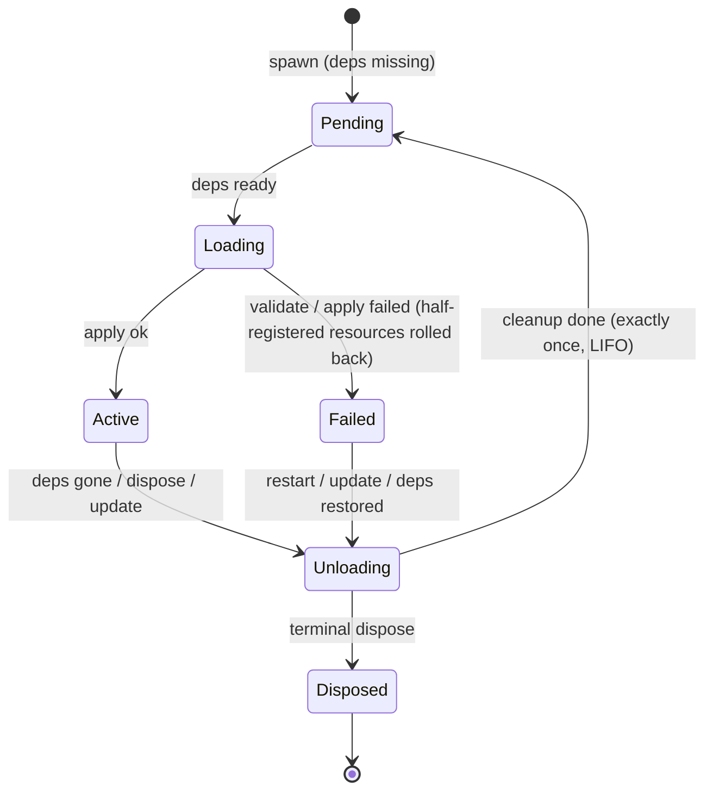
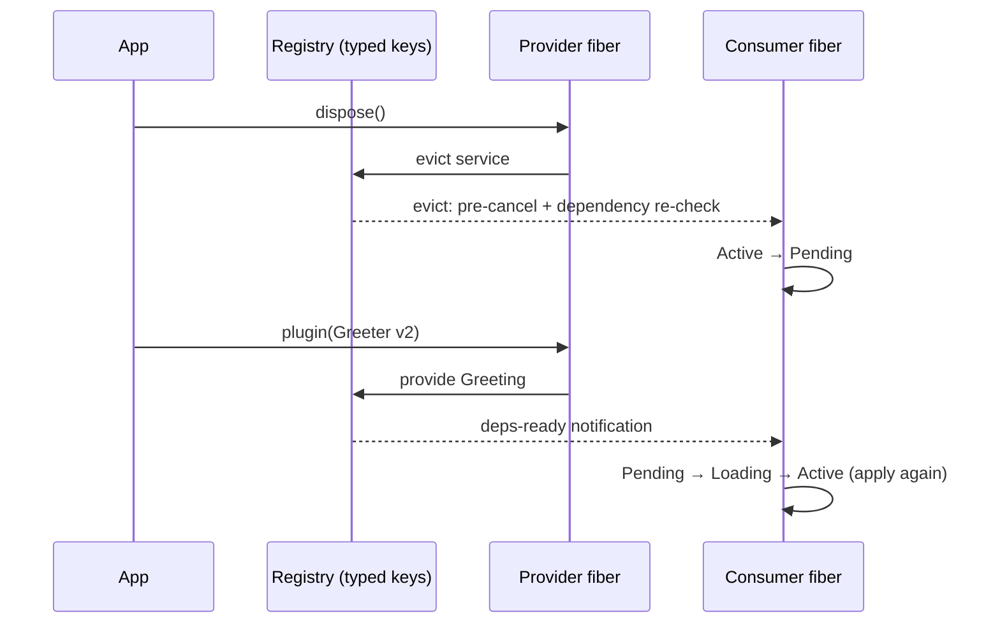

<div align="center">

# rutis

**A plugin framework for Rust**

Typed-key service container · fiber lifecycles · four-way event bus · dependency-driven lifecycle reloads

[](https://crates.io/crates/rutis)
[](https://docs.rs/rutis)
[](https://github.com/arcships/rutis/actions/workflows/ci.yml)
[](LICENSE)


An idiomatic Rust implementation of the Cordis core paradigm · [中文](README.md)

</div>

## ✨ Why

When your application needs a plugin architecture — editors, bots, agent hosts, composable servers — rolling your own means hand-writing a pile of error-prone infrastructure. rutis turns all of it into declarations:

| Hand-rolled pain | What rutis gives you |
|---|---|
| String-keyed services scattered everywhere | **Typed keys**: `TypeKey` identifies the service type without spelling its name; service availability and agreement between `injects()` and actual reads are checked at runtime |
| Implicit plugin start/stop ordering conventions | **One apply, everything wired**: provides services / listeners / cleanup, exactly once |
| Resource leaks and missed cleanups on unload | **Fiber containers**: strict LIFO cleanup, rolling back even mid-apply failures |
| Manually rebuilding a chain of things when a dependency changes | **Dependency-driven reload**: swap a provider, consumers evict and reload themselves |
| Restarting the whole process to change config | **Config hot update**: `update(config)` unloads and reloads cleanly, downstream follows |

## 🚀 Getting started

```bash
cargo add rutis@0.3
```

A provider, a consumer that declares a dependency, and a provider swap — full code at [crates/rutis/examples/quickstart.rs](crates/rutis/examples/quickstart.rs) (`cargo run -p rutis --example quickstart`):

```rust
use rutis::{BoxFuture, CordisError, Ctx, Effect, FiberState, FiberView, Plugin, TypeKey};

/// A service: the type is the key; one registration slot per type.
struct Greeting(String);

/// Provider: provides the service in apply; the framework removes it on unload.
struct Greeter { version: u32 }

impl Plugin for Greeter {
    fn name(&self) -> &str { "greeter" }
    fn apply<'a>(&'a self, ctx: &'a Ctx) -> BoxFuture<'a, Result<Effect, CordisError>> {
        let greeting = Greeting(format!("hello from greeter v{}", self.version));
        Box::pin(async move {
            ctx.provide(greeting)?;
            Ok(Effect::Done)
        })
    }
}

/// Consumer: declares a dependency on Greeting — once declared, the
/// framework owns when it loads.
struct Listener { deps: Vec<TypeKey> }

impl Plugin for Listener {
    fn name(&self) -> &str { "listener" }
    fn injects(&self) -> &[TypeKey] { &self.deps }  // stays Pending until ready
    fn apply<'a>(&'a self, ctx: &'a Ctx) -> BoxFuture<'a, Result<Effect, CordisError>> {
        Box::pin(async move {
            let greeting = ctx.require::<Greeting>()?.0.clone();
            println!("[listener] loaded: {greeting}");
            Ok(Effect::Done)
        })
    }
}

async fn wait_active(view: &FiberView) {
    let mut state = view.watch();
    loop {
        if state.borrow().state == FiberState::Active { return; }
        state.changed().await.expect("fiber driver alive");
    }
}

#[tokio::main]
async fn main() -> Result<(), Box<dyn std::error::Error>> {
    let ctx = Ctx::root()?;
    let listener = ctx.plugin(Listener {
        deps: vec![TypeKey::of::<Greeting>()],
    });
    // Provider arrives → gate opens, consumer loads automatically.
    let v1 = ctx.plugin(Greeter { version: 1 });
    wait_active(&listener).await;                 // [listener] loaded: hello from greeter v1

    // Swap the provider: old one unloads, the consumer is evicted, the new
    // one provides → automatic reload. The consumer is never touched.
    v1.dispose().await?;
    let _v2 = ctx.plugin(Greeter { version: 2 });
    wait_active(&listener).await;                 // [listener] loaded: hello from greeter v2
    ctx.shutdown().await?;
    Ok(())
}
```

## 🧩 Core concepts: the five pillars

| Pillar | What it is |
|---|---|
| **Plugin = unit of assembly** | one `apply` provides services / listeners / cleanup |
| **Fiber = lifecycle container** | six-state machine + dependency gating + cascading unload + exactly-once cleanup |
| **Service = typed registry** | isolate scopes; multiple instances of one interface via qualified keys |
| **Event bus = four dispatch semantics** | emit (ordered per key) / parallel (concurrent fan-out) / serial (first-value short-circuit) / waterfall (middleware chain) |
| **Dependency-driven reload** | provider unload → consumers evicted and reloaded automatically |

The mental model in one line: **declare dependencies → gated loading → provider changes → consumers reload themselves**.

Fiber lifecycle (failed loads roll back atomically; Failed is sticky until deps return or a hot update):



The full reload sequence (step 3 of the example above):



## ⚡ Feature tour

**Config hot update** — change config at runtime, reusing the state machine's exactly-once cleanup; affected consumers follow automatically:

```rust
struct MyFactory;
impl PluginFactory<MyConfig> for MyFactory {
    fn build(&self, cfg: &MyConfig) -> Result<Box<dyn Plugin>, CordisError> { /* ... */ }
}

let view = ctx.plugin_with(MyFactory, cfg_v1);
view.update(cfg_v2).await?;   // dry-run failure leaves everything untouched; success unloads + reloads
```

**Dynamic event names** — events whose names are only known at runtime (host events, script-registered channels): typed events + dynamic qualifiers inherit all four dispatch semantics and lifecycle cleanup for free:

```rust
ctx.events().on_keyed::<HostEvent>(&ctx, "session/event", listener)?;
ctx.events().emit_keyed(&ctx, name, Arc::new(event));
```

**API boundaries** — `require/require_as` are strict reads corresponding to Cordis's ordinary plugin service access. They check `injects()` along the fiber ancestry and distinguish undeclared, unavailable, out-of-scope, and inactive reads, retaining the call site. `get/get_as` correspond to Cordis's explicit `ctx.get()` locator: they return `Option` without enforcing declarations. A service is normally hidden while its provider is inactive or the reader is unloading, except that the provider's subtree can read its own service during cleanup. Instance keys also have subtree visibility checks. The `Ctx` passed to `on` owns a listener; the callback's `Ctx` belongs to the emitter. Capture the registration `Ctx` when the callback must register resources for its own plugin. See the compiling [listener ownership example](crates/rutis/examples/listener_ctx_ownership.rs).

Synchronous and asynchronous `apply` panics become plugin errors; a `check()` panic leaves a dependency unready; a `waterfall` callback panic propagates to its caller. `settle` is a FIFO barrier for one fiber, and Pending can be a stable result. Root `dispose()` remains restartable, while `shutdown()` closes it permanently; dropping a waiting future does not stop cleanup already in progress. `update(config)` reassembles a plugin without replacing process code. An early `Disposer::dispose()` failure returns to its caller without notifying the error sink; `Ctx::take_cleanup_errors()` consumes and releases these retained errors. Unconsumed errors join a terminal unload result or reach the error sink on reload.

**Relation to cordis** — rutis is an idiomatic Rust implementation of the [Cordis](https://github.com/shigma/cordis) paradigm, not a translation: all 96 original specs reviewed line by line, the 58 language-agnostic invariants locked by automated parity tests; every other difference is explicitly declared (decision table + non-port list + audit record). Known deliberate strengthenings: cross-effect cleanup is strictly serial LIFO (cordis runs concurrently), per-key emit ordering is rebuilt explicitly.

## 🛠 Built with rutis

| Project | Description |
|---|---|
| [rutis-agent](crates/rutis-agent) / [rutis-cli](crates/rutis-cli) | A minimal coding agent sample: aimux `LanguageModel` service + tool plugin + streaming driver plugin + ratatui TUI; `cargo install rutis-cli` |
| [rutis-dsh](crates/rutis-dsh) + [host/](host) | A bridge feeding LLM services to the dsh host process: Rust composition root ↔ loopback TCP ↔ TS bridge plugin; host events flow `evt/emit` → `HostEvent` into the kernel bus |
| [aimux-llm](crates/aimux-llm) | A standalone LLM service plugin: apply → registers the `llm` service, 329 providers |

Sample commands inside this repo:

```bash
cargo run -p rutis-cli -- --scripted          # offline agent demo, no API key
cargo run -p rutis-agent --example tui_scripted   # scripted-backend TUI
cargo test                                    # full test suite
```

> agent / cli consume [aimux](https://crates.io/crates/aimux-core) (unified LLM access layer) from crates.io — no sibling checkout needed; to hack a local aimux, add an uncommitted `[patch]` at the workspace root.

## 📚 Documentation

**Kernel & paradigm** — [kernel design (D1–D31 decision table)](docs/design-rust-port.md) · [96-spec parity ruling](docs/cordis-spec-parity-2026-08-18.md) · [hot update + dynamic events (design / three review rounds / post-mortem / audit)](docs/design-config-hot-update-and-dynamic-events-2026-09-21.md)

**Bridge & host** — [dual-core architecture & rustification roadmap](docs/design-dual-core-2026-08-20.md) · [dsh bridge v1 design](docs/design-dsh-bridge-2026-08-21.md) · [aimux-llm plugin ruling](docs/decision-aimux-llm-plugin-2026-08-23.md)

**Agent** — [agent framework](docs/design-min-agent-2026-08-18.md) · [verification & TUI](docs/design-agent-verification-tui-2026-08-18.md) · [minimal mode](docs/design-minimal-mode-2026-08-18.md)

## License

MIT (inherited from [Cordis](https://github.com/shigma/cordis) © Shigma).
