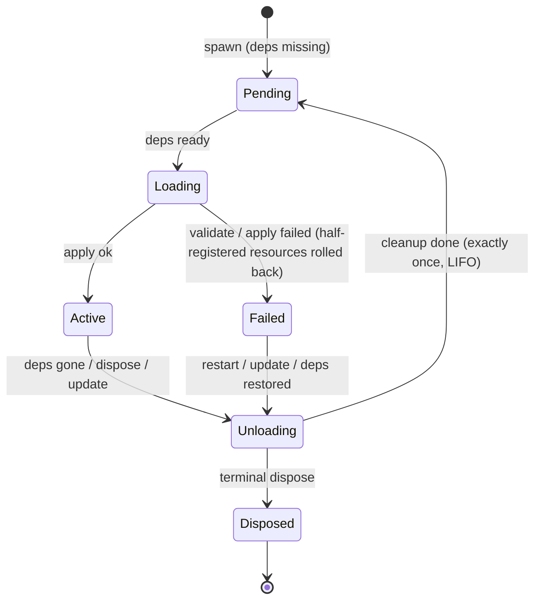
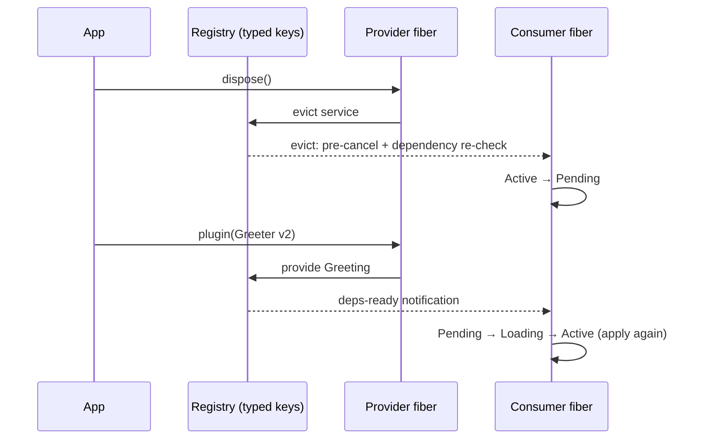

# rutis

**A plugin framework for Rust** — a type-safe service container, fiber lifecycles, a four-way event bus, and dependency-driven hot reloading. An idiomatic Rust implementation of the Cordis core paradigm.

[中文](README.md)

## Why

When your application needs a plugin architecture (editors, bots, agent hosts, composable servers), rolling your own usually means hand-writing service registration, plugin start/stop ordering, resource cleanup, and rebuild-on-dependency-change. rutis turns all of that into declarations:

- **One apply, everything wired** — a plugin's `apply` provides services / listeners / cleanup, guaranteed to run exactly once
- **Compile-time typed keys** — services are keyed by type (`ctx.get::<Database>()`), no string magic
- **No resource leaks** — every fiber (plugin container) drains its cleanups in strict LIFO on unload, rolling back even on mid-apply failures
- **Swap a provider, consumers reload themselves** — dependency relations are data, not callbacks scattered across your codebase
- **Change config at runtime** — `update(config)` unloads and reloads; affected downstream plugins follow automatically

## Getting started

```bash
cargo add rutis@0.2
cargo run -p rutis --example quickstart   # inside this repo
```

The full example ([crates/rutis/examples/quickstart.rs](crates/rutis/examples/quickstart.rs)) — a provider plugin, a consumer that declares a dependency on it, and an automatic consumer reload when the provider is swapped:

```rust
use rutis::{BoxFuture, CordisError, Ctx, Effect, Plugin, TypeKey};

/// A service: the type is the key; one registration slot per type.
struct Greeting(String);

/// Provider: provides the service in apply; the framework removes it on unload.
struct Greeter { version: u32 }

impl Plugin for Greeter {
    fn name(&self) -> &str { "greeter" }
    fn apply<'a>(&'a self, ctx: &'a Ctx) -> BoxFuture<'a, Result<Effect, CordisError>> {
        let greeting = Greeting(format!("hello from greeter v{}", self.version));
        Box::pin(async move {
            ctx.provide(greeting)?;
            Ok(Effect::Done)
        })
    }
}

/// Consumer: declares a dependency on Greeting — once declared, the
/// framework owns when it loads.
struct Listener { deps: Vec<TypeKey> }

impl Plugin for Listener {
    fn name(&self) -> &str { "listener" }
    fn injects(&self) -> &[TypeKey] { &self.deps }  // stays Pending until ready
    fn apply<'a>(&'a self, ctx: &'a Ctx) -> BoxFuture<'a, Result<Effect, CordisError>> {
        let greeting = ctx.get::<Greeting>().unwrap().0.clone();
        Box::pin(async move {
            println!("[listener] loaded: {greeting}");
            Ok(Effect::Done)
        })
    }
}

#[tokio::main]
async fn main() -> Result<(), Box<dyn std::error::Error>> {
    let ctx = Ctx::root()?;
    let listener = ctx.plugin(Listener {
        deps: vec![TypeKey::of::<Greeting>()],
    });
    // Provider arrives → gate opens, consumer loads automatically.
    let v1 = ctx.plugin(Greeter { version: 1 });
    wait_active(&listener).await;                 // [listener] loaded: hello from greeter v1

    // Swap the provider: old one unloads, the consumer is evicted, the new
    // one provides → automatic reload. The consumer is never touched.
    v1.dispose().await?;
    let _v2 = ctx.plugin(Greeter { version: 2 });
    wait_active(&listener).await;                 // [listener] loaded: hello from greeter v2
    Ok(())
}
```

## Core concepts: the five pillars

1. **Plugin = unit of assembly**: one `apply` provides services / listeners / cleanup
2. **Fiber = lifecycle container**: six-state machine + dependency gating + cascading unload + exactly-once cleanup
3. **Service = typed registry + isolate scopes** (multiple instances of one interface via qualified keys)
4. **Event bus = four dispatch semantics**: emit (fire-and-forget, ordered per key) / parallel (concurrent fan-out) / serial (first-value short-circuit) / waterfall (middleware chain)
5. **Dependency-driven reload**: provider unload → consumers evicted and reloaded automatically

The mental model in one line: **declare dependencies → gated loading → provider changes → consumers reload themselves**.

Fiber lifecycle (failed loads roll back atomically; Failed is sticky until deps return or a hot update):



The full reload sequence (step 3 of the example above):



## Feature tour

**Config hot update** — change config at runtime, reusing the state machine's exactly-once cleanup; affected consumers follow automatically:

```rust
struct MyFactory;
impl PluginFactory<MyConfig> for MyFactory {
    fn build(&self, cfg: &MyConfig) -> Result<Box<dyn Plugin>, CordisError> { /* ... */ }
}

let view = ctx.plugin_with(MyFactory, cfg_v1);
view.update(cfg_v2).await?;   // dry-run failure leaves everything untouched; success unloads + reloads
```

**Dynamic event names** — events whose names are only known at runtime (host events, script-registered channels): typed events + dynamic qualifiers inherit all four dispatch semantics and lifecycle cleanup for free:

```rust
ctx.events().on_keyed::<HostEvent>(&ctx, "session/event", listener)?;
ctx.events().emit_keyed(&ctx, name, Arc::new(event));
```

**Relation to cordis** — rutis is an idiomatic Rust implementation of the [Cordis](https://github.com/shigma/cordis) paradigm, not a translation: all 96 original specs were reviewed line by line; the 58 language-agnostic invariants are locked by automated parity tests (fiber timing, exactly-once cleanup, dependency gating, eviction & reload). Every other difference is explicitly declared (decision table + non-port list + audit record — see the docs below). Known deliberate strengthenings: cross-effect cleanup is strictly serial LIFO (cordis runs concurrently), per-key emit ordering is rebuilt explicitly.

## Built with rutis

| Project | Description |
|---|---|
| [rutis-agent](crates/rutis-agent) / [rutis-cli](crates/rutis-cli) | A minimal coding agent sample: aimux `LanguageModel` service + tool plugin + streaming driver plugin + ratatui TUI; build from source with `cargo run -p rutis-cli -- --scripted` (crates.io 0.1.0 is the older pre-rutui version) |
| [rutis-dsh](crates/rutis-dsh) + [host/](host) | A bridge feeding LLM services to the dsh host process: Rust composition root ↔ loopback TCP ↔ TS bridge plugin; host events flow `evt/emit` → `HostEvent` into the kernel bus |
| [aimux-llm](crates/aimux-llm) | A standalone LLM service plugin: apply → registers the `llm` service, 329 providers |

Sample commands inside this repo:

```bash
cargo test                                    # full suite: kernel contract+parity / hot update / event keys / bridge e2e / agent
cargo run -p rutis-cli -- --scripted          # offline agent demo, no API key
cargo run -p rutis-agent --example tui_scripted   # scripted-backend TUI
```

> agent / cli consume [aimux](https://crates.io/crates/aimux-core) (unified LLM access layer) from crates.io — no sibling checkout needed; to hack a local aimux, add an uncommitted `[patch]` at the workspace root.

## Documentation

**Kernel & paradigm**
- [design-rust-port.md](docs/design-rust-port.md) — kernel design (D1–D31 decision table)
- [cordis-spec-parity-2026-08-18.md](docs/cordis-spec-parity-2026-08-18.md) — the 96-spec parity ruling against original cordis
- [design-config-hot-update-and-dynamic-events-2026-09-21.md](docs/design-config-hot-update-and-dynamic-events-2026-09-21.md) — config hot update + dynamic event keys (design / implementation / three review rounds / post-mortem / cordis audit)

**Bridge & host**
- [design-dual-core-2026-08-20.md](docs/design-dual-core-2026-08-20.md) — dual-core architecture and the incremental-rustification roadmap
- [design-dsh-bridge-2026-08-21.md](docs/design-dsh-bridge-2026-08-21.md) — dsh bridge v1 design
- [decision-aimux-llm-plugin-2026-08-23.md](docs/decision-aimux-llm-plugin-2026-08-23.md) — the aimux-llm standalone-plugin ruling

**Agent**
- [design-min-agent-2026-08-18.md](docs/design-min-agent-2026-08-18.md) / [design-agent-verification-tui-2026-08-18.md](docs/design-agent-verification-tui-2026-08-18.md) — agent framework & TUI design
- [design-minimal-mode-2026-08-18.md](docs/design-minimal-mode-2026-08-18.md) — minimal mode (bash + replace_text)

## License

MIT (inherited from [Cordis](https://github.com/shigma/cordis) © Shigma).
