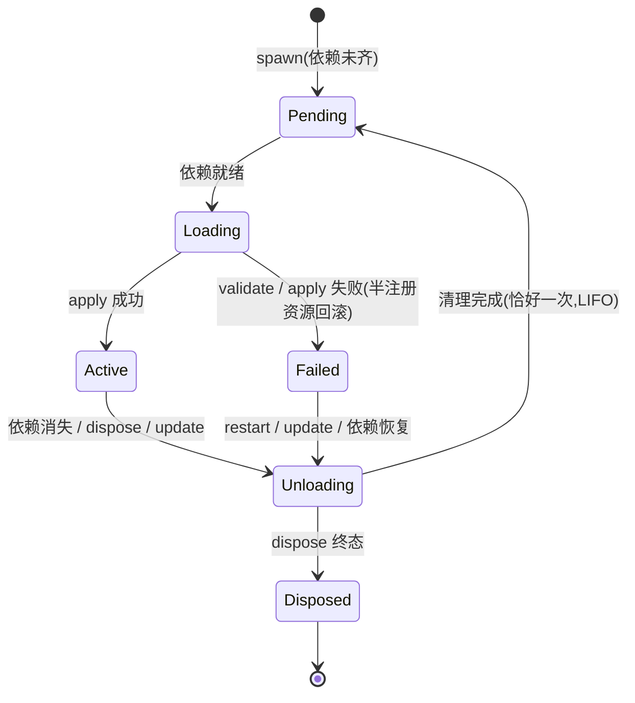
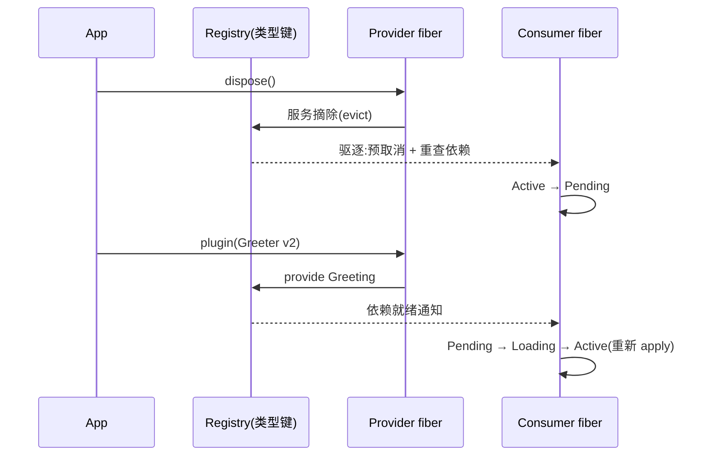

<div align="center">

# rutis

**Rust 插件框架**

类型键服务容器 · fiber 生命周期 · 四分发事件总线 · 依赖驱动重新装载

[](https://crates.io/crates/rutis)
[](https://docs.rs/rutis)
[](https://github.com/arcships/rutis/actions/workflows/ci.yml)
[](LICENSE)


Cordis 核心范式的 Rust 惯用实现 · [English](README.en.md)

</div>

## ✨ 为什么需要它

当你的应用需要插件化架构——编辑器、机器人、agent 宿主、可组合服务端——自己拼装意味着手写一堆易错的基础设施。rutis 把它们变成声明:

| 自己拼装的痛 | rutis 给你的 |
|---|---|
| 服务注册与查找散落各处的字符串键 | **类型键**：用 `TypeKey` 标识服务类型，避免拼写类型名；服务是否已提供、依赖声明与实际读取是否一致仍在运行期检查 |
| 插件启停顺序、谁先谁后的隐式约定 | **装配一次完成**:apply 同时提供服务 / 监听 / 清理,恰好一次执行 |
| 卸载时资源泄漏、清理漏跑 | **fiber 容器**:严格 LIFO 清理,中途失败也回滚 |
| 依赖变化后手动重建一串东西 | **依赖驱动重载**:换 provider,消费者自动驱逐重载 |
| 改配置要重启整个进程 | **配置热更新**:`update(config)` 干净卸载重载,下游自动跟随 |

## 🚀 快速上手

```bash
cargo add rutis@0.3
```

一个 provider、一个声明依赖的 consumer、一次换 provider——完整代码见 [crates/rutis/examples/quickstart.rs](crates/rutis/examples/quickstart.rs)(`cargo run -p rutis --example quickstart`):

```rust
use rutis::{BoxFuture, CordisError, Ctx, Effect, FiberState, FiberView, Plugin, TypeKey};

/// 服务:类型即键,注册槽全局唯一。
struct Greeting(String);

/// provider:apply 时提供服务,卸载时框架自动摘除。
struct Greeter { version: u32 }

impl Plugin for Greeter {
    fn name(&self) -> &str { "greeter" }
    fn apply<'a>(&'a self, ctx: &'a Ctx) -> BoxFuture<'a, Result<Effect, CordisError>> {
        let greeting = Greeting(format!("hello from greeter v{}", self.version));
        Box::pin(async move {
            ctx.provide(greeting)?;
            Ok(Effect::Done)
        })
    }
}

/// consumer:声明依赖 Greeting——声明了,装载时机就交给框架。
struct Listener { deps: Vec<TypeKey> }

impl Plugin for Listener {
    fn name(&self) -> &str { "listener" }
    fn injects(&self) -> &[TypeKey] { &self.deps }  // 未就绪则停在 Pending
    fn apply<'a>(&'a self, ctx: &'a Ctx) -> BoxFuture<'a, Result<Effect, CordisError>> {
        Box::pin(async move {
            let greeting = ctx.require::<Greeting>()?.0.clone();
            println!("[listener] loaded: {greeting}");
            Ok(Effect::Done)
        })
    }
}

async fn wait_active(view: &FiberView) {
    let mut state = view.watch();
    loop {
        if state.borrow().state == FiberState::Active { return; }
        state.changed().await.expect("fiber driver alive");
    }
}

#[tokio::main]
async fn main() -> Result<(), Box<dyn std::error::Error>> {
    let ctx = Ctx::root()?;
    let listener = ctx.plugin(Listener {
        deps: vec![TypeKey::of::<Greeting>()],
    });
    // provider 到位 → 门控放行,consumer 自动装载
    let v1 = ctx.plugin(Greeter { version: 1 });
    wait_active(&listener).await;                 // [listener] loaded: hello from greeter v1

    // 换 provider:旧的卸载、consumer 被驱逐、新的提供 → 自动重载,
    // 全程没有碰过 consumer。
    v1.dispose().await?;
    let _v2 = ctx.plugin(Greeter { version: 2 });
    wait_active(&listener).await;                 // [listener] loaded: hello from greeter v2
    ctx.shutdown().await?;
    Ok(())
}
```

## 🧩 核心概念:五支柱

| 支柱 | 是什么 |
|---|---|
| **插件 = 装配单元** | 一次 `apply`,提供服务 / 监听 / 清理 |
| **fiber = 生命周期容器** | 六态状态机 + 依赖门控 + 级联卸载 + 恰好一次清理 |
| **服务 = 类型键注册表** | isolate 作用域;同接口多实例走限定名键 |
| **事件总线 = 四分发** | emit(同键保序)/ parallel(并发全等)/ serial(首值短路)/ waterfall(中间件链) |
| **依赖驱动重载** | provider 卸载 → 消费者驱逐并自动重载 |

一句话心智模型:**声明依赖 → 门控装载 → provider 变 → 消费者自动重载**。

fiber 的六态生命周期(装载失败原子回滚,Failed 粘性直到依赖恢复或热更新):



依赖驱动重载的完整时序(上例第 3 步展开):



## ⚡ 能力一览

**配置热更新** —— 运行中改配置,复用状态机的恰好一次清理,受影响的消费者自动跟随:

```rust
struct MyFactory;
impl PluginFactory<MyConfig> for MyFactory {
    fn build(&self, cfg: &MyConfig) -> Result<Box<dyn Plugin>, CordisError> { /* ... */ }
}

let view = ctx.plugin_with(MyFactory, cfg_v1);
view.update(cfg_v2).await?;   // dry-run 不过则现状不动;通过则卸载重载
```

**动态事件名** —— 运行时才知道名字的事件(宿主事件、脚本注册),类型化事件 + 动态限定名,四分发与生命周期清理免费继承:

```rust
ctx.events().on_keyed::<HostEvent>(&ctx, "session/event", listener)?;
ctx.events().emit_keyed(&ctx, name, Arc::new(event));
```

**使用边界** —— `require/require_as` 是严格读取，对应 Cordis 普通插件访问服务时的声明检查；它沿 fiber 祖先链核对 `injects()`，并区分未声明、未就绪、实例越界和上下文失活，错误保留调用位置。同一次读取同时越界且上下文失活时，先报实例越界；登记和实例派发的错误优先级单独定义。`get/get_as` 对应 Cordis 显式 `ctx.get()` 定位器：返回 `Option`，不强制依赖声明。provider 未 Active 或读取方正在卸载时通常不可见，provider 子树在清理期间仍可读取自己提供的服务。实例键另有子树可见性检查。监听器由注册时传给 `on` 的 `Ctx` 持有，回调参数 `Ctx` 来自发送方；回调要给注册插件登记资源时，应捕获注册方的 `Ctx`。可编译示例见 [listener_ctx_ownership.rs](crates/rutis/examples/listener_ctx_ownership.rs)。

**依赖诊断** —— `ctx.diagnostics()` 列出存活 fiber 的身份、状态、声明与已绑定依赖，以及服务绑定。`injects[].status` 可区分缺失、实例越界、provider 未就绪、摘除中、check 拒绝或 panic；`TypeKey::describe()` 给出类型名、限定名和实例号。读取只使用已登记的元数据与最近一次门控检查结果，不调用插件或 check，也不触发生命周期转换。它逐个读取 fiber 和绑定，**不是全树原子快照**：并发生命周期变化时，同一结果中的状态、依赖和绑定可能来自不同时刻。check 状态可能停留在上次门控结果；调用 `refresh()` 后应等待相关 fiber 收敛，再重新读取诊断。Cordis 原生的投递观察、清理树和服务拦截差异见 [设计草案](docs/design-cordis-observation.md)。

`apply` 的同步及异步 panic 会变成插件错误；`check()` panic 视为依赖未就绪；`waterfall` 回调 panic 向调用方传播。`settle` 仅是该 fiber 的 FIFO 栅栏，Pending 也可能是稳定结果。root 的 `dispose()` 后仍可重启，`shutdown()` 是最终关闭；丢弃等待 future 不会停止已启动的清理。`update(config)` 重新装配插件，不替换进程中的代码。提前 `Disposer::dispose()` 的失败立即返回给调用方，不自动通知 ErrorSink；`Ctx::take_cleanup_errors()` 可取走并释放这些历史错误。未取走的错误在终态卸载时进入结果，在重载时交给 ErrorSink。

**与 cordis 的关系** —— rutis 是 [Cordis](https://github.com/shigma/cordis) 范式的 Rust 惯用实现,不是翻译:96 个原版 spec 逐条审阅,58 个语言无关不变量全部自动化对拍;其余差异全部显式声明(决策表 + 不移植清单 + 对照审计)。已知的刻意强化:跨 effect 清理严格串行 LIFO(cordis 并发)、emit 同键保序显式重建。

## 🛠 用 rutis 做的东西

| 项目 | 说明 |
|---|---|
| [rutis-agent](crates/rutis-agent) / [rutis-cli](crates/rutis-cli) | 最小 coding agent 样例:aimux `LanguageModel` 服务 + 工具插件 + 流式 driver 插件 + ratatui TUI;`cargo install rutis-cli` |
| [rutis-dsh](crates/rutis-dsh) + [host/](host) | 给 dsh 宿主进程供 LLM 服务的桥:Rust 组合根 ↔ loopback TCP ↔ TS 桥插件;宿主事件经 `evt/emit` → `HostEvent` 进内核总线 |
| [aimux-llm](crates/aimux-llm) | 独立 LLM 服务插件:apply → 注册 `llm` 服务,329 provider |

仓库内运行样例:

```bash
cargo run -p rutis-cli -- --scripted          # 无 key 离线 agent 演示
cargo run -p rutis-agent --example tui_scripted   # 离线脚本后端 TUI
cargo test                                    # 全量测试
```

> agent / cli 经 crates.io 消费 [aimux](https://crates.io/crates/aimux-core)(LLM 统一访问层),无需并列检出;hack 本地 aimux 用工作区根的 `[patch]`。

## 📚 文档

**从这里开始开发** — [应用设计指南](docs/development-guide.md)（如何拆插件、画依赖图、设计重载与多实例）· [开发手册](docs/development-handbook.md)（API 用法、资源清理、事件、排障与验证）· [完整可运行示例](crates/rutis/examples/development_workflow.rs)

**内核与范式** — [内核设计(D1-D31 决策表)](docs/design-rust-port.md) · [96 spec 对拍判定](docs/cordis-spec-parity-2026-08-18.md) · [热更新+动态事件(设计/三轮评审/复盘/审计)](docs/design-config-hot-update-and-dynamic-events-2026-09-21.md) · [shutdown 与卸载等待截止时间](docs/core-shutdown-and-disposal-deadline.md)

**桥与宿主** — [双核架构与锈化路线](docs/design-dual-core-2026-08-20.md) · [dsh 桥 v1 设计](docs/design-dsh-bridge-2026-08-21.md) · [aimux-llm 插件裁决](docs/decision-aimux-llm-plugin-2026-08-23.md)

**Agent** — [agent 框架](docs/design-min-agent-2026-08-18.md) · [验证与 TUI](docs/design-agent-verification-tui-2026-08-18.md) · [minimal mode](docs/design-minimal-mode-2026-08-18.md)

**升级** — [0.1.0 → 0.2.0 迁移说明](docs/migration-0.1-to-0.2.md)

## License

MIT(继承自 [Cordis](https://github.com/shigma/cordis) © Shigma)。
