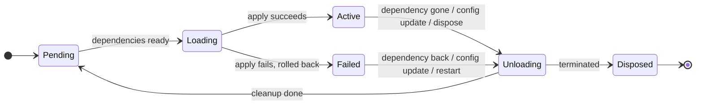

<div align="center">

# rutis

**A plugin runtime for programs that keep running**

Plugins say what they need and what they provide; rutis decides when they start, when they stop, and when they start again.<br>
A Rust core · plugins in TypeScript and Python · across processes and machines

[](https://crates.io/crates/rutis)
[](https://www.npmjs.com/package/@arcships/rutis)
[](https://pypi.org/project/rutis/)
[](https://docs.rs/rutis)
[](https://github.com/arcships/rutis/actions/workflows/ci.yml)
[](LICENSE)

[Quick start](#quick-start) · [Guides](docs/guide/README.en.md) · [API docs](https://docs.rs/rutis) · [中文](README.zh-CN.md)

</div>

<br>

Editors, chat bots, agents, composable servers: once a program accepts plugins, it runs into the same questions. In what order do plugins start? What happens while a dependency is missing? When a service is replaced, who has to restart? Did unloading leave anything behind? Does changing one setting mean restarting the whole process?

rutis turns those questions into declarations. A plugin states which services it depends on and the runtime does the rest: it starts the plugin once its dependencies are there, stops it when they go away, and reloads it when a provider is replaced. Everything a plugin registers while starting is cleaned up exactly once, in reverse order, when it stops.

The model comes from [Cordis](https://github.com/shigma/cordis) in the TypeScript ecosystem. rutis is its idiomatic Rust implementation, and carries the same model to other languages and other machines.

## Features

- **Dependencies drive the lifecycle** — declare what you depend on; when to start, stop and reload is up to the runtime. Typed plugins keep the declared dependencies and the ones actually used in agreement at compile time.
- **Cleanup you can rely on** — each plugin runs in its own fiber. Services, listeners and child plugins are registered under it and released exactly once, LIFO, on unload; a failed load rolls back what it had registered.
- **Change without downtime** — hot-update configuration, swap providers, add and remove plugins; only what depends on the change restarts.
- **Plugins in other languages** — TypeScript, JavaScript and Python plugins follow the same model. Services are called across languages, and a plugin need not know what its peers are written in or where they run.
- **Many nodes** — hosts link over WebSocket and TLS to share services, run plugins on another machine, forward events, and reconnect after a drop.
- **Data-driven** — `rutis-loader` describes the plugins to run as layered configuration and keeps reconciling it; `rutis-host` runs plugins without a line of Rust.

## Quick start

### In Rust

```bash
cargo add rutis
cargo add tokio --features full
```

```rust
use std::sync::Arc;
use rutis::{BoxFuture, CordisError, Ctx, Effect, Plugin, Typed, TypedPlugin};

/// A service is a type.
struct Greeting(String);

/// Provides Greeting. What apply registers is released when the plugin stops.
struct Greeter(&'static str);

impl Plugin for Greeter {
    fn name(&self) -> &str { "greeter" }

    fn apply<'a>(&'a self, ctx: &'a Ctx) -> BoxFuture<'a, Result<Effect, CordisError>> {
        Box::pin(async move {
            ctx.provide(Greeting(format!("hello from {}", self.0)))?;
            Ok(Effect::Done)
        })
    }
}

/// Depends on Greeting: starts when it appears, restarts when it is replaced.
struct Listener;

impl TypedPlugin for Listener {
    type Deps = (Arc<Greeting>,);

    fn name(&self) -> &str { "listener" }

    fn apply<'a>(&'a self, _: &'a Ctx, (greeting,): Self::Deps) -> BoxFuture<'a, Result<Effect, CordisError>> {
        Box::pin(async move {
            println!("{}", greeting.0);
            Ok(Effect::Done)
        })
    }
}

#[tokio::main]
async fn main() -> Result<(), Box<dyn std::error::Error>> {
    let ctx = Ctx::root()?;
    let listener = ctx.plugin(Typed::new(Listener));  // waits for a Greeting

    let english = ctx.plugin(Greeter("English"));
    (&english).await?;
    (&listener).await?;                               // hello from English

    english.dispose().await?;                         // the listener stops…
    let esperanto = ctx.plugin(Greeter("Esperanto"));
    (&esperanto).await?;
    (&listener).await?;                               // …and starts again: hello from Esperanto

    ctx.shutdown().await?;
    Ok(())
}
```

Nothing touched `Listener`: when the provider changed, it stopped and started again on its own. Run it from the repository with `cargo run -p rutis --example quickstart`.

### Without Rust

```bash
npx @arcships/rutis-host new weather --lang node
cd weather && npm install
npx rutis-host dev          # run the plugin, reload when files change
```

For Python, create the project with `uvx rutis-host new weather --lang python`, then `uv sync` and `uv run rutis-host dev`.

```ts
import { definePlugin } from '@arcships/rutis'

interface Llm {
  ask(question: string): Promise<string>
}

export default definePlugin<{ city?: string }>({
  inject: ['llm'],                             // services it needs: starts once all are there
  provides: { weather: { today: 'async' } },   // services it offers, and how each method is called
  apply(ctx, config) {
    const llm = ctx.use<Llm>('llm')
    const city = config.city ?? 'Oslo'
    ctx.provide('weather', {
      today: () => llm.ask(`weather in ${city}`),
    })
  },
})
```

`llm` can come from another plugin in the same process, from a Python plugin, or from another machine; this plugin stays the same. The full workflow is in [TypeScript plugins](docs/guide/typescript-plugin.en.md) and [Python plugins](docs/guide/python-plugin.en.md).

## How it works

A plugin is a unit of assembly: one `apply` provides services, registers listeners and records cleanup. Each plugin runs in a fiber, and the fiber's state is driven by its dependencies:


```mermaid
stateDiagram-v2
    direction LR
    [*] --> Pending
    Pending --> Loading : dependencies ready
    Loading --> Active : apply succeeds
    Loading --> Failed : apply fails, rolled back
    Active --> Unloading : dependency gone / config update / dispose
    Failed --> Unloading : dependency back / config update / restart
    Unloading --> Pending : cleanup done
    Unloading --> Disposed : terminated
    Disposed --> [*]
```

Services are registered by type. The event bus dispatches in four ways: emit, parallel, serial and waterfall. When a provider unloads, the plugins that depend on it are evicted and load again once a new provider appears.

In one line: **declare dependencies → gated loading → provider changes → consumers reload on their own**.

## Packages

| For | Rust (crates.io) | Node (npm) | Python (PyPI) |
| --- | --- | --- | --- |
| The core | [`rutis`](https://crates.io/crates/rutis) | | |
| Writing plugins | [`rutis-sdk`](https://crates.io/crates/rutis-sdk) (dylib plugins) | [`@arcships/rutis`](https://www.npmjs.com/package/@arcships/rutis) | [`rutis`](https://pypi.org/project/rutis/) |
| Running plugins in your app | [`rutis-loader`](https://crates.io/crates/rutis-loader), [`rutis-bridge`](https://crates.io/crates/rutis-bridge), [`rutis-dylib`](https://crates.io/crates/rutis-dylib) (dylib plugins) | [`@arcships/rutis-runtime`](https://www.npmjs.com/package/@arcships/rutis-runtime) | [`rutis`](https://pypi.org/project/rutis/) |
| A host without Rust | [`rutis-host`](https://crates.io/crates/rutis-host) | [`@arcships/rutis-host`](https://www.npmjs.com/package/@arcships/rutis-host) | [`rutis-host`](https://pypi.org/project/rutis-host/) |

All of these, the core and the dylib toolchain included, form a release train: released together at one version, currently 0.8. Use the same version for every rutis package.

## Documentation

- **[Guides](docs/guide/README.en.md)** — organized by task: TypeScript and Python plugins, running rutis-host, linking nodes, embedding in Rust, working with Cordis.
- **[Application design guide](docs/development-guide.en.md)** — splitting an app into plugins, drawing the dependency graph, designing reloads and multiple instances.
- **[Development handbook](docs/development-handbook.en.md)** — API usage, resource cleanup, events, troubleshooting and verification.
- **[Core features](docs/core-features.en.md)** — config hot update, dynamic events, interception, diagnostics, and the boundaries of each.
- **[API docs](https://docs.rs/rutis)** — the complete reference on docs.rs.
- **Design and decisions** — [core design](docs/design-rust-port.en.md), the [spec-by-spec parity check against Cordis](docs/cordis-spec-parity-2026-08-18.en.md), and every design record in [docs](docs).
- **Upgrading** — [0.7 → 0.8](docs/migration-0.7-to-0.8.en.md) · [from rutis-interop to 0.7](docs/migration-interop-to-0.7.en.md) · [0.6.0 → 0.6.1](docs/migration-0.6.0-to-0.6.1.en.md) · [0.5 → 0.6](docs/migration-0.5-to-0.6.en.md) · [0.3 → 0.5](docs/migration-0.3-to-0.5.en.md) · [0.1 → 0.2](docs/migration-0.1-to-0.2.en.md)

## Built with rutis

| Project | |
| --- | --- |
| [rutis-host](crates/rutis-host) | A host without Rust: runs TypeScript, JavaScript and Python plugins from a `rutis.json`, reloads them during development, links machines. |
| [rutis-agent](crates/rutis-agent) · [rutis-cli](crates/rutis-cli) | A minimal coding agent in which the model service, tools, streaming driver and TUI are all plugins. Try it offline with `cargo run -p rutis-cli -- --scripted`. |
| [rutis-dsh](crates/rutis-dsh) | Runs the full dsh web interface inside a rutis host, with model calls served by aimux in the same process. |
| [aimux-llm](crates/aimux-llm) | Wraps [aimux](https://crates.io/crates/aimux-core) as an LLM service plugin. |

## Platforms and status

rutis is at 0.x and its API is still evolving. Breaking changes are listed in the release notes and come with a migration guide.

- **The core** is pure Rust with tokio, tokio-util and thiserror as its only dependencies; it needs Rust 1.85 or later.
- **Language runtimes** (Node and Python rows, remote runtimes, shared services, peers) run on Linux, macOS and Windows x64 (MSVC); they need Node 24+ or Python 3.12+. So does the `rutis-host` command. Still Unix-only: the `Process::launch` / `Process::mount` compatibility API and the Cordis mount bindings generated with it.
- **dylib plugins** load on Linux, macOS and Windows x64 (MSVC).

## Contributing

Issues and pull requests are welcome: bugs, places where the docs are unclear, features you would like. Please read the [contributing guide](CONTRIBUTING.md) first, and report security issues privately as described in the [security policy](SECURITY.md).

## Acknowledgements and license

The design of rutis comes from [Cordis](https://github.com/shigma/cordis) by [Shigma](https://github.com/shigma). Without Cordis's thinking about plugins, contexts and dependencies, this project would not exist.

Released under the [MIT](LICENSE) license.
