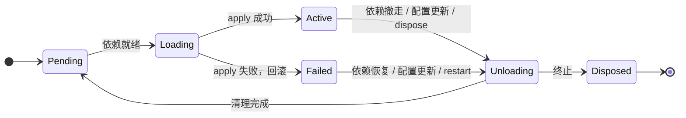

<div align="center">

# rutis

**为长期运行的程序准备的插件运行时**

插件写下自己需要什么、提供什么；rutis 决定它们何时启动、何时停下、何时重来。<br>
Rust 内核 · TypeScript、Python 与 Go 插件 · 跨进程，跨机器

[](https://crates.io/crates/rutis)
[](https://www.npmjs.com/package/@arcships/rutis)
[](https://pypi.org/project/rutis/)
[](https://docs.rs/rutis)
[](https://github.com/arcships/rutis/actions/workflows/ci.yml)
[](LICENSE)

[快速开始](#快速开始) · [指南](docs/guide/README.md) · [API 文档](https://docs.rs/rutis) · [English](README.md)

</div>

<br>

编辑器、聊天机器人、agent、可组合的服务端：程序一旦允许插件，就会遇到同一组问题。插件按什么顺序启动？依赖还没到时怎么办？一个服务被替换后，谁该重启？卸载时有没有漏掉什么？改一项配置，要不要重启整个进程？

rutis 把这些问题变成声明。插件写下它依赖哪些服务，剩下的交给运行时：依赖齐了才启动，依赖撤走就停下，provider 换了就重新装载；插件在启动时注册的一切，停下时按相反的顺序恰好清理一次。

这套模型来自 TypeScript 生态的 [Cordis](https://github.com/shigma/cordis)，rutis 是它在 Rust 中的惯用实现，并把同一套模型带到了其他语言和其他机器上。

## 特性

- **依赖即生命周期** — 声明依赖，启动、停止和重载的时机交给运行时。类型化插件让声明的依赖和实际用到的依赖在编译期保持一致。
- **清理有保证** — 每个插件运行在自己的 fiber 里。服务、监听器、子插件都登记在它名下，卸载时按 LIFO 恰好释放一次；装载失败时，已经注册的部分会回滚。
- **不停机地变化** — 热更新配置、替换 provider、增删插件，只有依赖它的那部分会重启。
- **多语言插件** — TypeScript、JavaScript、Python、Go 插件使用同一套模型。服务可以跨语言调用，插件不必知道对方用什么写成、运行在哪里。
- **多节点** — 宿主之间通过 WebSocket 与 TLS 互联：共享服务、在另一台机器上运行插件、转发事件、断线后自动重连。
- **数据驱动** — `rutis-loader` 用分层配置描述要运行的插件并持续调和；`rutis-host` 让你不写一行 Rust 就能运行插件。

## 快速开始

### 在 Rust 中

```bash
cargo add rutis
cargo add tokio --features full
```

```rust
use std::sync::Arc;
use rutis::{BoxFuture, CordisError, Ctx, Effect, Plugin, Typed, TypedPlugin};

/// 服务就是一个类型。
struct Greeting(String);

/// 提供 Greeting。apply 里注册的东西，插件停下时自动释放。
struct Greeter(&'static str);

impl Plugin for Greeter {
    fn name(&self) -> &str { "greeter" }

    fn apply<'a>(&'a self, ctx: &'a Ctx) -> BoxFuture<'a, Result<Effect, CordisError>> {
        Box::pin(async move {
            ctx.provide(Greeting(format!("hello from {}", self.0)))?;
            Ok(Effect::Done)
        })
    }
}

/// 依赖 Greeting：它出现时启动，被替换时重启。
struct Listener;

impl TypedPlugin for Listener {
    type Deps = (Arc<Greeting>,);

    fn name(&self) -> &str { "listener" }

    fn apply<'a>(&'a self, _: &'a Ctx, (greeting,): Self::Deps) -> BoxFuture<'a, Result<Effect, CordisError>> {
        Box::pin(async move {
            println!("{}", greeting.0);
            Ok(Effect::Done)
        })
    }
}

#[tokio::main]
async fn main() -> Result<(), Box<dyn std::error::Error>> {
    let ctx = Ctx::root()?;
    let listener = ctx.plugin(Typed::new(Listener));  // 等待 Greeting

    let english = ctx.plugin(Greeter("English"));
    (&english).await?;
    (&listener).await?;                               // hello from English

    english.dispose().await?;                         // listener 随之停下……
    let esperanto = ctx.plugin(Greeter("Esperanto"));
    (&esperanto).await?;
    (&listener).await?;                               // ……又自动启动：hello from Esperanto

    ctx.shutdown().await?;
    Ok(())
}
```

没有人碰过 `Listener`：provider 一换，它就跟着停下、再启动。在仓库里运行：`cargo run -p rutis --example quickstart`。

### 不写 Rust

```bash
npx @arcships/rutis-host new weather --lang node
cd weather && npm install
npx rutis-host dev          # 运行插件，文件改动时自动重载
```

Python 项目用 `uvx rutis-host new weather --lang python` 创建，再 `uv sync` 和 `uv run rutis-host dev`；Go 项目用 `rutis-host new weather --lang go`，再 `go mod tidy` 和 `rutis-host dev`。

```ts
import { definePlugin } from '@arcships/rutis'

interface Llm {
  ask(question: string): Promise<string>
}

export default definePlugin<{ city?: string }>({
  inject: ['llm'],                             // 需要的服务：都就绪才启动
  provides: { weather: { today: 'async' } },   // 提供的服务，以及每个方法的调用方式
  apply(ctx, config) {
    const llm = ctx.use<Llm>('llm')
    const city = config.city ?? 'Oslo'
    ctx.provide('weather', {
      today: () => llm.ask(`weather in ${city}`),
    })
  },
})
```

`llm` 可以来自同一进程里的另一个插件、一个 Python 插件，或者另一台机器，这个插件都不用改。完整流程见 [TypeScript 插件](docs/guide/typescript-plugin.md)、[Python 插件](docs/guide/python-plugin.md) 和 [Go 插件](docs/guide/go-plugin.md)。

## 工作方式

插件是装配单元：一次 `apply` 提供服务、注册监听、登记清理。每个插件运行在一个 fiber 里，fiber 的状态由依赖驱动：



服务以类型为键注册；事件总线提供 emit、parallel、serial、waterfall 四种分发方式；provider 卸载时，依赖它的插件会被驱逐，等新的 provider 出现后自动重新装载。

一句话：**声明依赖 → 门控装载 → provider 变化 → 消费者自动重载**。

## 包

| 用途 | Rust（crates.io） | Node（npm） | Python（PyPI） |
| --- | --- | --- | --- |
| 内核 | [`rutis`](https://crates.io/crates/rutis) | | |
| 写插件 | [`rutis-sdk`](https://crates.io/crates/rutis-sdk)（dylib 插件） | [`@arcships/rutis`](https://www.npmjs.com/package/@arcships/rutis) | [`rutis`](https://pypi.org/project/rutis/) |
| 在应用中运行插件 | [`rutis-loader`](https://crates.io/crates/rutis-loader)、[`rutis-bridge`](https://crates.io/crates/rutis-bridge)、[`rutis-dylib`](https://crates.io/crates/rutis-dylib)（dylib 插件） | [`@arcships/rutis-runtime`](https://www.npmjs.com/package/@arcships/rutis-runtime) | [`rutis`](https://pypi.org/project/rutis/) |
| 不写 Rust 的宿主 | [`rutis-host`](https://crates.io/crates/rutis-host) | [`@arcships/rutis-host`](https://www.npmjs.com/package/@arcships/rutis-host) | [`rutis-host`](https://pypi.org/project/rutis-host/) |

Go 插件用模块 [`github.com/arcships/rutis/go/rutis`](go/rutis)（SDK，以及插件二进制自带的运行时）。

以上所有包（包括内核和 dylib 工具链）组成发布列车，一起发布、版本相同，当前为 0.8。各个 rutis 包请使用同一个版本。

## 文档

- **[指南](docs/guide/README.md)** — 按任务组织：写 TypeScript / Python / Go 插件、运行 rutis-host、连接节点、在 Rust 中嵌入、与 Cordis 互通。
- **[应用设计指南](docs/development-guide.md)** — 如何拆分插件、画依赖图、设计重载与多实例。
- **[开发手册](docs/development-handbook.md)** — API 用法、资源清理、事件、排障与验证。
- **[内核能力一览](docs/core-features.md)** — 配置热更新、动态事件、拦截、诊断，以及各自的使用边界。
- **[API 文档](https://docs.rs/rutis)** — docs.rs 上的完整参考。
- **设计与决策** — [设计哲学](docs/design-philosophy.md)、[内核设计](docs/design-rust-port.md)、[与 Cordis 的逐条对拍](docs/cordis-spec-parity-2026-08-18.md)，以及 [docs](docs) 目录下的全部设计记录。
- **升级** — [0.7 → 0.8](docs/migration-0.7-to-0.8.md) · [从 rutis-interop 迁移到 0.7](docs/migration-interop-to-0.7.md) · [0.6.0 → 0.6.1](docs/migration-0.6.0-to-0.6.1.md) · [0.5 → 0.6](docs/migration-0.5-to-0.6.md) · [0.3 → 0.5](docs/migration-0.3-to-0.5.md) · [0.1 → 0.2](docs/migration-0.1-to-0.2.md)

## 用 rutis 构建

| 项目 | |
| --- | --- |
| [rutis-host](crates/rutis-host) | 不写 Rust 的宿主：按 `rutis.json` 运行 TypeScript、JavaScript、Python 和 Go 插件，开发时自动重载，连接多台机器。 |
| [rutis-agent](crates/rutis-agent) · [rutis-cli](crates/rutis-cli) | 最小的 coding agent：模型服务、工具插件、流式驱动和 TUI 都是插件。`cargo run -p rutis-cli -- --scripted` 可以离线体验。 |
| [rutis-dsh](crates/rutis-dsh) | 在 rutis 宿主里运行 dsh 的完整 web 界面，模型调用由同进程的 aimux 提供。 |
| [aimux-llm](crates/aimux-llm) | 把 [aimux](https://crates.io/crates/aimux-core) 包装成一个 LLM 服务插件。 |

## 平台与状态

rutis 仍处于 0.x，API 还会演进。不兼容的变化会写进发布说明，并附迁移指南。

- **内核** 是纯 Rust，依赖只有 tokio、tokio-util 和 thiserror；需要 Rust 1.85 或更高。
- **语言运行时与 rutis-host**（Node、Python 与 Go 行、远程运行时、跨语言共享服务、节点、Cordis 挂载）支持 Linux、macOS 和 Windows x64（MSVC）；需要 Node 22+ 或 Python 3.12+；Go 插件是编译好的二进制，构建时需要 Go 1.24+。
- **dylib 插件** 支持 Linux、macOS 和 Windows x64（MSVC）。

## 参与

欢迎提 issue 和 pull request：bug、文档里说不清的地方、想要的功能，都可以。开始之前请读 [贡献指南](CONTRIBUTING.zh-CN.md)；安全问题请按 [安全策略](SECURITY.md) 私下报告。

## 致谢与许可

rutis 的设计源自 [Shigma](https://github.com/shigma) 的 [Cordis](https://github.com/shigma/cordis)。没有 Cordis 对插件、上下文与依赖的思考，就不会有这个项目。

以 [MIT](LICENSE) 许可发布。
