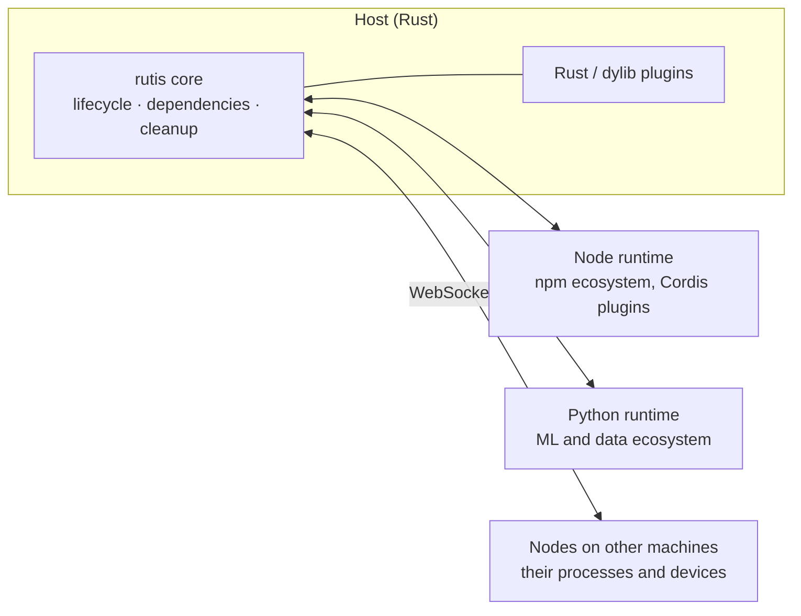
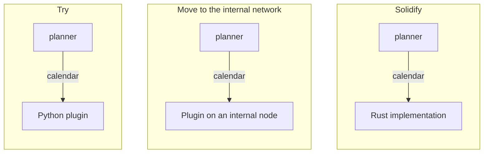

# rutis design philosophy

[中文](design-philosophy.md) · [Core design](design-rust-port.en.md) · [Core features](core-features.en.md)

Status: current. Date: 2026-10-08.

**rutis is an application operating system for software that iterates on itself and adapts to its environment: a harness for connecting and adapting.**

Its lifecycle model comes from [Cordis](https://github.com/shigma/cordis), but it starts from a different place: Cordis runs a plugin ecosystem inside one process; rutis lets a host program connect to more runtimes, processes and devices by itself, and understand and iterate on those connections.

This document explains that starting point, and the shape, costs and principles that follow from it. The mechanisms are in the individual design documents.

## 1. Software has to adapt to its environment by itself

When software is itself an agent, or is developed by agents, what matters most is that it can deal with its environment and surroundings quickly and form connections, and that it can understand and iterate on its own ability to connect to that environment.

**The party that makes and initiates connections is the software host itself, not whoever maintains the environment.** That is why rutis is not an MCP-style protocol. MCP solves the problem on the environment's side: the environment's maintainers wrap capabilities as servers and the host calls them. The connection stays outside the host, and what the host can do depends on what exists outside it. rutis solves the problem on the host's side: whatever the host needs to reach, it writes a plugin for (in whichever language fits best, possibly written by an agent), tries it, changes it, replaces it, and from then on the connection is part of the host, with a lifecycle, observable and cleaned up. The two can coexist, and an MCP client can be just another plugin in the host; but the environment should not decide where the host's capabilities end.

So what matters more and more is that the host itself has **the ability to adapt and to iterate on how it reaches its environment**:

- **Make connections**: write plugins in any connected language and run them in this process, another process or on another machine;
- **Understand connections**: `diagnostics()` lists each plugin's state, dependencies and service bindings; `rutis-host check` lists each row's dependencies and the services it provides;
- **Iterate on connections**: reload when code changes, update configuration live, and have the plugins using an implementation follow along when it is replaced;
- **Iterate without breaking**: nothing starts before its dependencies are ready, every cleanup runs exactly once on unload, and failures roll back. Loading, unloading and replacing often leaves nothing behind.

## 2. A plugin system is a small application operating system

Once a program accepts plugins, it has to answer the questions an operating system answers: what starts first, what happens while a dependency is missing, who has to restart when a part is replaced, whether unloading left anything behind, how parts call each other. rutis puts these questions into a small core:

| Operating system | rutis |
| --- | --- |
| Kernel: small, stable, rarely changed | The `rutis` core, depending only on tokio, tokio-util and thiserror |
| Processes | Plugins; language runtimes, remote nodes and dylibs are plugins too |
| System calls | Services, provided and used by name or by type |
| Drivers | Mounts and bridges: language runtimes, node links, Cordis mounts |
| Scheduling and reclamation | Start once dependencies are ready, stop when they go away, clean up in reverse order of registration |

The "peripherals" of this operating system are other runtimes and system processes. **Plugins in other languages and on other machines are not add-ons; they are the reason it exists**: every runtime or machine connected is one more set of capabilities the host can reach.

## 3. Rust at the core, other languages to connect and adapt

The plugin system has to be more stable than anything running on it, and easy to extend and to maintain stably over the long term. So the core is written in Rust, the lifecycle model is implemented only there, and every semantic guarantee is pinned by tests; the other languages have only a small SDK and do not replicate the framework.

Connecting and adapting go to whichever language fits best. This matches the idea of an agent harness: a stable core, plus runtimes that can be connected and replaced at any time. Once a host no longer stops at one runtime and one language, the problems it can solve and the resources it can reach are no longer bounded by any single ecosystem.

## 4. Borrowing each language's ecosystem, from trying to stable

Runtimes in different languages bring the ecosystems of their language stacks: Python brings ML and data processing, Node brings npm and existing Cordis plugins, and remote nodes bring the processes and devices of another machine.

Trying and stabilizing is necessarily a process, and multi-language runtimes naturally cover the whole path from experimental code to production:

1. **Try**: connect quickly with Python or TypeScript, possibly written by an agent, reloaded on every change under `rutis-host dev`;
2. **Prove**: run it in a real host, using and used by other plugins through services; the service's name and methods settle at this step;
3. **Solidify**: rewrite the parts that have stood the test of time in Rust for stability and performance.

The path works because of the lifecycle model inherited from Cordis: **a plugin depends on a service's name, not on an implementation**, and when the implementation changes, the plugins depending on it stop and start again on their own. So changing the implementation language or where it runs is, to its users, the same service with a new provider:

Across all three stages, not one line of `planner` changes and the host does not restart. This is the same idea as the [dual-core architecture](design-dual-core-2026-08-20.en.md)'s "TS is the lab, Rust takes the graduates", extended to every connected language.

## 5. The fundamental difference from Cordis

rutis inherits its lifecycle model from Cordis, and the core semantics agree; see the [spec-by-spec parity check](cordis-spec-parity-2026-08-18.en.md). Cordis is the core of Koishi. It lets a large number of plugin authors write plugins that load and unload cleanly with hardly a thought about lifecycle; for a system whose parts all live in one Node process, its implicit style built on JS language features is the right choice.

The fundamental difference is that rutis is designed around the idea of a harness for connecting and adapting:

| | Cordis | rutis |
| --- | --- | --- |
| What it is for | Running a plugin ecosystem inside one process | Letting a host connect to and adapt to its environment |
| Where capabilities come from | The framework's own plugins (Cordis plugins on npm) | Connecting to runtimes, processes, devices and ecosystems that already exist; no ecosystem of its own |
| Where the parts are | One Node process | Different languages, processes and machines |
| What it may rely on | A single JS thread, shared objects, language features such as Proxy | Only explicit contracts: once a process boundary is crossed, implicit conventions break |

So rutis is not a translation of Cordis. Mechanisms that only hold within one process (Proxy property access, rewriting the context per caller, `Context.filter`, the `internal/*` hooks) are not carried over; problems that only appear across processes (ordering across threads, withdrawing services across processes, reconnecting after a drop, protocol versions) are treated as first-class.

## 6. Costs

- **Processes and latency**: each language needs at least one process, and a synchronous cross-language call takes about 30µs (measured on the Node side), far slower than a call within a process. Capabilities called often should eventually be solidified in Rust or placed in the same runtime.
- **Weaker semantics**: across a process boundary, events can only be notifications, waterfalls are not forwarded, and `instanceof` does not hold; see the [boundary rules](requirements-protocol-plugins.en.md) §5.
- **Failure scope**: plugins in one runtime share a process; if one crashes the process, the others in it stop too. Isolation means more runtime instances.
- **Environment requirements**: each language used needs its environment (Node 22+, Python 3.12+), deployed along with it.
- **More verbose code**: obtaining services and passing the context explicitly takes a few more words than Cordis's `ctx.foo`.
- **Maintenance surface**: every language connected is one more runtime and one more SDK to maintain over the long term.

## 7. Principles and how to decide

This section follows from the claims above and is written mainly for contributors.

### Principles

1. **The model is implemented once, in the Rust core**; plugins in other languages are leaves with a small SDK ([multi-language design](design-multilang-runtimes-2026-10-03.en.md)).
2. **Compatibility work happens outside the core** ([mount requirements](requirements-protocol-plugins.en.md) §1).
3. **Guarantees are written down and pinned by tests**; guarantees not made are written down too ([core design](design-rust-port.en.md) D31).
4. **Extension points are opened for concrete needs, and kept narrow**; no catch-all hooks ([observation and interception design](design-cordis-observation.en.md)).
5. **Whatever rutis connects to is a plugin**: runtimes, nodes and mounts are under the same lifecycle, with no special privileges.
6. **Contracts cover only what crossing a boundary needs**: service names and method shapes (sync or async), no general type layer.
7. **What cannot be done across a boundary becomes a boundary rule**, not a silent degradation.
8. **Dependency declarations contain only service names**, never languages or locations.
9. **Configuration describes the desired state**, which the loader keeps reconciling; the host does not hand-write start and stop sequences.
10. **Explicit over implicit**: implicit mechanisms do not cross a process boundary.

### Deciding whether a capability belongs

1. Does it widen what a host can connect to or adapt to, or help the host understand and iterate on its own connections? A runtime is worth connecting for the ecosystem it brings, not to support one more language.
2. Can it live outside the core?
3. Does it still hold across a process boundary?
4. Does it have a concrete user?
5. Can its guarantees be written as tests?

## 8. Open questions

- **Permissions**: trust is currently per trusted peer. The more devices and external runtimes a host connects to, the finer the authorization it needs: which node or plugin may provide or use which services.
- **Contract evolution**: for "Python first, Rust later" to be seamless, the data shapes of one service must also stay the same across languages; for now that relies on convention.
- **Cycle diagnostics**: the core does not promise cycle detection, but the loader and host know the services plugins declare and could report suspected cycles.
- **More runtimes**: runtimes for macOS system capabilities (Swift) and for Go are planned ([multi-language design](design-multilang-runtimes-2026-10-03.en.md) §11), to be added one by one as real needs appear.

## Related documents

- [Writing a Python plugin](guide/python-plugin.en.md) · [Writing a TypeScript plugin](guide/typescript-plugin.en.md) · [Connecting nodes](guide/nodes.en.md) · [Embedding in a Rust application](guide/rust-host.en.md)
- [Core design](design-rust-port.en.md) · [Parity check against Cordis](cordis-spec-parity-2026-08-18.en.md) · [Dual-core architecture](design-dual-core-2026-08-20.en.md)
- [Multi-language decision record](decision-multilang-2026-10-03.en.md) · [Multi-language plugin design](design-multilang-runtimes-2026-10-03.en.md) · [Remote plugins](design-remote-plugins-2026-10-03.en.md)
