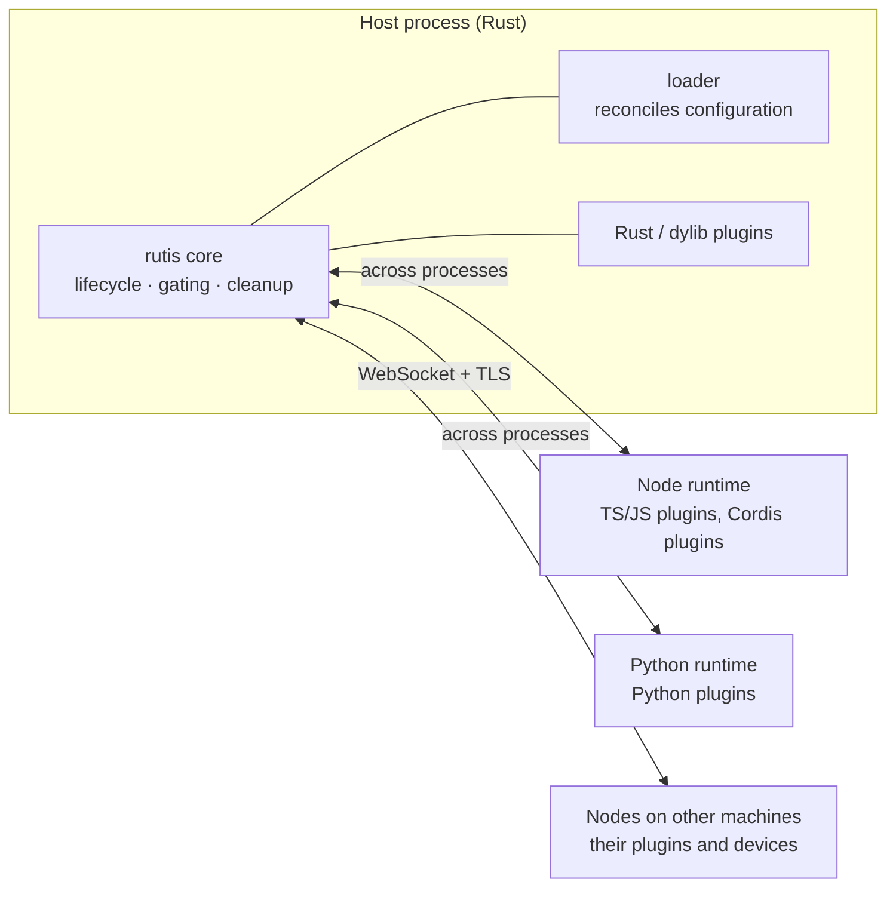

# rutis design philosophy

[中文](design-philosophy.md) · [Core design](design-rust-port.en.md) · [Core features](core-features.en.md)

Status: current. Date: 2026-10-08.

This document explains why rutis is shaped the way it is, and what to rely on when deciding whether a capability belongs in it. It is written for users who want to know what rutis is for and for contributors. The mechanisms are in the individual design documents; this one covers the starting point, the principles that follow from it, and what they cost.

## In one sentence

**rutis is the trunk that lets software connect to and adapt to its environment by itself.** It provides a stable plugin core in Rust and, through plugins in other languages and on other machines, connects to more runtimes, system processes and devices, so that a host program can build, understand and iterate on its own connections to its environment.

A few terms used below:

- **Host**: the program that runs plugins, either `rutis-host` or a Rust application embedding rutis.
- **Plugin**: a unit of function that can be loaded and unloaded on its own. It provides **services** (objects shared by name or by type) and uses services other plugins provide.
- **Fiber**: each plugin's lifecycle container in the core, recording whether it is waiting, running, failed or unloading.
- **Gating**: a plugin starts once every dependency it declares is ready, and stops when any of them is withdrawn.
- **Loader and rows**: the loader decides from configuration which plugins run; each entry in that configuration is a row.
- **Runtime**: a process for one language, such as a Node process or a Python process; plugins in that language are loaded into it.

## 1. The problem: software has to connect to its environment itself

When software is itself an agent, or is developed by agents, what it needs most is to reach its surroundings quickly: files and applications on the machine, some Python library, a device on another machine; and to see what it is already connected to and what went wrong, so it can do better.

There is an easily missed premise here: **the party that makes the connection is the host itself, not whoever maintains the environment.** The environment does not prepare an interface for this host; whatever the host needs, it has to connect to on its own, and replace if the connection is poor. So the host needs more than particular capabilities. It needs the ability to acquire them:

- **Make connections**: write a plugin in whichever language fits best and run it in this process, another process or on another machine;
- **Understand connections**: know what state each plugin is in, what it depends on, what it provides and what is missing;
- **Iterate on connections**: reload when the code changes, and have whatever uses an implementation follow along when it is replaced;
- **Iterate without breaking**: load, unload and replace often without leaving resources uncleaned.

rutis is designed to provide these four things.

## 2. An example: giving an agent a calendar

Suppose an agent host needs to know the user's schedule for today.

**Day one: connect with Python first.** CalDAV libraries are most readily available in Python, so the agent writes a Python plugin that provides a `calendar` service:

```python
from rutis import define_plugin


class Calendar:
    def __init__(self, url):
        self.url = url

    async def today(self):
        return await fetch_events(self.url)   # read today's events with any CalDAV library


def apply(ctx, config):
    ctx.provide("calendar", Calendar(config["url"]))


plugin = define_plugin(apply, provides={"calendar": Calendar})
```

The schedule is used by a `planner` plugin written in TypeScript. It only declares that it depends on `calendar`; it neither knows nor cares what language the other side is written in or where it runs:

```ts
import { definePlugin } from '@arcships/rutis'

interface Calendar { today(): Promise<string[]> }

export default definePlugin({
  inject: ['calendar'],
  provides: { planner: { plan: 'async' } },
  apply(ctx) {
    const calendar = ctx.use<Calendar>('calendar')
    ctx.provide('planner', {
      plan: async () => `Today: ${(await calendar.today()).join(', ')}`,
    })
  },
})
```

```json
{
  "runtimes": { "node": { "project": "." }, "py": { "project": "plugins" } },
  "rows": [
    { "id": "calendar", "name": "py:caldav_calendar", "config": { "url": "https://dav.example.com/me" } },
    { "id": "planner", "name": "./planner.ts" }
  ]
}
```

While developing `calendar`, run it under `rutis-host dev`, which reloads it whenever a file changes; `planner` stops and starts again with it, and the host does not restart. `rutis-host run` prints every change in a row's state, and `rutis-host check` lists each row's dependencies and the services it provides, so the host always knows what it is connected to.

**Week two: the calendar server is only reachable from the internal network.** Move the `calendar` row to a node on a machine inside that network, which runs it and exports `calendar`; locally, replace that row with a link to that node that imports the service:

```json
{ "id": "office", "name": "rutis-bridge/peer", "config": { "peer": "office", "dial": "wss://office.example.com/rutis", "import": ["calendar"] } }
```

When the link drops, `calendar` is withdrawn and `planner` stops and waits; once it reconnects, both come back on their own. Not one line of `planner` changed.

**Month three: solidify in Rust.** The capability is stable and called often, so the host becomes a [Rust application embedding rutis](guide/rust-host.en.md) that implements a `calendar` service of the same name in Rust, and the old row is removed. To `planner`, the same service simply has a new provider.

Each step of this example corresponds to one of the principles below.

## 3. The shape of rutis

### A small application operating system

Once a program accepts plugins, it has to answer the questions an operating system answers: what starts first, what happens while a dependency is missing, who has to restart when a part is replaced, whether unloading left anything behind, how parts call each other. rutis puts these questions into a small core and answers them with one set of lifecycle rules:

| Operating system | rutis |
| --- | --- |
| Kernel: small, stable, rarely changed | The `rutis` core, depending only on tokio, tokio-util and thiserror |
| Processes | Plugins; language runtimes, remote nodes and dylibs are plugins too |
| System calls | Services, provided and used by name or by type |
| Drivers | Mounts and bridges: Cordis mounts, language runtimes, node links |
| Scheduling and supervision | Dependency gating, dependency-driven reload, the loader reconciling against configuration |
| Resource reclamation | Every cleanup runs exactly once, in reverse order of registration, rolled back on failure |
| Introspection | `diagnostics()` lists each plugin's state, dependencies and service bindings; the cleanup tree; pre-dispatch observation |

### Rust as the trunk, other languages as the limbs



What must not fail over the long term is in Rust: the core, the lifecycle, scheduling and cleanup. Connecting and adapting go to whichever language fits best: Python has the ML and data ecosystem, Node has npm and existing Cordis plugins, and remote nodes reach devices and processes on other machines. This is the shape of an agent harness: a stable trunk with limbs that can grow and be replaced at any time. Once a host is no longer limited to one runtime and one language, the problems it can solve and the resources it can reach are no longer bounded by any single ecosystem.

### From trying to stable is one path

Trying things out and making them stable is necessarily a process. Multi-language runtimes let that process happen without switching frameworks or rewriting the users of a capability:

1. **Try**: write a plugin quickly in Python or TypeScript, possibly generated by an agent, reloaded on every change under `rutis-host dev`.
2. **Prove**: run it as a loader row in a real host, depending on and depended on by other plugins through services; the service's name and methods settle at this step.
3. **Solidify**: rewrite the parts that have stood the test of time in Rust (built into the host, or as a dylib plugin) for stability and performance.

Between steps, the plugins using the capability do not change. This is the same idea as the [dual-core architecture](design-dual-core-2026-08-20.en.md)'s "TS is the lab, Rust takes the graduates", extended to every connected language.

## 4. How rutis relates to Cordis and MCP

### Cordis: the same model, a different world

rutis takes its lifecycle model from [Cordis](https://github.com/shigma/cordis), and the core semantics agree; see the [spec-by-spec parity check](cordis-spec-parity-2026-08-18.en.md). Cordis is the core of Koishi. It lets a large number of plugin authors write plugins that load and unload cleanly with hardly a thought about lifecycle, and Koishi's plugin ecosystem shows the approach works. It gets there through JS language features: Proxy makes `ctx.foo` return the service directly, and side effects of a service call are recorded under the caller automatically. For a system whose parts all live in one Node process, that is the right choice.

rutis faces a different world:

| | Cordis | rutis |
| --- | --- | --- |
| Where the parts are | One Node process | Different languages, processes and machines |
| Where capabilities come from | The framework's own plugin ecosystem (Cordis plugins on npm) | Connecting to runtimes, processes and ecosystems that already exist; no ecosystem of its own |
| Main users | Many plugin authors | People who assemble a system around a host, and agents |
| What it may rely on | A single JS thread, one shared set of objects, language features such as Proxy | Only explicit contracts: once a process boundary is crossed, implicit conventions break |

So rutis is not a translation of Cordis. Mechanisms that only hold within one process, such as Proxy property access, rewriting the context per caller (traceable and caller-shadow), `Context.filter` and the `internal/*` hooks, are not carried over. Problems that only appear across processes, such as ordering across threads, withdrawing services across processes, reconnecting after a drop and protocol versions, are treated as first-class.

### MCP: does the connection stay outside the host, or become part of it?

MCP is good at handing existing capabilities to a model as tools: a server lists tools, and the model calls them as needed. The difference from rutis is not who writes the connection (an agent can just as well write an MCP server itself), but what the connection is inside the host:

- **A different unit.** MCP's unit is one tool call; rutis's unit is a part with dependencies. `planner` depends on `calendar`: when `calendar` disappears, `planner` stops, and when it returns, `planner` starts again. MCP servers have no such relationship with each other.
- **A different owner.** MCP capabilities stay outside the host, which can only call them; a capability connected through rutis is part of the host: it has a lifecycle, can be observed, replaced and cleaned up, and can use services the host and other plugins provide.

The two can coexist: an MCP client can perfectly well be a rutis plugin that offers a server's tools to other plugins as a service. But what a host can do should not depend only on which servers exist outside it.

## 5. Principles

### The core

1. **The model is implemented once, in the Rust core.** Dependency gating, starting and stopping, reloading, cleanup and hot configuration updates exist in one implementation, in rutis; other languages do not replicate the framework ([multi-language design](design-multilang-runtimes-2026-10-03.en.md) §2).
2. **Compatibility work happens outside the core.** Adapting to a new runtime or protocol happens in bridges, mounts and runtime plugins ([mount requirements](requirements-protocol-plugins.en.md) §1). The core changes only for its own semantics.
3. **Guarantees are written down and pinned by tests.** Properties that hold naturally in one process, such as handling events in emission order, disappear across threads and processes. rutis rebuilds the guarantees it needs one by one, records them in the decision table and fixes them with deterministic tests ([core design](design-rust-port.en.md) D31). Guarantees it does not make are written down too.
4. **Extension points are opened for concrete needs, and kept narrow.** There are no catch-all hooks. When there is a real user, an interface is opened for that particular action, as with pre-dispatch observation and service read/write interception ([observation and interception design](design-cordis-observation.en.md)).

### Connecting

5. **Whatever rutis connects to is a plugin.** Language runtimes, remote nodes and Cordis mounts are ordinary plugins or loader rows under the same lifecycle: when a runtime process exits unexpectedly, its rows stop and wait, and the host decides whether to restart it; when a link drops it reconnects on its own, and the plugins depending on it start again once it is back. A connection has no privileges outside the lifecycle.
6. **Plugins in other languages are leaves.** One runtime plugin and one process per language. The language side needs only a small SDK: `apply`, use services, provide services, return cleanup. The one exception is Node, which keeps full Cordis so that existing Cordis plugins on npm can be reused.
7. **Contracts cover only what crossing a boundary actually needs.** A cross-language call needs a service name and a method shape (sync or async); that is the contract. There is no general type-description or code-generation layer for it. Where strong types are needed, such as a Rust application mounting Cordis plugins, they are generated for that one boundary only.
8. **What cannot be done across a boundary becomes a boundary rule, not a pretense.** A cross-process `emit` is only a notification, waterfalls are not forwarded, a sync call cannot wait on the other side's event loop; these are written in the [boundary rules](requirements-protocol-plugins.en.md) §5. Saying clearly that something cannot be done is better than degrading silently.
9. **Isolation on demand.** By default there is one process per language, and calls within a process skip inter-process communication; an unstable plugin can be put in a separate runtime instance.

### Adapting

10. **Changing the implementation language is changing the provider.** Moving a service from a Python implementation to a Rust one is, to the core, an ordinary provider replacement: the old one unloads, the new one appears, and its users stop briefly and are reloaded automatically. The host does not restart, and the users' code does not change.
11. **Users do not care where a provider is.** Dependency declarations contain only service names, never languages or locations; the same `calendar` can come from this process, a process in another language, or another machine.
12. **Configuration describes the desired state.** The loader describes what should run as layered configuration and keeps reconciling. When the environment changes, the configuration changes and rutis converges to it; the host does not hand-write start and stop sequences.

### Explicitness

13. **Explicit over implicit.** Services are obtained explicitly with `require` / `get`, dependencies are written in declarations, and `TypedPlugin` checks them at compile time. When a service registers resources on behalf of its caller, the caller passes its own `Ctx` explicitly instead of having the context rewritten implicitly as in Cordis. Implicit mechanisms are convenient within one process, but they do not cross a process boundary.

## 6. Costs

These choices are not free:

- **Processes and latency.** Each language needs at least one process, and a synchronous cross-language call takes about 30µs (measured on the Node side), far slower than a call within a process. Capabilities called often should eventually be solidified in Rust or placed in the same runtime.
- **Weaker semantics.** Across a process boundary, events can only be notifications, waterfalls are not forwarded, and `instanceof` does not hold (see principle 8). Plugins have to follow the boundary rules.
- **Failure scope.** Plugins in one runtime share a process; if one crashes the process, the others in it stop too. Isolation means more runtime instances, and so more processes.
- **Environment requirements.** Each language used needs its environment: Node 24+, Python 3.12+, and the dependencies deployed with it.
- **More verbose code.** Obtaining services and passing `Ctx` explicitly takes a few more words than Cordis's `ctx.foo`.
- **Maintenance surface.** Every language connected is one more runtime and one more SDK to maintain over the long term. This is why the first question in section 7 acts as the gate.

## 7. Deciding whether a capability belongs

When a new capability is proposed, ask in order:

1. **Does it widen what a host can connect to or adapt to, or help the host understand and iterate on its own connections?** Whether a runtime is worth connecting depends on the ecosystem it brings, not on supporting one more language. Python brings the ML and data ecosystem; shell-like languages that can only pass data have no use for services, gating and cleanup, so they become a command-style tool runtime and stay out of the plugin protocol.
2. **Can it live outside the core?** Whatever fits in a bridge, mount, runtime plugin, the loader or the host does not go into the core.
3. **Does it still hold across a boundary?** Mechanisms that hold only within one process or one language do not enter cross-boundary contracts; where they are truly needed, they are implemented locally at a single boundary with their scope written down.
4. **Does it have a concrete user?** Extension points and compatibility layers without a user are not built; when one appears, a narrow interface is opened for that action.
5. **Can its guarantees be written as tests?** Promises that cannot be stated or tested are not made. For example, the core does not promise dependency cycle detection: services can be registered dynamically at run time, so a cycle cannot be proven.

## 8. Open questions

- **Permissions.** Trust is currently per trusted peer: running plugins on behalf of another node is only opened to trusted nodes, and plugins in one runtime share a process and must trust each other. The more devices and external runtimes a host connects to, the finer the authorization it needs: which node or plugin may provide or use which services.
- **Contract evolution.** A service name plus method shapes is enough for today's cross-language calls. For "Python first, Rust later" to be seamless, the data shapes of one service must also stay the same across languages; for now that relies on convention.
- **Cycle diagnostics.** The core does not promise cycle detection, but the loader and host know the services plugins declare, and could report suspected cycles as diagnostics.
- **More runtimes.** Runtimes for macOS system capabilities (Swift) and for Go are planned ([multi-language design](design-multilang-runtimes-2026-10-03.en.md) §11), to be added one by one as real needs appear.

## Related documents

- [Core design](design-rust-port.en.md): the five pillars and the decision table
- [Spec-by-spec parity check against Cordis](cordis-spec-parity-2026-08-18.en.md)
- [Dual-core architecture](design-dual-core-2026-08-20.en.md): TS is the lab, Rust takes the graduates
- [Multi-language decision record](decision-multilang-2026-10-03.en.md) and [multi-language plugin design](design-multilang-runtimes-2026-10-03.en.md)
- [Mounting Cordis plugins: requirements](requirements-protocol-plugins.en.md)
- [Remote plugins](design-remote-plugins-2026-10-03.en.md) · [Connecting nodes](guide/nodes.en.md)
