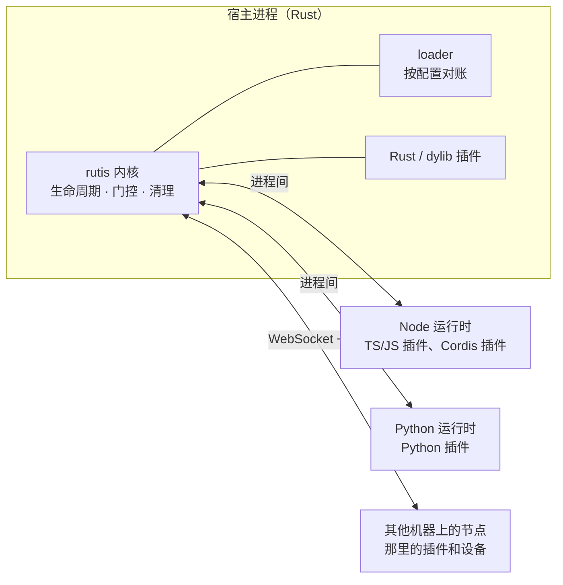

# rutis 设计哲学

[English](design-philosophy.en.md) · [内核设计](design-rust-port.md) · [内核能力一览](core-features.md)

状态：现行。日期：2026-10-08。

本文说明 rutis 为什么是现在这个样子，以及判断一项能力该不该做时依据什么。读者是想了解 rutis 定位的使用者和参与开发的贡献者。具体机制见各设计稿，这里讲出发点、由它推出的原则，以及为此付出的代价。

## 一句话

**rutis 是让软件自己连接和适应环境的躯干。** 它用 Rust 提供一个稳定的插件内核，通过其他语言的插件和其他机器上的插件连接更多的运行时、系统进程和设备，让宿主程序自己建立、认识和迭代它与环境之间的连接。

文中会用到几个词：

- **宿主**：运行插件的程序，可以是 `rutis-host`，也可以是嵌入 rutis 的 Rust 应用。
- **插件**：可以单独装上和卸下的功能单元。它提供**服务**（按名字或类型共享的对象），也使用别的插件提供的服务。
- **fiber**：每个插件在内核里的生命周期容器，记录它处在等待、运行、失败还是卸载中。
- **门控**：插件声明的依赖全部就绪才启动，任何一个撤销就停下。
- **loader 与行**：loader 按配置决定运行哪些插件，配置里的每一项叫一行。
- **运行时**：某种语言的进程，例如一个 Node 进程或一个 Python 进程，同一语言的插件都装在里面。

## 一、问题：软件要自己去连接环境

当软件本身是一个 agent，或者由 agent 开发时，它最需要的能力是快速接触周围的环境：本机的文件和应用、某个 Python 库、另一台机器上的设备，并且能看清自己已经接上了什么、哪里出了问题，再去改进。

这里有一个容易被忽略的前提：**发起连接的是宿主自己，而不是环境的维护者。** 环境不会为这个宿主准备好接口；需要什么，宿主就得自己接上去，接得不好就换掉。所以宿主需要的不只是某几项能力，而是获得能力的能力：

- **建立连接**：用最合适的语言写一个插件，在本进程、别的进程或别的机器上运行；
- **认识连接**：知道每个插件处在什么状态、依赖什么、提供什么，缺了什么；
- **迭代连接**：改了代码就重新加载，换掉一个实现时使用它的部分自动跟上；
- **迭代中不出错**：频繁地装上、卸下、替换，不留下没清理的资源。

rutis 就是为提供这四件事而设计的。

## 二、一个例子：给 agent 接上日历

设想一个 agent 宿主需要知道用户今天的日程。

**第一天：先用 Python 接上。** CalDAV 的库在 Python 里最现成，agent 就用 Python 写一个提供 `calendar` 服务的插件：

```python
from rutis import define_plugin


class Calendar:
    def __init__(self, url):
        self.url = url

    async def today(self):
        return await fetch_events(self.url)   # 用任意 CalDAV 库读取今天的日程


def apply(ctx, config):
    ctx.provide("calendar", Calendar(config["url"]))


plugin = define_plugin(apply, provides={"calendar": Calendar})
```

用日程的是一个 TypeScript 写的 `planner` 插件。它只声明依赖 `calendar`，不知道也不关心对方用什么语言写、在哪里运行：

```ts
import { definePlugin } from '@arcships/rutis'

interface Calendar { today(): Promise<string[]> }

export default definePlugin({
  inject: ['calendar'],
  provides: { planner: { plan: 'async' } },
  apply(ctx) {
    const calendar = ctx.use<Calendar>('calendar')
    ctx.provide('planner', {
      plan: async () => `今天：${(await calendar.today()).join('、')}`,
    })
  },
})
```

```json
{
  "runtimes": { "node": { "project": "." }, "py": { "project": "plugins" } },
  "rows": [
    { "id": "calendar", "name": "py:caldav_calendar", "config": { "url": "https://dav.example.com/me" } },
    { "id": "planner", "name": "./planner.ts" }
  ]
}
```

开发 `calendar` 时用 `rutis-host dev` 运行它，改了文件就重新加载；`planner` 随之停下、再启动，宿主不用重启。`rutis-host run` 打印每一行状态的变化，`rutis-host check` 列出每一行的依赖和提供的服务，宿主随时知道自己接上了什么。

**第二周：日历服务只能从内网访问。** 把 `calendar` 那一行搬到内网机器上的节点里，由那台机器运行并导出 `calendar`；本机把那一行换成一条到它的连接，导入这个服务：

```json
{ "id": "office", "name": "rutis-bridge/peer", "config": { "peer": "office", "dial": "wss://office.example.com/rutis", "import": ["calendar"] } }
```

连接断开时，`calendar` 撤销，`planner` 停下等待；重连以后两者自动恢复。`planner` 的代码一行没改。

**第三个月：固化成 Rust。** 这项能力已经稳定，调用也频繁，宿主改为[嵌入 rutis 的 Rust 应用](guide/rust-host.md)，用 Rust 实现同名的 `calendar` 服务，删掉原来那一行。对 `planner` 来说，这只是同一个服务换了一个提供者。

这个例子里的每一步，都对应下文的一条原则。

## 三、rutis 的形状

### 一个小型应用操作系统

程序一旦接受插件，就要回答操作系统要回答的那些问题：谁先启动，缺了依赖怎么办，一个部件被替换时谁要跟着重启，卸载有没有留下东西，部件之间怎样调用。rutis 把这些问题收进一个小内核，用同一套生命周期规则回答：

| 操作系统 | rutis |
| --- | --- |
| 内核：小、稳定、很少改 | `rutis` 内核，只依赖 tokio、tokio-util、thiserror |
| 进程 | 插件；语言运行时、远端节点、dylib 也都是插件 |
| 系统调用 | 服务，按名字或类型提供和使用 |
| 驱动 | 挂载与桥：Cordis 挂载、语言运行时、节点连接 |
| 调度与监管 | 依赖门控、依赖驱动重载、loader 按配置持续对账 |
| 资源回收 | 每项清理恰好执行一次，按注册的逆序执行，失败时回滚 |
| 自省 | `diagnostics()` 列出每个插件的状态、依赖和服务绑定；清理树；投递前观察 |

### Rust 做躯干，其他语言做触手



必须长期不出错的部分用 Rust：内核、生命周期、调度与清理。连接和适应的部分交给最合适的语言：Python 有 ML 和数据生态，Node 有 npm 和现成的 Cordis 插件，远端节点能触及另一台机器上的设备和进程。这正是 agent harness 的形状：一个稳定的躯干，加上可以随时生长、替换的触手。不再局限于一种运行时和语言，宿主能解决的问题和能接触到的资源就不再受某一个生态的限制。

### 从尝试到稳定是一条路径

尝试与稳定必然是一个过程。多语言运行时让这个过程不必换框架、不必重写使用方：

1. **尝试**：用 Python 或 TypeScript 快速写一个插件，可以由 agent 生成，在 `rutis-host dev` 下改了就重新加载。
2. **验证**：作为 loader 的一行在真实宿主里运行，和其他插件按服务互相依赖，服务的名字和方法在这一步稳定下来。
3. **固化**：被时间验证过的部分改写成 Rust（编进宿主，或作为 dylib 插件），换取稳定性和性能。

每一步之间，使用这项能力的插件都不用改。这和 [双核架构](design-dual-core-2026-08-20.md) 里"TS 是实验室，Rust 收毕业生"是同一个思路，推广到了任何已接入的语言。

## 四、和 Cordis、MCP 的关系

### Cordis：同一个模型，不同的世界

rutis 的生命周期模型来自 [Cordis](https://github.com/shigma/cordis)，两者的核心语义一致，见 [逐条对拍](cordis-spec-parity-2026-08-18.md)。Cordis 是 Koishi 的内核，它让大量插件作者几乎不用考虑生命周期就能写出装得上、卸得干净的插件，Koishi 的插件生态证明了这条路走得通。它借助 JS 的语言特性做到这一点：Proxy 让 `ctx.foo` 直接拿到服务，调用服务时副作用自动记在调用方名下。对一个所有部件都在同一个 Node 进程里的系统，这是正确的选择。

rutis 面对的是另一种世界：

| | Cordis | rutis |
| --- | --- | --- |
| 部件在哪里 | 同一个 Node 进程 | 不同语言、不同进程、不同机器 |
| 能力从哪来 | 框架内部的插件生态（npm 上的 Cordis 插件） | 连接外部已有的运行时、进程和生态，不自建生态 |
| 主要用户 | 大量插件作者 | 组装系统的宿主作者，以及 agent |
| 可以依赖什么 | JS 单线程、共享同一组对象、Proxy 等语言特性 | 只能依赖显式的契约：跨过进程以后，隐式约定都会失效 |

所以 rutis 不是 Cordis 的翻译。只在单进程里成立的机制，比如 Proxy 属性访问、按调用方改写上下文（traceable 与 caller-shadow）、`Context.filter`、`internal/*` 钩子，rutis 不照搬；跨进程以后才出现的问题，比如多线程下的顺序、跨进程撤销服务、断线重连、协议版本，rutis 当作一等问题处理。

### MCP：连接停在宿主外面，还是成为宿主的一部分

MCP 擅长把现成的能力以工具的形式交给模型：一个 server 列出工具，模型按需调用。rutis 和它的区别不在于谁来写连接（agent 同样可以自己写一个 MCP server），而在于连接在宿主里是什么：

- **单位不同。** MCP 的单位是一次工具调用；rutis 的单位是一个有依赖关系的部件。`planner` 依赖 `calendar`，`calendar` 消失时 `planner` 停下，回来时 `planner` 重新启动。MCP 的 server 之间没有这种关系。
- **归属不同。** MCP 的能力停在宿主外面，宿主只能调用它；rutis 里接上的能力是宿主的一部分：有生命周期，能被观察、替换、清理，也能使用宿主和其他插件提供的服务。

两者可以并存：一个 MCP 客户端完全可以是 rutis 里的一个插件，把某个 server 的工具作为服务提供给其他插件。但宿主能做什么，不应只取决于外面有哪些 server。

## 五、原则

### 内核

1. **范式只实现一份，在 Rust 内核里。** 依赖门控、启动停止、重载、清理、配置热更新只在 rutis 里有一份实现，其他语言一侧不复刻框架（[多语言设计](design-multilang-runtimes-2026-10-03.md) §二）。
2. **兼容工作在外层完成，不改内核。** 接一种新运行时、一个新协议，适配都放在桥、挂载和运行时插件里（[挂载需求](requirements-protocol-plugins.md) §1）。内核只因自身语义需要而改变。
3. **保证要写出来，并用测试钉住。** 单进程里天然成立的性质，例如事件按发射顺序处理，在多线程和跨进程后都会消失。rutis 把需要的保证逐条重建，写进决策表，用确定性的测试固定（[内核设计](design-rust-port.md) D31）。不提供的保证也写明。
4. **扩展点按具体需求开，开得窄。** 不提供万能钩子。有真实使用方时，针对那个动作开一个接口，例如投递前观察、服务读写拦截（[观察与拦截设计](design-cordis-observation.md)）。

### 连接

5. **接上的东西都是插件。** 语言运行时、远端节点、Cordis 挂载都是普通插件或 loader 的行，受同一套生命周期管理：运行时进程意外退出，它的行停下等待，由宿主决定是否重启；节点断线后自动重连，恢复后依赖它的插件重新启动。连接不享有生命周期之外的特权。
6. **其他语言的插件是叶子。** 每种语言一个运行时插件、一个进程。语言一侧只要一个很小的 SDK：`apply`、使用服务、提供服务、返回清理。唯一的例外是 Node 一侧保留完整的 Cordis，因为要复用 npm 上已有的 Cordis 插件。
7. **契约只约定跨边界真正需要的东西。** 跨语言调用需要服务名和方法形状（同步还是异步），这就是契约；不为此建通用的类型描述层或代码生成层。需要强类型的地方，例如 Rust 应用挂载 Cordis 插件，只在那一条边界上生成。
8. **跨边界后做不到的事写成边界规则，不假装做到。** 跨进程的 `emit` 只是通知、waterfall 不转发、同步调用不能等待对方的事件循环，这些都写在[边界规则](requirements-protocol-plugins.md) §5 里。宁可明确说做不到，也不静默降级。
9. **按需隔离。** 默认一种语言一个进程，同进程内的调用不走进程间通信；不稳定的插件可以单独放进另一个运行时实例。

### 适应

10. **换实现语言等于换提供者。** 同一个服务从 Python 实现换成 Rust 实现，对内核来说只是一次普通的提供者替换：旧的卸载，新的出现，使用方被短暂停下后自动重新装载。宿主不需要重启，使用方的代码不需要改。
11. **使用方不关心提供方在哪里。** 依赖声明里只有服务名，不出现语言和位置；同一个 `calendar` 可以来自本进程、另一个语言的进程或另一台机器。
12. **配置描述期望状态。** loader 用分层配置描述要运行什么，并持续对账。环境变化时改配置，由 rutis 把现状收敛到配置描述的状态，而不是由宿主手写启动和停止的顺序。

### 显式

13. **显式优于隐式。** 服务用 `require` / `get` 显式获取，依赖在声明里写明，`TypedPlugin` 在编译期核对依赖。服务要替调用方登记资源时，由调用方显式传入自己的 `Ctx`，而不是像 Cordis 那样隐式改写上下文。隐式机制在同一个进程里很顺手，但跨不过进程边界。

## 六、代价

这些选择不是免费的：

- **进程与延迟。** 每种语言至少一个进程；跨语言的同步调用约 30µs（Node 侧实测），远比进程内调用慢。频繁调用的能力最终应该固化到 Rust 或放进同一个运行时。
- **语义降级。** 跨过进程边界后，事件只能是通知，waterfall 不转发，`instanceof` 不成立（见原则 8）。插件要按边界规则来写。
- **故障范围。** 同一个运行时里的插件共享一个进程，一个插件让进程崩溃，同进程的插件一起停下。隔离要靠多开运行时实例，代价是更多进程。
- **环境依赖。** 用到哪种语言，就要有那种语言的环境：Node 24+、Python 3.12+，部署时要带上依赖。
- **写法更啰嗦。** 显式获取服务、显式传入 `Ctx`，比 Cordis 的 `ctx.foo` 多写几个字。
- **维护面。** 每接一种语言，就多一个运行时和一个 SDK 要长期维护。这是第七节第一个问题要把关的原因。

## 七、判断一项能力该不该做

提出新能力时，依次问：

1. **它扩大了宿主能连接或适应的范围，或者让宿主更能认识和迭代自己的连接吗？** 接一种运行时值不值得，看它带来多少生态能力，而不是为了多支持一种语言。Python 带来 ML 和数据生态；只能传数据的 Shell 类语言用不上服务、门控和清理这套模型，做成命令型的工具运行时，不进插件协议。
2. **它能放在内核之外吗？** 能放在桥、挂载、运行时插件、loader 或 host 里的，就不进内核。
3. **它跨过边界后还成立吗？** 只在单进程或单语言里成立的机制，不进入跨边界的契约；确实需要的，在单一边界上局部实现，并写明范围。
4. **它有具体的使用方吗？** 没有使用方的扩展点和兼容层不做，有了再按那个动作开窄接口。
5. **它的保证能写成测试吗？** 说不清、测不了的承诺不做。例如内核不承诺依赖环检测：服务可以在运行中动态注册，环无法证明。

## 八、还开放的问题

- **权限。** 现在的信任粒度是"可信的对端"：只对可信节点开放代为运行插件，同一运行时里的插件共享进程、必须互信。接上的设备和外部运行时越多，越需要更细的授权：哪个节点、哪个插件可以提供或使用哪些服务。
- **契约的演进。** 服务名加方法形状足够支撑现在的跨语言调用。"先 Python、后 Rust"要做到无缝，同一服务在不同语言里的数据形状也要一致，这一层目前靠约定。
- **依赖环诊断。** 内核不承诺环检测，但 loader 和 host 掌握插件声明的服务，可以把疑似的环作为诊断信息报告出来。
- **更多运行时。** macOS 系统能力（Swift）和 Go 的运行时在计划中（[多语言设计](design-multilang-runtimes-2026-10-03.md) §十一），按真实需求逐个接入。

## 相关文档

- [内核设计](design-rust-port.md)：五支柱与决策表
- [与 Cordis 的逐条对拍](cordis-spec-parity-2026-08-18.md)
- [双核架构](design-dual-core-2026-08-20.md)：TS 是实验室，Rust 收毕业生
- [多语言决策记录](decision-multilang-2026-10-03.md) 与 [多语言插件设计](design-multilang-runtimes-2026-10-03.md)
- [挂载 Cordis 插件：需求](requirements-protocol-plugins.md)
- [远程插件](design-remote-plugins-2026-10-03.md) · [连接节点](guide/nodes.md)
