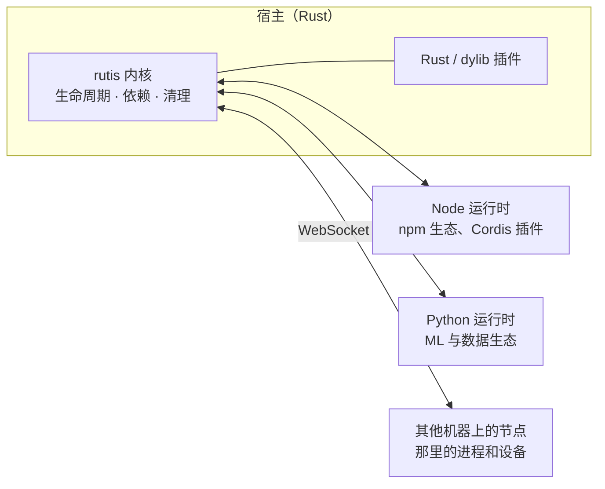
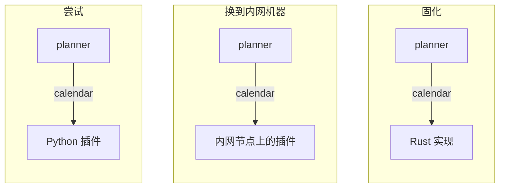

# rutis 设计哲学

[English](design-philosophy.en.md) · [内核设计](design-rust-port.md) · [内核能力一览](core-features.md)

状态：现行。日期：2026-10-08。

**rutis 是一个为能自我迭代、适应环境的软件而设计的应用操作系统，是一个连接与适应的躯壳。**

它的生命周期模型来自 [Cordis](https://github.com/shigma/cordis)，但出发点不同：Cordis 在一个进程里经营一个插件生态；rutis 要让宿主程序自己去连接更多的运行时、进程和设备，并且能认识和迭代这些连接。

本文说明这个出发点，以及由它推出的形状、代价和原则。具体机制见各设计稿。

## 一、软件要自己适应环境

当软件本身是一个 agent，或者由 agent 开发时，它最重要的追求是能快速与环境和周边打交道、建立连接，并且能有效地认识和迭代自己与环境连接的能力。

**发起和制作连接的主体，是软件宿主本身，而不是环境的维护者。** 这是 rutis 不做成 MCP 这类协议的原因。MCP 解决的是环境一侧的问题：环境的维护者把能力包装成 server，宿主去调用。连接停在宿主外面，宿主能做什么，取决于外面有什么。rutis 解决的是宿主一侧的问题：宿主需要接触什么，就自己写一个插件接上去（用最合适的语言，也可以由 agent 来写），试用、修改、替换，这个连接从此成为宿主的一部分，有生命周期，能被观察和清理。两者可以并存，一个 MCP 客户端也可以只是宿主里的一个插件；但宿主的能力边界不应由环境决定。

所以越来越重要的，是让宿主本身拥有**适应与迭代访问环境的能力**：

- **建立连接**：用任何已接入的语言写插件，在本进程、别的进程或别的机器上运行；
- **认识连接**：`diagnostics()` 列出每个插件的状态、依赖和服务绑定；`rutis-host check` 列出每一行插件的依赖和提供的服务；
- **迭代连接**：改了代码就重新加载，配置热更新，换掉一个实现时使用它的插件自动跟上；
- **迭代中不出错**：依赖未就绪就不启动，卸载时每项清理恰好执行一次，失败时回滚。频繁地装上、卸下、替换，也不会留下残留。

## 二、插件系统是一个小型应用操作系统

程序一旦接受插件，就要回答操作系统要回答的那些问题：谁先启动，缺了依赖怎么办，一个部件被替换时谁要跟着重启，卸载有没有留下东西，部件之间怎样调用。rutis 把这些问题收进一个小内核：

| 操作系统 | rutis |
| --- | --- |
| 内核：小、稳定、很少改 | `rutis` 内核，只依赖 tokio、tokio-util、thiserror |
| 进程 | 插件；语言运行时、远端节点、dylib 也都是插件 |
| 系统调用 | 服务，按名字或类型提供和使用 |
| 驱动 | 挂载与桥：语言运行时、节点连接、Cordis 挂载 |
| 调度与回收 | 依赖就绪才启动，依赖消失就停下，卸载时按注册的逆序清理 |

这个操作系统的"外设"，是其他运行时和系统进程。**多语言插件和远程插件不是附加功能，而是它存在的理由**：每接入一种运行时、一台机器，宿主能触及的能力就多一块。

## 三、Rust 做核心，其他语言做连接与适应

插件系统本身必须比跑在它上面的任何东西都稳定，并且容易扩展、容易长期稳定地维护。所以核心用 Rust 写，生命周期的模型只在这里实现一份，每一条语义保证都用测试钉住；其他语言一侧只有一个很小的 SDK，不复刻框架。

连接和适应则交给最合适的语言。这本身就很符合 agent harness 的概念：一个稳定的核心，加上可以随时接入、替换的各种运行时。当宿主不再止步于某一种运行时和语言，它能解决的问题和能接触到的资源，就不再受任何单一生态的限制。

## 四、借助各语言的生态，从尝试走到稳定

不同语言的运行时带来不同语言栈上的生态能力：Python 有 ML 和数据处理，Node 有 npm 和现成的 Cordis 插件，远端节点带来另一台机器上的进程和设备。

尝试与稳定必然是一个流程，多语言运行时自然覆盖了从代码尝试到正式落地的整条路径：

1. **尝试**：先用 Python 或 TypeScript 快速接入，可以由 agent 来写，在 `rutis-host dev` 下改了就重新加载；
2. **验证**：在真实的宿主里运行，和其他插件互相使用服务，服务的名字和方法在这一步稳定下来；
3. **固化**：被时间验证过的部分改写成 Rust，换取稳定性和性能。

这条路径走得通，靠的是从 Cordis 继承来的生命周期模型：**插件依赖的是服务的名字，不是某个实现**，实现换了，依赖它的插件会自动停下、再启动。所以换实现语言、换运行位置，对使用方来说只是同一个服务换了一个提供者：

三个阶段里，`planner` 一行代码都不用改，宿主也不用重启。这和 [双核架构](design-dual-core-2026-08-20.md) 里"TS 是实验室，Rust 收毕业生"是同一个思路，推广到了任何已接入的语言。

## 五、与 Cordis 的根本区别

rutis 从 Cordis 继承了生命周期模型，核心语义一致，见 [逐条对拍](cordis-spec-parity-2026-08-18.md)。Cordis 是 Koishi 的内核，它让大量插件作者几乎不用考虑生命周期，就能写出装得上、卸得干净的插件；对一个所有部件都在同一个 Node 进程里的系统，它借助 JS 语言特性的隐式写法是正确的选择。

两者根本的不同，是 rutis 按照连接与适应躯壳的理念来设计：

| | Cordis | rutis |
| --- | --- | --- |
| 要做什么 | 在一个进程里经营一个插件生态 | 让宿主连接和适应它所处的环境 |
| 能力从哪来 | 框架内部的插件（npm 上的 Cordis 插件） | 连接外部已有的运行时、进程、设备和生态，不自建生态 |
| 部件在哪里 | 同一个 Node 进程 | 不同语言、不同进程、不同机器 |
| 可以依赖什么 | JS 单线程、共享的对象、Proxy 等语言特性 | 只能依赖显式的契约：跨过进程以后，隐式约定都会失效 |

所以 rutis 不是 Cordis 的翻译。只在单进程里成立的机制（Proxy 属性访问、按调用方改写上下文、`Context.filter`、`internal/*` 钩子）不照搬；跨进程以后才出现的问题（多线程下的顺序、跨进程撤销服务、断线重连、协议版本）当作一等问题处理。

## 六、代价

- **进程与延迟**：每种语言至少一个进程；跨语言的同步调用约 30µs（Node 侧实测），远慢于进程内调用。调用频繁的能力最终应该固化到 Rust，或者放进同一个运行时。
- **语义降级**：跨过进程边界后，事件只能是通知，waterfall 不转发，`instanceof` 不成立，见 [边界规则](requirements-protocol-plugins.md) §5。
- **故障范围**：同一个运行时里的插件共享一个进程，一个插件让进程崩溃，同进程的插件一起停下。隔离要靠多开运行时实例。
- **环境依赖**：用到哪种语言，就要有那种语言的环境（Node 22+、Python 3.12+），部署时一起带上。
- **写法更啰嗦**：显式获取服务、显式传入上下文，比 Cordis 的 `ctx.foo` 多写几个字。
- **维护面**：每接入一种语言，就多一个运行时和一个 SDK 要长期维护。

## 七、原则与判断标准

这一节由前面的主张推出，主要写给参与开发的人。

### 原则

1. **范式只实现一份，在 Rust 内核里**；其他语言的插件是叶子，只有很小的 SDK（[多语言设计](design-multilang-runtimes-2026-10-03.md)）。
2. **兼容工作在外层完成，不改内核**（[挂载需求](requirements-protocol-plugins.md) §1）。
3. **保证要写出来，并用测试钉住**；不提供的保证也写明（[内核设计](design-rust-port.md) D31）。
4. **扩展点按具体需求开，开得窄**，不提供万能钩子（[观察与拦截设计](design-cordis-observation.md)）。
5. **接上的东西都是插件**：运行时、节点、挂载受同一套生命周期管理，不享有特权。
6. **契约只约定跨边界真正需要的东西**：服务名和方法形状（同步还是异步），不建通用的类型层。
7. **跨边界做不到的事写成边界规则**，不静默降级。
8. **依赖声明里只有服务名**，不出现语言和位置。
9. **配置描述期望状态**，由 loader 持续对账，而不是由宿主手写启停顺序。
10. **显式优于隐式**：隐式机制跨不过进程边界。

### 判断一项能力该不该做

1. 它扩大了宿主能连接或适应的范围，或者让宿主更能认识和迭代自己的连接吗？接一种运行时，看它带来多少生态能力，而不是为了多支持一种语言。
2. 它能放在内核之外吗？
3. 它跨过进程边界后还成立吗？
4. 它有具体的使用方吗？
5. 它的保证能写成测试吗？

## 八、还开放的问题

- **权限**：现在的信任粒度是"可信的对端"。接上的设备和外部运行时越多，越需要更细的授权：哪个节点、哪个插件可以提供或使用哪些服务。
- **契约的演进**："先 Python、后 Rust"要做到无缝，同一服务在不同语言里的数据形状也要一致，这一层目前靠约定。
- **依赖环诊断**：内核不承诺环检测，但 loader 和 host 掌握插件声明的服务，可以把疑似的环报告出来。
- **更多运行时**：macOS 系统能力（Swift）和 Go 的运行时在计划中（[多语言设计](design-multilang-runtimes-2026-10-03.md) §十一），按真实需求逐个接入。

## 相关文档

- [写一个 Python 插件](guide/python-plugin.md) · [写一个 TypeScript 插件](guide/typescript-plugin.md) · [连接节点](guide/nodes.md) · [在 Rust 应用里嵌入](guide/rust-host.md)
- [内核设计](design-rust-port.md) · [与 Cordis 的逐条对拍](cordis-spec-parity-2026-08-18.md) · [双核架构](design-dual-core-2026-08-20.md)
- [多语言决策记录](decision-multilang-2026-10-03.md) · [多语言插件设计](design-multilang-runtimes-2026-10-03.md) · [远程插件](design-remote-plugins-2026-10-03.md)
