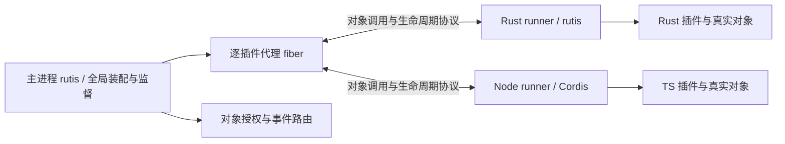

# 协议插件设计：基于 rutis / Cordis 的跨语言对象与插件体系

> 2026-09-27 重设计；替代本文件此前以 schema 方法调用为中心的方案。
> 状态：设计提案，尚未实现。API、消息名与描述符均为草图，冻结门槛见 §16。
> 源码基准：rutis main `446e58d`；需求 [#46](https://github.com/arcships/rutis/issues/46)、[#47](https://github.com/arcships/rutis/issues/47)、[#48](https://github.com/arcships/rutis/issues/48)。
> [#41](https://github.com/arcships/rutis/issues/41) 已关闭，基准已包含代绑定 Ctx；接入仍需回归。
> 第一优先目标：Rust 插件基于 rutis，TS 插件基于 Cordis，双向提供和消费对象。

本文“必须 / 不得”是硬约束，“建议”是可说明理由偏离的建议，“可”是可选能力。
“协议”指 rutis 与 Cordis 之间拟议的互操作协议，不声称 Cordis 已有本文定义的通用对象线协议。

## 一、目标：插件使用对象，框架负责跨进程

**插件提供服务对象，其他插件通过各自语言的上下文取得并使用它；真实对象留在原进程，框架在对端提供代理。**
返回值、参数、事件载荷中都可以包含对象引用。作者不需要自己维护对象 id、JSON 路由和远端资源账本。
JSON Schema 只约束数据部分；它不是“只许暴露纯数据”的边界。

首批必须同时实现：

- Rust runner 内运行真正的 rutis 插件，复用 Plugin / PluginFactory、Ctx、依赖门控、effect 和子插件机制。
- Node runner 内运行真正的 Cordis 插件，复用 Context、inject、Service/服务注册、事件和清理机制。
- TS 消费 Rust 对象、Rust 消费 TS 对象；方法可以返回有状态对象，该对象可以继续调用或传回。
- 两种 runner 都支持多个插件共用进程，每插件有独立宿主代理 fiber、上下文和装载代。

不另造一套要求 Rust/TS 作者放弃 rutis/Cordis 的插件接口。需要补的是协议适配层、对象接口声明和代理生成。
不承诺任意现有插件无需修改即可跨进程：同步远程访问、语言反射和未声明的接口必须显式适配。

首版本机 Linux 私有 IPC；Rust↔TS 的对象、回调、异步事件、服务端流及故障语义验收后，再接其他语言。
网络远程接入、跨进程共享堆、任意 Rust trait 自动导出、任意 JS 原型远程反射、客户端/双向流、状态迁移和无中断更新不在首版范围。
资源配额、内存/CPU/并发/速率上限与默认时限仍不在本轮设计。

## 二、作者体验与兼容边界

以下为生成接口后的使用草图，不是已经存在的 API。

```ts
// 一个正常的 Cordis 插件；database 来自 Rust，但作者不处理对象编号。
export const inject = ['database']
export async function apply(ctx: Context) {
  const connection = await ctx.database.connect({ name: 'main' })
  ctx.effect(() => () => connection.release()) // 拟议代理释放 API
  await connection.query({ sql: 'SELECT 1' })
  await ctx.database.inspect(connection)      // 传回的是同一个对象的引用
}
```

```rust,ignore
// 真正 rutis Plugin::apply 内；生成的代理适配为该进程的本地服务类型。
let database = ctx.require_as::<DatabaseClient>(database_key.clone())?;
let connection = database.connect(Connect { name: "main".into() }).await?;
connection.query(Query { sql: "SELECT 1".into() }).await?;
database.inspect(connection.clone()).await?;
// 对象导入范围登记在本代 ctx，卸载兜底释放；可提前显式 release。
```

服务提供者把真实对象注册到 rutis/Cordis，再由导出适配器暴露声明的接口。业务对象无需实现 wire dispatcher。
已有本地 trait/Service 与生成接口不同，则写一次类型适配；不能靠同名让任意 Rust trait 或 JS 对象自动变成可远程接口。

| 行为 | 同进程原生对象 | 跨进程代理 |
| --- | --- | --- |
| 服务获取 | 本地上下文与依赖门控 | 提前安装已授权代理，仍从本地上下文获取 |
| 方法调用 | 保留语言原有行为 | 异步调用；Promise / Future 明示等待和错误 |
| 返回活对象 | 原对象/Arc | 保留身份的对象代理，不序列化整个对象 |
| 属性读取 | 本地字段/getter | 不变快照字段或显式异步 getter；不悄悄同步阻塞 |
| 对象相等 | 本地语言身份 | 同一导入范围与权限视图内稳定；跨视图使用协议身份比较 |
| 函数参数 | 普通闭包 | 已声明签名的回调对象；不发送源码或闭包捕获内容 |
| 卸载 | 本地框架清理 | 本地框架清理 + 撤销远程对象、回调、订阅与调用 |

例如 `actor.agent.session` 只有在这些字段被明确声明为不可变对象关系、代理已物化时才能直接导航。
可变或惰性关系使用 `await actor.getAgent()` 等接口，不用 JSON 快照冒充活对象。
代理不是语言级透明分布式内存；不远程执行任意字段赋值、枚举 getter、`instanceof` 或原型链访问。

## 三、已有基础与实际差距

| 现有基础 | 复用与需要补齐的部分 |
| --- | --- |
| [rutis Plugin](../crates/rutis/src/plugin.rs)、[Ctx](../crates/rutis/src/ctx.rs)、[fiber](../crates/rutis/src/fiber.rs) | 直接用于 Rust runner 和宿主代理；补代门控、对象导入/导出资源与本地状态上报 |
| [rutis 事件分发](../crates/rutis/src/bus.rs) | 复用作用域、监听归属及异步分发；接入跨语言注册与 continuation |
| [旧桥 RPC](../crates/rutis-cordis/src/rpc.rs) | 帧、请求和错误处理经验可复用；需补对象、双向取消、消费驱动和代隔离 |
| [CordisService](../crates/rutis-cordis/src/services.rs) | 现有实现是 JSON 方法分发，不是通用对象代理；不能仅换名称就宣称完成 |
| [TS 桥插件](../host/src/plugin.ts) | 已使用 Cordis；目前活对象会转成数据替身，需验证真正代理能保持对象身份 |
| [旧桥设计](design-dsh-bridge-2026-08-21.md) | 已指出 actor/agent/session 的身份关系影响插件行为，成为对象验收用例 |

当前 [host/package.json](../host/package.json) 固定 `@deepseek-ai/cordis` 4.0.1。
本轮另参考本机 Cordis 源码快照 `f8ea3cd` 的 Context/reflect/fiber/events；该快照不是上述已发布包的等价证明。
M0 必须锁定实际使用的 Cordis 包、来源和完整版本，核对可用的托管门控、清理及事件扩展点。
如果公共扩展点不足，先提交最小 Cordis 适配变更并测试；不得依赖未版本化的私有字段假装已经可用。

协议层拟放入独立 `rutis-protocol` crate 和配套 TS 包，避免破坏旧 `rutis-cordis` 消息。
Rust/TS 集成层依赖各自原生框架；公共线协议不依赖 Rust ABI、JS vtable 或 dsh 业务类型。

## 四、三层架构与生命周期权威



**主进程管理跨进程装配意图，各 runner 的原生框架执行本地生命周期。** 不在语言 SDK 内复制第二套 rutis。

| 层次 | 负责什么 | 不负责什么 |
| --- | --- | --- |
| 主进程 rutis | 静态服务图、授权、全局可用性、逐插件代理、组恢复 | 不持有远端业务对象的内存，不执行 TS 插件 |
| Rust/rutis、TS/Cordis runner | 本地插件、上下文、真实服务对象、effect、内部子插件 | 不自行替换全局 activation，不绕过宿主重启托管插件 |
| 协议 SDK | 接口注册、代理/导出表、编解码、调用/回调、资源归属 | 不让作者手工维护对象 id，不独立决定业务重试 |

一个“托管插件”对应一个主进程代理 fiber 和一个 runner 内顶层 fiber。
本地框架正常管理它的内部子插件；首版内部子插件不另建全局代理，其对外服务归属于托管根的 activation。
内部服务失效须撤销对应导出；若属于清单承诺的必要导出，整个托管根退出全局可用状态。
需要子插件独立部署、配置或故障边界时，把它声明为独立托管插件，不能让两套管理器同时拥有同一实例。

runner 为托管根注入代绑定的执行门控，只有宿主发起 start 才能打开。本地框架发现依赖失效可以立即停止业务并上报，不能等待远端许可才撤销对象。
本地刷新不得在旧 activation 中自动再次 apply；门控须在本地本次装载失效时闭锁，新一次装载要求宿主签发新 activation。
M0 验证这一点；若 rutis/Cordis 当前入口不能保证，增加显式托管适配点，不靠观察状态后补救竞态。

## 五、runtime 组、包与部署

同语言、框架/解释器版本、依赖环境和信任边界兼容的插件可共享 runner 进程；每插件仍有独立上下文和代。
共享是优先验证的默认方案，M2 对比共享/单成员组的启动、RSS/PSS、更新和故障影响后再定默认值。
TS 与 Rust 分别测量，不预设节省比例，也不要求全宿主每语言只能有一个进程。

Rust 首版 runner 在构建时静态链接所选 rutis 插件，通过工厂表装载；单成员可独立发布，多成员需要部署方统一构建。
同一 Rust runner 内依赖正常遵守 Rust 编译兼容性；不同 runner 与主进程之间只需协议兼容，不需匹配 rustc/SDK ABI。
后续可在 runner 内复用 [dylib SDK](design-dylib-sdk-2026-09-24.md)，但它不是 Rust 协议插件的首版前置。
TS runner 装载锁定版本的 Cordis 与插件模块；代码/依赖变更重启整组，不用删除模块缓存假装卸载干净。

```toml
[plugin]
id = "example.database"
version = "1.0.0"
runtime = "rust-rutis"       # TS 使用 node-cordis
factory = "database"         # TS 使用 entry 指定包内模块
protocol_family = "rutis-cordis-objects"
protocol_version = "0.experimental"

[[provides]]
name = "database"
interface = "example.Database"
version = "1.0.0"
bundle_sha256 = "<64 hex digits>"
```

包包括完整接口 bundle、配置描述、代码和依赖摘要。Rust 产物清单绑定 runner 哈希、factory 与接口；缺失 factory 在准备期拒绝。
宿主部署描述指定实例、runtime 组、requires→provider 路由、exports、事件权限和配置。
接口模块可以闭合引用其他对象接口，不要求每个返回对象都是独立命名服务。
prepare 只读包和配置、校验摘要与接口、冻结依赖和路由，不执行插件来探测它需要什么。
路径限包内相对路径，拒绝越界符号链接；执行用 argv。包版本目录不可变。
服务 requires 静态化，缺依赖 Pending；完整图检查循环，不支持用动态对象引用偷偷增加必需注入关系。

## 六、接口契约：值、对象和回调

接口描述符是统一语义来源，表达对象接口、方法、属性策略、事件、回调、流和所有权。
JSON Schema 2020-12 的受限子集只负责值类型与配置。对象引用不是 JSON Schema `$ref`，回调也不是一个可序列化函数。
可从 Rust/TS 声明生成描述符，但所有语言须消费同一份打包字节；M1 先实现描述符→两端绑定，不依赖运行时反射猜接口。

```json
{
  "id": "example.database",
  "version": "1.0.0",
  "interfaces": {
    "Database": {
      "methods": {
        "connect": {
          "params": {"kind": "value", "schema": {"type": "object", "properties": {"name": {"type": "string"}}, "required": ["name"], "additionalProperties": false}},
          "result": {"kind": "object", "interface": "Connection", "ownership": "scope"}
        },
        "inspect": {
          "params": {"kind": "object", "interface": "Connection", "ownership": "borrow"},
          "result": {"kind": "value", "schema": {"type": "boolean"}}
        }
      }
    },
    "Connection": {
      "methods": {
        "query": {
          "params": {"kind": "value", "schema": {"type": "object", "properties": {"sql": {"type": "string"}}, "required": ["sql"], "additionalProperties": false}},
          "result": {"kind": "value", "schema": {"type": "array", "items": {"type": "object"}}}
        }
      }
    }
  }
}
```

这是描述符片段，省略通用错误、能力要求与方法执行策略；M1 schema 冻结前不可当作完整包直接发布。
描述符还需表达 `record/list/optional` 中嵌套对象、回调签名及借用/保存方式。
合法对象图可以有环：`session.agent.session` 指向同一身份；禁止递归展开成无限 JSON。
值 schema 首版只用对象/数组/布尔/null/有限数字/字符串/enum/判别 union 与 bundle 内无环值 `$ref`。
不支持外部 schema 下载、任意正则、任意语言对象序列化；整数超过 JS 安全范围用声明的十进制字符串。

接口身份为精确版本加 bundle 原始字节 SHA-256，准入时校验整个可达接口集合。
小版本增加成员也先走显式多版本适配；这是保守过渡方案，不能用 semver 代替兼容证明。
对象/回调的方向、异步行为、权限和生命周期是契约的一部分，不能只检查参数 JSON。

## 七、对象身份、代理与授权

### 7.1 真实对象与引用

对象身份包含 `owner runtime epoch + owner activation + object id`；主进程原生对象也有明确的 owner 代。
owner 的导出表按有效 grant/执行 pin 持有真实对象，本地稳定身份映射保证仍存活的同一对象重复导出时身份一致。对象 id 在本 epoch 内不复用。
Rust 持有注册的 Arc；TS 使用对象身份映射，不按字段相等合并对象。显式 release 后再次导入允许生成新代理包装。

调用者持有的是 `ObjectRef` 代理与授权凭据，不持有远端业务对象内存。
同一导入 scope、对象身份和接口权限视图复用代理，TS `===` 和 Rust 代理身份比较保持稳定；权限视图包含授权来源，来源不同不混用撤销状态，不可因缓存合并而扩大权限。
跨视图提供显式 `sameObject` 比较身份，比较身份本身不授予调用权。回传 owner 时解析为原真实对象，不复制一份。
业务 `close()` 是对象方法；代理 `release()` 是放弃本 scope 的远端访问，两者必须分开，释放代理不自动调用任意业务 close。

### 7.2 授权与转交

宿主 broker 为“接收者 activation + 对象身份 + 接口视图 + 来源授权”登记不透明 grant。
Object id 不是凭证。每次调用校验调用者、grant、owner 代、接口、方法、作用域与当前可用性。
同组跨托管插件调用首版也经 broker，避免本地快捷路径绕过撤销和权限；单插件内部对象仍直接调用。

方法返回对象、事件携带对象、参数转交对象都经 SDK 自动登记，并由 broker 校验目标接口和转交许可。
首版 grant 默认不向第三方转交；传回原 owner 允许但仍验证来源。需要 A→B→C 传递时，接口/部署显式允许 delegate。
派生 grant 保留授权来源链：owner 或任一授权来源失活都撤销下游，接收者清理只撤销其自己的授权分支。
对象转交不是绕过服务注入的动态服务注册；纯对象引用失效使操作返回错误，不自动把每条对象关系变成 fiber 必需依赖。
命名服务 provider 失效则走正常依赖驱逐；回调对象失效不能反过来驱逐整棵服务图。

### 7.3 属性、图与状态

接口可以声明不可变值快照、不可变对象关系，以及异步 get/set 方法。不得默认遍历用户 getter 或递归序列化任意对象。
不变关系通过带身份的对象表物化：先建立全部代理，再连接关系，所以有环也只创建一次；所有引用逐项授权。
变化的状态由方法/事件观察，不把本地缓存声称为远端当前值。直接属性写入、未声明成员及 `__proto__` 等反射入口拒绝。
同步属性只访问已物化的声明内容；不能靠阻塞 Node 事件循环或 Rust executor 来模拟远程同步 getter。

## 八、对象与任务的生命周期

不实现分布式垃圾收集器。每个导入引用、导出 pin、回调、订阅、调用与流必须属于明确 scope。
scope 可为 activation、显式子资源范围或一次调用；跨语言环不延长 scope 的生命。

| 操作 | 保证 |
| --- | --- |
| `borrow` 参数/回调 | 只在该调用实际执行和登记子任务期间有效；被保存后越界调用明确失败 |
| `scope` 返回对象/持久回调 | 接收者 scope 拥有 grant；显式 release 或 scope 卸载统一回收 |
| 导出对象 | owner activation 管理导出表的生命周期；根服务由本地框架持有，临时对象由 grant/call 保持存活，均不能阻止 owner 撤销 |
| 最后 grant 释放 | 无在飞调用后释放导出 pin；真实对象是否销毁由本地所有权决定 |
| 需要外部资源清理的对象 | 导出适配器登记明确 disposer，释放 pin 时执行；有本地用户的对象不使用独占 disposer 策略 |
| owner 失活 | 立即拒绝新操作，撤销全部派生 grant；在飞任务取消并仍被跟踪 |

同一 scope/权限视图及授权来源重复收到对象时合并为一个逻辑 grant，不累加无法观察的远端引用计数；不同 scope 和授权来源各自登记，回收不得相互误伤。
身份缓存使用弱引用或在回收时摘除，不能因缓存本身永久保活临时对象。独占 disposer 与可共享导出必须在接口/适配中区分，不能对仍有合法使用者的对象提前销毁。
显式 release 幂等，关闭该导入 scope 中所有对应代理别名；Rust Drop / TS finalizer 只能辅助，不能承担正确性保证。
TS finalizer 的不确定时机不影响 activation 卸载兜底。长期 activation 中的临时资源应使用子 scope 或显式 release。
不定义引用数量上限，但协议必须有释放路径和观测信息；不把内存配额后置误解为可以永不回收。

引用随结果/流项目发出前登记为待接收 grant，接收者物化成功后 accept，放弃则 release。
调用已取消、参数解码失败、事件没人消费或流项目被丢弃时，SDK/broker 回收未交付 grant；不能留下永远无人释放的对象。
断线回收接收者该 epoch 的所有 grant。在线但不响应的接收方保留可诊断的未确认记录，不假称回收；可关闭其 scope/插件进行收敛。
accept/release 乱序按单调状态幂等处理，release 后的 accept 不复活 grant；详细帧在 M1/M2 冻结。

取消用户等待不会立即释放仍在执行任务需要的 borrow/pin。先撤销新调用入口，完成确认后才释放执行引用。
owner 卸载不等待外部 release 才关闭闸门；本地清理等待任务或 disposer 完成，未确认则 StopUnconfirmed。

## 九、服务图、装载与恢复

### 9.1 服务安装与启动

1. prepare 冻结清单、必需注入、接口和授权；build 不执行插件代码。
2. supervisor 独立启动 runtime 并完成 hello，发布 `RuntimeReady`。不能等成员 apply 才启动进程。
3. 代理 fiber 的 RuntimeReady 与业务依赖就绪后，捕获本代服务绑定，签发 activation，先登记回滚清理。
4. runner 在托管根的注入作用域内安装导入代理，再交给真正 rutis/Cordis 装载插件。禁止其他 activation 访问这些绑定。
5. 本地插件启动期间只用已授予的依赖，导出对象先暂存；runner 报告本地装载完成及完整服务表。
6. 宿主核对清单与代，将导出包装成带可用性检查的本地服务；代理 apply 成功 Active 后才开放外部调用和事件。

协议入口需有 activation 发布屏障：宿主完成服务登记并确认 Active 后通知 runner 激活对外事件；此前事件登记为启动期暂存或明确返回未就绪，失败回滚时取消并释放载荷引用，不能宣称已派发。
发布前到达的合法对象调用等待该屏障或返回可辨识的未就绪错误，不进入未发布 handler；若本地此时已失效，activate 也不得重新打开旧代。
不要求整组所有插件同时 Ready。B→A 依赖时先启动 B，再启动 A，组内依赖不造成全组屏障死锁。
同名导出、缺导出、接口不匹配或部分启动失败回滚此 activation；无法确认清理则禁止新代。
Rust 的通用路由使用宿主构造的 TypeKey，生成适配器提供本地具体客户端类型；TS 在正确 Cordis scope 提供服务代理。
旧 Arc/JS 引用绑定旧代，不因全局同名 provider 更换而偷偷重绑。

### 9.2 停止与双端配对

失活先关闭服务、对象、回调和事件闸门，再发送 stop；runner 关闭托管门控，调用本地框架清理，并等待登记的任务与资源。
stop 完成意味着本地 fiber 清理及协议资源收敛，不只是收到命令。Closing 仍接收完成控制消息。
本地框架主动失败/退出时先撤销，再上报宿主，宿主驱逐消费者；不得在 runner 里悄悄换代并复用旧对象 id。
配置更新只重装目标插件；代码、runner 构建产物和依赖变更重启整组。修改注入/导出声明需重新部署实例。

超过调用方等待截止仍未清理完成，默认 StopUnconfirmed：暂停该实例、禁止自动重试、要求运维介入。
残余任务可能继续占用资源或执行 OS 副作用，撤销协议能力不等于停止这些行为。
迟到的完成确认解除未确认状态，但不自动重装。管理者可显式停止/重启整组；部署可预先选择自动升级策略。
普通 RPC 超时不触发整组强杀，不声明能安全强杀共享解释器里的单插件。

### 9.3 组故障与屏障

组崩溃、断线、强制重启时，先撤销 RuntimeReady 及全组 activation，取消调用、撤销 grant/订阅，驱逐相关消费者。
supervisor 独立推进进程及受管后代的终止/回收，不排在 fiber effect 清理之后。
旧成员及受驱逐消费者清理完成、旧进程确认回收后，才启动新 epoch、重新 hello 和按依赖装配；不恢复旧对象或请求。
单个对象 disposer 失败也须在屏障诊断中可见，不能只等待服务代理卸载就宣布结束。

若本地消费者卡住，保持 Ready 关闭；管理等待截止返回 `RecoveryBlocked`、阻塞 fiber/代和进程回收状态。
这是安全性优先于组可用性的明确取舍。重复 restart 不绕过屏障；停止阻塞任务的拥有者后可继续恢复。
无法协作退出的宿主本地任务需外部重启整个宿主，无同进程强制跳过入口；旧进程回收失败则 Quarantined，禁止新 epoch。
管理锁不跨 await；dispose/shutdown 的终态意图优先，旧重试不复活已删除实例。

## 十、调用、回调、取消与流

每次调用标识包含发起端 epoch、activation、call id；broker 分配路由关联，不以另一连接恰好相同的 id 匹配。
默认方法可并发执行，owner 负责对象内部同步。接口可声明有序执行，但不能在持有对象互斥锁时等待会回调该对象的远端操作。
连接接收泵、生命周期控制与业务 handler 分离；A→B→A 回调不能被单线程分发循环或“全对象调用串行锁”锁死。
M2 必测嵌套回调。同步 API 需要本地适配为异步，否则明确 unsupported，不能偷偷阻塞 executor。

回调是反向可调用对象，由 SDK 导出已声明签名的函数包装。默认 borrow；订阅等需要持久回调时使用明确 scope 并返回可释放订阅。
回调不传原始 Ctx，也不自动继承任意全局权限；其执行保持创建它的上下文/activation。
`this` 语义由接口适配明确绑定，不能把收到的数据对象当成可以伪造的 Cordis Context。

deadline 从本地调用接收起覆盖排队、写入、执行及流读取，过线传剩余时长。未发送时取消移出队列；已发送则发 cancel。
本地等待只结算一次，取消后仍跟踪实际执行；handler 和登记子任务结束后 `call/finished` 才确认完成，正常最终应答也可确认。
迟到完成/取消幂等，不恢复业务等待。派生调用传播剩余 deadline 与取消，未退出原生任务继续归属旧代。
不自动重试有副作用的调用；断线/超时结果可为执行情况未知，业务重试需自己的幂等契约。

服务端流按需拉取，未消费时生产者不能无限推进；流中对象项目服从 §8 的 grant 接收/释放规则。
取消/drop 撤销后续交付并等待独立执行完成，终态与在途消费确认幂等收尾。空流合法，顺序和最终状态明确。
首轮逐项 pull/ack，批量窗口和具体资源上限后置。控制帧与清理不得等待业务流消费者释放数据额度。

## 十一、事件与 Cordis 行为保真

事件不能统一降级成通知。跨界事件必须声明参数（可含对象）、作用域、分发模式、结果与错误规则。
主进程 broker 对已导出的事件维护唯一监听列表与顺序；本地框架通过适配器登记/移除监听，不把同一事件在两端各广播一遍。
托管事件经过指定适配入口，使用原始 Cordis 事件 API 的同步调用必须有兼容性检查；不影响纯本地未导出的事件。

| 模式 | 首版跨界语义 |
| --- | --- |
| 通知 emit | 本地入队即返回，不表示远端 handler 已完成；错误进入归属诊断，不能用于必须同步完成的业务 |
| parallel | 取一次有效监听快照并发调用，等待全部结束、汇总错误 |
| serial | 按权威列表顺序等待，按契约显式 Continue/Return 判断短路，不用跨语言 truthiness |
| waterfall | 使用调用范围的 next/terminal 回调对象，支持异步进入下游及返回上游；不是把值依次做 map |
| 同步 bail / 同步 waterfall | 本地行为保留；跨界必须显式迁为异步接口，否则拒绝，不能把 Promise 当同步结果 |

Cordis 版本对短路值和异常的具体行为须由适配器映射并用语料确认，不把 null/false/undefined 任意合并。
waterfall 的 next 最多调用一次，由权威分发端原子检查；重复调用、调用结束后再用、取消后继续 next 明确拒绝。
回调只能推进本次分发的下一项，不能伪造其他事件/作用域的 continuation。

监听属于创建它的 activation，注销先关闭回调准入；返回完成确认后不再启动新回调，在飞回调可仍在清理并被跟踪。
once 在执行前原子摘除，重入也只执行一次；prepend/注册顺序由 broker 序号表达，跨进程不存在可依赖的“同时注册顺序”。
派发使用快照，注销/失活的监听在真正执行前再次检查闸门；不因快照存在而调用已卸载实例。
事件 scope 由宿主授权，保留实例/子树过滤，不接受远端自报任意 scope id 或原始 Context.filter。
不支持表达的自定义过滤器在导出期拒绝，不能扩大为全局事件。

订阅安装有 ready 确认，调用方需要保证不漏首条事件时必须等待该确认；同步 ctx.on 不能假装远端已经完成注册。
事件携带同一 session 对象时，接收 scope 得到稳定代理，可作为本地 Map 的身份键；释放/换代后明确失效。

## 十二、传输、消息与错误

首版 Linux 每组一条继承的私有 Unix stream socket，u32 网络字节序长度 + UTF-8 JSON。
stdout/stderr 不承载协议。跨 runner 调用由主进程中转，owner 保有真实对象；无需全网状连接。
解析前检查长度/深度与结构，禁止按未验证长度分配；具体数值在实现验证后确定，不等于本轮设计资源配额。

| 消息族（拟议） | 语义 |
| --- | --- |
| runtime/hello、runtime/stop | 协议版本、框架版本、已实现能力、epoch 与组退出 |
| plugin/start、ready、activate、stop、state | 本地框架配对、发布屏障、清理和失效上报 |
| object/export、grant、accept、release、revoke | 对象登记、定向授权、接收确认与生命周期 |
| object/call、result、error、cancel、finished | 双向对象及回调调用，区分等待与执行完成 |
| event/subscribe、ready、unsubscribe、dispatch | 有作用域与分发模式的事件及订阅屏障 |
| stream/pull、item、end | 消费驱动、对象项目与终态 |

方法/返回值的载荷使用显式 tagged value：值、对象引用、回调或组合结构，不能把普通 JSON 中形似 id 的字段解释为能力。
正式协议必须冻结无歧义编码、引用表、版本、双向路由和错误 schema；消息名列表本身不算完成线协议设计。
原始对象 id/令牌不向业务日志泄漏，不接受任意成员路径作为调用表达式。

握手只报告 runtime 已可接收装载，不表示所有插件就绪；不二次 hello 重用 epoch。
生命周期消息以宿主授权为准，普通成员不能发组管理命令。正常业务错误只影响可归属的调用/activation。
损坏帧、半帧写失败、无法归属的控制消息终止连接并按组故障处理；正常迟到释放/完成不杀整组。
错误区分 InvalidParams、InterfaceMismatch、CapabilityDenied、StaleObject、ScopeClosed、Cancelled、DeadlineExceeded、Unavailable 与业务错误。
协议错误携带阶段及 `execution: not_started | unknown`；业务错误的结果含义由接口定义，不回显任意堆栈或秘密。

## 十三、权限、进程与诊断

协议授权限制经框架执行的对象操作，不是 OS 沙箱。同组代码共享地址空间、全局状态和环境，必须互信。
默认同用户运行，不保证秘密隔离；不可信代码的 UID/容器/平台 sandbox 属部署层，不把对象引用当安全沙箱。
不暴露真实内存指针、Rust TypeId、任意 Ctx、JS 原型或任意方法反射；接口适配器是明确的导出边界。

单插件停止只处理它的 scope；强停 runtime 影响全组。supervisor 回收旧进程及受管后代，有证据才开启新 epoch。
不强制 cgroup，也不把 kill 主 PID 声称为完整进程树回收；Linux 后端需实测，其他 OS 单独验收。
脚本操纵用户应用时，目标应用不自动归入 runtime 子进程树；副作用不承诺回滚。

诊断连接主进程代理与 runner 本地 fiber，展示两边状态、epoch/activation、导出对象、grant 来源、scope、调用和订阅。
能够回答“哪个插件持有这份对象访问权”“谁阻止回收”“是业务 close 还是代理 release”，但不记录业务对象内容。
StopUnconfirmed / RecoveryBlocked / Quarantined 分别展示残余任务、本地清理阻塞与进程回收失败，不合成 stopped 布尔值。

## 十四、已有桥迁移与其他语言

旧 `rutis-cordis`、dsh host 保留原握手及回归。新对象协议用独立 family/实验版本，不能把旧 JSON liveRef 当成可调用对象。
先选 Rust/rutis↔TS/Cordis 的真实服务迁移：至少包含返回对象、身份关系、反向回调与事件，不只迁移无状态 echo。
对照同进程原生运行与跨进程运行的可观察结果，列出同步接口改造和不能支持的边界。
切换先停止旧 provider，再开放新 provider；回退重建旧部署，不复制运行中对象状态或同时执行两套业务。
实际用例和回归通过并发布迁移说明后，才另议旧桥废弃窗口；不在本 PR 自动迁移 dsh 全栈。

Python、Go 等后续 SDK 实现上下文、服务对象、代理、事件和清理的公共范式，不需完整复制 rutis/Cordis 的所有内部机制。
Shell、PowerShell、AppleScript/JXA 可先实现能力子集；缺对象/回调/事件能力时必须拒绝相应接口，不能默默转成 JSON。
详细路线图及 Go 构建边界见[语言扩展路线图](roadmap-protocol-plugin-languages-2026-09-26.md)。

## 十五、验收矩阵

以下均待实现；使用真实 rutis、锁定版本的 Cordis 与真实进程，可控时序代替固定 sleep。

| 编号 | 场景 | 必须断言 |
| --- | --- | --- |
| T01 | 两个 Rust 插件、两个 TS 插件分别共享 runner | 真正 rutis/Cordis fiber，独立上下文、代和正常卸载 |
| T02 | Rust 与 TS 双向依赖注入 | 本地框架接口取得服务；无手写对象 id/JSON 路由；缺依赖不启动 |
| T03 | connect 返回有状态对象、再次调用并传回 owner | 同一真实对象，状态保持；两种方向都通过 |
| T04 | 同一对象重复返回、对象图有环 | scope/权限视图内稳定身份，Map 键有效，图不会无限展开 |
| T05 | 接口视图、伪造对象、第三方转交 | 权限不合并；默认拒绝转交，授权链撤销传播；回传 owner 正确 |
| T06 | 显式 release、scope 卸载、别名与跨语言环 | 幂等，停止新调用，pin/disposer 收敛，不依赖 JS GC |
| T07 | 取消/解码失败/未消费项目中含对象 | 未交付 grant 被回收，accept/release 竞态不复活 |
| T08 | A→B→A 回调与 borrow 越界 | 无接收泵死锁，保持创建者上下文，越界引用明确失败 |
| T09 | 持久回调与订阅注销、once 重入 | scope 清理，在飞任务有归属，once 只执行一次 |
| T10 | 属性和不变 actor.agent.session 关系 | 身份保持；可变远程属性需 await，禁止伪同步及反射穿透 |
| T11 | parallel/serial/waterfall 跨两端 | 顺序/短路/错误一致；next 最多一次、上下游返回与取消正确 |
| T12 | 事件 scope、同步 bail、订阅 ready | 不越作用域、不重复派发；同步跨界拒绝，ready 后不漏首事件 |
| T13 | RuntimeReady 与 start/activate、同组依赖 | 无引导死锁，无未发布对象/事件外泄，其他成员不必等全组启动 |
| T14 | 本地框架主动失效和自动 refresh | 立即闭锁并上报，不在旧 activation 重新 apply；新代由宿主签发 |
| T15 | 内部子插件与必要服务失效 | 本地拥有子树，对外归属托管根，无双重管理；撤销同步至宿主 |
| T16 | 正常配置更新、部分启动失败、代码更新 | 单插件与整组边界明确，回滚完整，不重绑旧对象代理 |
| T17 | 取消/应答/drop/finished 竞态与慢流 | 等待一次结算、执行仍跟踪；背压、不丢终态与对象释放 |
| T18 | StopUnconfirmed 及迟到完成 | 禁新代、明确干预；迟到确认不自动重装，强停展示整组影响 |
| T19 | 崩溃/断线/旧 epoch 迟到帧 | 所有对象/订阅失效；进程与旧代屏障前不恢复、不重放 |
| T20 | 本地消费者/disposer 卡住、进程回收失败 | RecoveryBlocked/Quarantined 准确；监督不被清理阻塞，无强行放行 |
| T21 | dispose/update/retry 并发及旧 Ctx | 终态优先，#41 代隔离成立，旧任务不污染新代 |
| T22 | schema/接口/能力不匹配与数据错误 | Rust/TS 同一合法/非法语料；不静默降级对象为数据 |
| T23 | 真实进程退出、受管后代回收与旧桥迁移 | 平台证据、旧桥回归及迁移/回退样例 |
| T24 | Rust/TS 各自共享与单成员对照 | 记录环境、启动/RSS/PSS、依赖、更新和故障影响，再决定默认分组 |

## 十六、实施顺序与冻结门槛

| 阶段 | 交付 | 完成条件 |
| --- | --- | --- |
| M0 原生框架接入 | 锁定 rutis/Cordis，托管根门控、本地失效上报、scope 与清理适配 | T14/T15/T21 原型；证明不需另一套语言插件内核 |
| M1 对象协议与绑定 | 接口描述符、值/对象/回调编码、grant 与 scope、Rust/TS 生成适配器 | 双向对象往返内存测试及 T04–T07/T22 语料，不能只做 DTO |
| M2 双 runtime 纵向 | Rust/rutis 与 TS/Cordis 真插件双向调用、返回对象、回调、共享/单成员组 | T01–T03/T08/T10/T13，提前 T24；优先级相同，不将 Rust runner 留到后续 |
| M3 生命周期与恢复 | 本地清理、对象回收、故障、更新、取消/流 | T06/T07/T16–T21；默认干预策略、进程回收可验证 |
| M4 事件行为保真 | 订阅、对象载荷、作用域、异步分发与 continuation | T09/T11/T12；原生与跨进程对照，不用通知替代 waterfall |
| M5 首版发布验收 | Rust/TS 全部对象/事件语料、Linux 后端、真实迁移样例与文档 | T01–T24 有证据；其他语言不阻塞首版 |
| 后续语言 | Python、Go、系统脚本与其他 runtime | 独立能力和平台验收，见路线图 |

待冻结清单：

- M0：锁定 Cordis 发行包及适配接口，证明托管代门控可实现；不以参考快照代替验收。
- M1：接口描述符、身份/权限视图、组合值与对象图编码、scope/borrow、grant 接收释放、错误模型。
- M2：hello 与 start/activate/stop、双向路由、对象调用/回调帧、解析边界及基础代理 API。
- M3：取消完成记录回收、流拉取/对象交付、恢复状态和管理 API。
- M4：事件 scope/顺序/短路映射、订阅 ready、waterfall continuation 的编码及竞态语料。
- M5：以上均冻结为同一可互通版本；此前只能发布实验包，不能称为稳定协议。

资源治理参数继续后置；不以尚未测量的限额填补对象生命周期缺口。#46–#48 在实现验收后关闭，本 PR 仅 Refs。

## 十七、完成定义

- [ ] Rust 协议插件实际基于 rutis，TS 协议插件实际基于 Cordis，使用原生服务/插件与清理入口。
- [ ] 双向返回、传回、授权转交对象及回调成功；作者无需手工维护对象 id。
- [ ] 对象身份、作用域、权限、事件、取消、清理和故障行为有可执行证据，T01–T24 通过。
- [ ] 同步/异步及反射边界明确；不声称任意本地插件零修改跨进程，也不把对象降成 JSON 快照。
- [ ] 共享与单成员组均可用，Rust/TS 分别测量；默认分组有依据。
- [ ] Linux 回收、原生框架版本锁定、旧桥回归、迁移样例完成；跨语言状态不偷换新代。
- [ ] 后续语言按能力独立发布，不阻塞 Rust/TS；资源上限没有提前写成既定配置。
