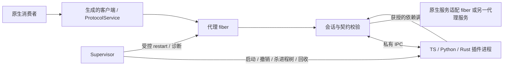

# 协议插件设计：进程外插件、服务代理与生命周期（2026-09-25）

> 状态：完整设计提案，尚未实现；不是现有 API 或已通过的验收记录。
> 基准：main `ee63071`。需求：[代理 fiber #46](https://github.com/arcships/rutis/issues/46)、
> [接口契约 #47](https://github.com/arcships/rutis/issues/47)、
> [隔离与强制停止 #48](https://github.com/arcships/rutis/issues/48)。
> 上线前置：[旧代注册隔离 #41](https://github.com/arcships/rutis/issues/41)。
> 本文的“宿主”指 Rust 主进程，“插件进程”指受其管理的进程；不沿用旧桥中把 Node 对端称为 host 的命名。

## 一、定义与范围

**协议插件是通过显式、可版本化的消息契约与 rutis 交互的进程外装配单元。**
每个插件实例在宿主内有一个代理 fiber；其服务、依赖与资源归属进入同一 rutis 图。
插件代码运行在独立进程，主进程不加载其 Rust dylib、不执行 Python/JS 代码。
语言 SDK 将本地异步服务映射为协议调用，宿主代理承担契约校验和生命周期配对。

目标：

1. TS、Python 和 Rust 插件可独立发布，保持已约定的契约即可使用，不绑定主进程的 rustc 或 SDK 二进制。
2. 原生插件可以消费远端服务；协议插件可以消费明确授予的原生或其他协议插件服务。
3. 依赖未就绪不运行插件业务；依赖丢失、断线、更新都沿 rutis 驱逐和重载语义收敛。
4. 插件崩溃或不响应卸载时，宿主能撤销调用能力并终止其进程树；失败不扩散到其他插件进程。
5. 请求、取消、超时、流式背压、错误和恢复策略有可测试的边界。

v1 决策：**本机、受宿主管理、一进程一插件实例、JSON 契约、异步 RPC 与服务端流**。
Linux 是首个验收平台；不具备所需进程树管理能力时明确拒绝启动，不悄悄降级。
TS 是第一条完整纵向实现；Python 与 Rust 使用同一协议和测试语料，按实施阶段补齐。

不包含：网络远程插件、第三方自行连接的常驻 daemon、共享插件进程、任意 Rust trait 自动代理、
同步借用或共享内存跨界、客户端流/双向流、状态迁移、恰好一次业务执行、无中断替换、插件市场和签名信任体系。
事件总线四种分发及 waterfall 不在 v1 线协议中；连续数据先用显式服务流表达，不能把未知事件模式降级为通知。

**进程隔离不是权限沙箱。** 默认子进程以宿主用户身份运行，文件和网络权限相同；环境变量按宿主配置传入，
但不承诺秘密隔离。面对有意攻击宿主或逃逸进程管理的插件，还必须配置独立的 OS 沙箱；见 §十二。

## 二、关键裁决与已有设计的关系

| 问题 | 本文裁决 | 原因及代价 |
| --- | --- | --- |
| 谁控制插件生命周期 | rutis 代理 fiber；远端只执行 start/stop | 不能让两端各自决定是否 Active |
| 故障单位 | 一个实例的一代对应一个进程树 | 启动成本高于共享 Node 进程，但停止不波及无关实例 |
| 契约来源 | 受限 JSON Schema 2020-12 + 方法描述符 | 延续 JSON 数据面，明确生成器支持范围 |
| 版本兼容 | 精确版本 + 契约 bundle 哈希 | 不把 semver 字符串当成结构兼容证明 |
| 服务键 | 宿主构造 `TypeKey<ProtocolService>` + 契约/路由限定名 | 远端不能伪造 Rust `TypeId`；未知接口仍可用通用调用面 |
| 重连 | 销毁旧代，启动新进程、新连接、新 activation | 不恢复旧请求，不把旧 Arc 偷换到新 provider |
| 强制停止 | 独立 supervisor 负责，不能排在 fiber 清理之后 | 本地消费者的清理也可能迟迟不结束 |
| 底层桥复用 | 复用已验证的概念和测试；新建独立协议运行时 | 旧桥的无界任务、JSON 透传和取消处理不足以支持本契约 |

[dylib SDK 设计](design-dylib-sdk-2026-09-24.md)用于可信一方插件在主进程共享 Rust 类型；
本设计跨进程只共享契约，不依赖其中的 SDK 身份、全局分配器或启动器校验。

[dsh 桥 v3.2](design-dsh-bridge-2026-08-21.md)将 TS 插件生死交给 TS，Rust 主要提供服务并观察事件。
本设计采用逐插件代理 fiber，是另一个生命周期模式。旧 `rutis-cordis`/`rutis-dsh` 及 `host/` 不隐式迁移；
旧 `hello` 的 `protocol: 1` 与本文 `family: "rutis-plugin", version: 1` 不是同一协议。
需要复用 Cordis 插件时，在独立进程的适配器里把一个选定插件暴露成本文契约，并关闭其独立自动重启策略。

## 三、源码现状与差距

以下结论来自基准源码；右侧均为待实现，不能据左侧已有类型宣称验收完成。

| 现有基础 | 本设计必须增加的内容 |
| --- | --- |
| [rpc.rs](../crates/rutis-cordis/src/rpc.rs)：帧、请求表、握手、超时、孤儿应答、`HostGone` | 激活代隔离、双向取消处理、有界调度、从入队开始的 deadline、连接终止与任务回收 |
| [proto.rs](../crates/rutis-cordis/src/proto.rs)：`HelloCaps`、`HelloVerify`、`PluginLedger` | 不执行代码的清单校验、契约哈希、宿主签发能力、实例与 activation 身份 |
| [services.rs](../crates/rutis-cordis/src/services.rs)：`svc/call`、`svc/part` | 服务图中的远端 provider、逐方法校验、流 credit；现有 `CordisService` 只是 JSON 调用面 |
| [tcp.rs](../crates/rutis-cordis/src/tcp.rs)：专用 loopback TCP、行帧 | v1 继承私有 socket、长度前缀、严格帧错误和完整资源配额 |
| [plugin.rs](../crates/rutis/src/plugin.rs)：工厂、静态 `injects` | 纯构造 `ProxyFactory`、预先冻结的依赖映射 |
| [fiber.rs](../crates/rutis/src/fiber.rs)：装载回滚、串行重启、update、watch | supervisor 与这些 API 的配对，不新增一套内核状态机 |
| [ctx.rs](../crates/rutis/src/ctx.rs)：`require_as`、`provide_as_with_check`、effect、refresh | 按 activation 撤销的代理；#41 的代绑定 Ctx 是前置条件 |

具体限制：现有 `Bridge::request` 在发送完成后才开始等待超时；入站 request/notify 会各自 spawn；
`ServiceDispatch` 没有 credit 窗口。本文运行时不得直接包一层这些 API 就宣称满足 §九、§十的 deadline 和背压。

## 四、组件与所有权

拟新增 `rutis-protocol` crate，依赖 rutis、tokio、序列化/校验库，不依赖 dsh，也不依赖 `rutis-sdk`。
crate 初版内部按职责分模块，避免在协议尚未验证时先拆出多个稳定公共 crate。



| 组件 | 持有的资源与职责 |
| --- | --- |
| `ContractCatalog` | 宿主批准的契约 bundle、预编译校验器、生成器版本；离线准备 |
| `PreparedPlugin` | 不可变包路径、清单摘要、已校验配置、部署路由；不持有运行进程 |
| `ProxyFactory` | 插件逻辑身份、固定 `injects`/exports 签名；validate/build 仅做纯检查与构造 |
| 每代 `Activation` | activation id、撤销状态、捕获的取消 token、能力表、请求/流、私有连接 |
| `Supervisor` | 每实例进程槽位、OS 进程树句柄、退出记录、重试定时器；独立于 fiber 清理等待 |
| 语言 runner | 完成握手后才执行插件业务 start，分发调用和 stop；不得自行重新装载下一代 |
| `ProtocolService` | 某一代、某一契约的可撤销调用面；旧引用永远不指向新代 |

supervisor 属于宿主根资源，所有代理销毁后才能关闭。子进程退出监视、日志排空与停止定时器运行在独立监督执行资源上，
不能依赖插件业务 future 让出宿主的同一个执行线程。主进程自身崩溃后的清理由部署服务管理器覆盖，不伪称进程内任务仍能运行。

## 五、包、部署配置与静态声明

### 5.1 插件包

```text
weather-1.2.0/
  plugin.toml
  contracts/weather-1.0.0.json
  contracts/log-1.0.0.json
  config.schema.json
  dist/main.mjs
  ...锁定的运行依赖...
```

```toml
[plugin]
id = "example.weather"
version = "1.2.0"
protocol_family = "rutis-plugin"
protocol_version = 1
entry = "dist/main.mjs"
runtime = "node"                    # 宿主映射到批准的解释器；不是 shell 命令

[[provides]]
name = "weather"
contract = "example.weather"
version = "1.0.0"
sha256 = "<契约 bundle 的 64 位十六进制摘要>"

[[requires]]
name = "log"
contract = "example.log"
version = "1.0.0"
sha256 = "<契约 bundle 的 64 位十六进制摘要>"
```

清单格式本身也有严格 schema；示例省略包文件摘要表，正式打包要求覆盖入口、契约、配置 schema 和运行依赖。
摘要保证部署一致性，不建立作者可信身份。解释器由宿主配置选择并记录版本，不要求插件与主进程使用相同工具链。
包安装到可信、不可变版本目录；更新新增目录，不覆盖运行中的代码或依赖。
路径必须是包内相对路径，拒绝穿越与逃逸包根的符号链接；命令按 argv 构造，不经 shell 拼接。

### 5.2 宿主部署描述

宿主另行指定 `instance = "weather-east"`、包位置、配置、requires 到服务路由的映射、exports 的发布路由、
环境变量、工作目录、资源上限与恢复策略。插件仅声明需要什么，不能决定宿主授权什么。
同一个包可装多个实例；每实例独立 fiber、进程树和限额。

`prepare()` 只读取文件、验证哈希、编译允许的 schema、校验配置和路由；**不启动插件以探测依赖**。
所有 `requires` 在 spawn 前变成静态 `TypeKey`，与 D32f 一致。缺失契约、重复别名、契约冲突在 prepare 阶段拒绝。
未就绪的服务是正常 Pending，不以“先启动远端再询问需要谁”绕过门控。

完整部署图可知时提前检查循环；动态宿主服务使图不完整时，保留 Pending 并展示缺失边，不能假称已证明无环。
v1 不提供可选依赖，按配置选依赖应拆装配单元。部署层为每个导出路由预留唯一发布者；同包不同实例必须显式不同名。
保留内核作用域语义；instance-scoped 路由只能由宿主依据本地实例身份生成和授权，线上的字符串不能构造内核 `InstanceId`。

## 六、契约、版本与类型生成

### 6.1 唯一来源

选定 **JSON Schema 2020-12 的受限子集**表达数据；一个 `interface.json` bundle 同时包含：
`id`、精确 `version`、方法名、调用模式（`unary` / `server_stream`）、params/result/item/error 的 schema。
方法描述符是 rutis 定义的包格式，并非声称 JSON Schema 标准自带 RPC。
配置、帧信封和控制消息同样从版本化 schema 生成。
`unary` 必须声明 params/result/error；`server_stream` 必须声明 params/item/error，
最终 result 固定为协议的 item 数量摘要，不另定义业务 result。

选择依据：现有桥和 TS/Python 消费习惯都是 JSON，便于检查和故障复现；protobuf 可作为后续编码提案，
WIT 可作为后续 Wasm 组件提案，v1 不同时维护三份接口定义。
这是一项项目裁决，不是 JSON Schema 比其他方案普遍更优的性能结论。

支持范围：对象、数组、布尔、null、有限数字、字符串、enum/const、required、additionalProperties、
有显式判别字段且分支互斥的 oneOf，以及 bundle 内无环 `$ref`。
限制字符串/数组/对象大小；整数字段只能用 JS 安全整数范围，u64/金额等使用契约明确的十进制字符串。
拒绝远程 `$ref`、递归引用、任意正则和未支持的关键字；不做类型强转、填默认值或静默丢字段。
`format` 不作为关键校验依据；JSON Schema 将 annotation 与 assertion 区分，见[规范](https://json-schema.org/draft/2020-12/json-schema-validation)。
未知字段按该字段 schema 的 `additionalProperties` 处理；线协议控制消息一律拒绝未知字段。
对象的 required 与 null 各有独立意义，生成器不得合并成同一种 optional。

```json
{
  "id": "example.weather",
  "version": "1.0.0",
  "methods": {
    "get": {
      "mode": "unary",
      "params": {
        "type": "object",
        "properties": {"city": {"type": "string", "maxLength": 128}},
        "required": ["city"], "additionalProperties": false
      },
      "result": {
        "type": "object",
        "properties": {"celsius": {"type": "number"}},
        "required": ["celsius"], "additionalProperties": false
      },
      "error": {
        "type": "object",
        "properties": {"code": {"const": "unknown_city"}},
        "required": ["code"], "additionalProperties": false
      }
    }
  }
}
```

这是完整的最小方法描述示例；控制协议另有自己的错误枚举，不能由业务 error schema 覆盖。
打包工具生成唯一 UTF-8 bundle 文件，双方对**分发文件原始字节**求 SHA-256；不在 Rust/JS/Python 各自重新序列化后算哈希。
打包时锁定生成器、schema 子集版本和规范化输出；注释/排版改变导致哈希改变也按不同产物处理。

### 6.2 兼容规则

身份为 `(contract id, exact version, bundle sha256)`，三者都匹配才准入。
握手交换 manifest 中的全量 requires/provides；要求与宿主 `PreparedPlugin` 一致，不接受远端临时下载的 schema。
semver 仅表达作者的演进承诺，v1 **不按 `^1` 自动适配**。

| 变化 | 发布规则 | v1 如何共存 |
| --- | --- | --- |
| 仅实现变化，契约字节不变 | 插件版本变；契约不变 | 可对原 fiber 执行 update |
| 新方法/可选字段 | 新 minor 契约和新哈希；仍需评估双向数据兼容 | 显式支持旧版本与新版本两个端点，不能只改版本声明 |
| 删除、改类型、改错误/流语义 | 新 major 契约 | 独立路由或明确适配器 |
| 相同版本但哈希不同 | 发布错误 | 拒绝并展示本地/远端摘要 |

宿主可在 catalog 中并存多个精确版本，每条路由只选一个。旧版本何时撤销由部署图决定，不由连接自行协商升级。

### 6.3 生成物与校验责任

同一 bundle 生成 Rust DTO/客户端/服务适配骨架、TS 类型及运行时校验包装、Python 类型及包装。
类型生成不能代替运行时校验。宿主对每条入站 params、结果、业务错误、stream item 验证；
对每条出站数据在编码入队前同样验证。对端 SDK 做对称检查，不能因此省略宿主检查。

生成 API 必须暴露 deadline、取消、业务错误和传输错误，不生成看似本地同步借用的方法。
CI 重新生成并检查零差异；共享合法/非法语料在三种语言中得出一致结论。
生成器和校验库的具体选型在 M1 技术验证中锁定，不把尚未验证的第三方库当作保证。

## 七、服务图映射与能力边界

### 7.1 统一调用面

宿主中的通用服务对象为拟议 `ProtocolService`，提供有界的异步 `call` / `server_stream`。
生成的 `WeatherClient` 只是其强类型包装，不改变服务的内核身份。
服务键由宿主的路由编码器确定：`TypeKey::keyed_dynamic::<ProtocolService>(route_key)`。
`route_key` 对 `(contract id, exact version, hash, binding name)` 做无歧义长度编码，不能随意字符串拼接造成碰撞。

原生消费者仍通过普通 `injects` 与 `require_as` 获取服务：

```rust,ignore
// 拟议 API；key 来自已校验的宿主路由，不是远端传入的 TypeId。
let service = ctx.require_as::<ProtocolService>(weather_key.clone())?;
let weather = WeatherClient::from_service(service)?;
let value = weather.get(Get { city: "Shanghai".into() }, call_options).await?;
```

已有原生 trait 不会凭同名自动变成远端类型。要导出原生服务，编写或生成本地适配 fiber：
其 `injects` 声明原生服务，apply 捕获当前 provider 的 Arc，提供相应 `ProtocolService`。
原生 provider 失活时，该适配 fiber 被驱逐，继而驱逐协议消费者。
需要把协议服务暴露成既有 Rust trait 时使用反向适配 fiber，且只支持可远程表达的方法。
同步借用、指针、引用生命周期、进程内可变共享对象、泛型方法不自动越界。

### 7.2 代理的声明与注册

`ProxyFactory::injects` 使用 prepare 时冻结的 requires 路由，`build` 只构造 `ProxyPlugin`。
在 apply 中、启动远端业务之前通过 `require_as` 捕获每个依赖的**本代绑定**；远端以后调用该依赖只能走这个绑定，
不能每次按全局名称查询并意外转到新 provider。

插件的 provides 在远端 start 成功后由宿主一次装配注册，使用 `provide_as_with_check`，check 只读本代可用标志。
内核在 provider 为 Loading 时不向消费者开放这些服务，apply 成功成为 Active 后才统一可见。
中途注册失败依赖内核回滚已登记资源；不新增“远端随意 register 任意服务”的控制消息。
同一 activation 的多个导出共享同一个撤销闸门。

每个 proxy 调用还检查闸门与捕获的取消 token；仅靠注册表摘除不足以撤销消费者已经持有的 Arc。
适配原生服务时也必须有同样的闸门。失活后的旧 Arc 返回 `StaleActivation` 或 `Unavailable`，绝不重绑新进程。

### 7.3 能力表

宿主在 start 消息里为 requires 生成不透明、activation 内唯一的 `capability`；为 provides 分配导出句柄。
远端只能使用这些句柄和对应契约中的方法。句柄不编码内部 TypeKey，也不接受任意 `scopeId` 路由。
请求的 connection、activation、方向、capability、方法均由宿主校验；未知能力拒绝并计数。

这是协议入口的授权边界，不是同用户恶意代码的 OS 权限隔离。
requires 的能力在 Starting 阶段可用于插件初始化；它们绑定已就绪的依赖，Stopping 后全部撤销，stop 不能再调用业务服务。
需要外部清理 I/O 的插件自行完成；不能在卸载时重新申请宿主能力以延长资源寿命。

## 八、生命周期与代隔离

### 8.1 三种身份

| 身份 | 生命周期 | 用途 |
| --- | --- | --- |
| package id + instance name | 部署实例 | 人读身份和同名仲裁，不直接授权 |
| 内核 PluginId / generation | rutis fiber / 装载代 | 本地诊断与核心清理归属 |
| activation id | 每次实际 apply 新建的随机 128-bit id | 每个进程、连接、能力和请求的撤销边界 |

activation id 由宿主签发，不复用；不能从可复用 PID、插件自报 id 或请求序号推导。
它与内核 generation 记录关联，但不把远端给出的数字当成 Ctx 的代号。
#41 防止宿主中的旧任务注册到新代；线协议的 activation 检查防止迟到帧命中新代。两者不能互相替代。

### 8.2 状态映射

远端状态单独放进协议诊断，不能向内核写一个不存在的状态。

| 场景 | 内核可观察状态 | 协议状态与动作 |
| --- | --- | --- |
| 依赖缺失 | Pending | Dormant，无进程 |
| apply 启动/握手/start | Loading | Starting |
| 服务装配成功 | Active | Ready |
| 初始化失败 | Unloading → Failed | Faulted，回滚并回收进程 |
| Active 进程退出/断线 | 先可能仍 Active，随后重启清理 | 立即 Unavailable，闸门关闭，不等待内核状态发布 |
| 依赖驱逐或 restart | Unloading → Pending → Loading（依赖就绪时） | Stopping → Reaped → 新 Starting |
| 显式 dispose/shutdown | Unloading → Disposed | Stopping → Reaped；禁止自动恢复 |
| 杀进程后仍无法确认退出 | 内核仍按真实清理进展显示 | Quarantined，禁止再次 spawn |

Failed 是装载失败状态，Active 进程崩溃不会自动让内核变成 Failed；supervisor 必须显式触发收敛。
本设计不新增 `FiberView::fail()`，不在后台直接篡改内核状态。

### 8.3 装载顺序

1. `prepare` 和 factory validate/build 完成纯校验；dry-run 不创建进程、套接字或监听任务。
2. 依赖满足，apply 获得本代 Ctx，立即捕获 cancellation token，向 supervisor 申请实例的唯一进程槽。
3. 捕获 requires 绑定；supervisor 建立 activation 与清理所有权；**先登记失败路径可回收的资源，再启动子进程**。
   申请/登记与 spawn 的并发取消必须由同一槽位协议处理，不能留下“进程已启动但还没有清理 owner”的窗口。
4. 连接握手完成，校验远端包摘要、插件身份、requires/provides 与契约集；不匹配直接终止该进程。
5. 再检查捕获的依赖及本代取消状态，签发能力，发送 `plugin/start`，传递配置与句柄。
6. 远端验证配置、装配处理器，返回 start 成功；无服务可用之前不接受宿主业务调用。
7. 宿主登记全部服务与 effect，最后再次检查 cancellation/连接状态和 activation 闸门，apply 返回成功。
   如果此时断线，check 为 false，消费者不能因短暂 Active 获得可用服务；supervisor 随即安排重启。

apply 的所有异步等待都 select 本代取消与所属阶段的 deadline；恢复退避先于 spawn、可取消且不计入 10s startup。
旧槽位回收受 stop/reap deadline 约束；startup 从新进程启动开始覆盖连接、hello、start 和服务登记，不能分步重置。
它持有的回收 guard 与 supervisor 共享同一完成状态；失败、取消、panic 和正常 effect 清理都 join 同一次停止。
不能让一次 drop 仅停止等待却丢失子进程句柄。

### 8.4 卸载、故障与恢复

停止的线性化点是 activation 从 Open 变为 Closing：此后不准入新业务调用，能力撤销，所有导出 check 变 false。
宿主通知 `ctx.refresh()` 使依赖图重查，排空本代请求/流为明确错误；迟到结果只计数，不复活能力。
Closing 仍允许本代 stop 应答和停止所需的控制消息，不能把业务撤销检查误用于 stop 回包而使所有卸载必然超时。

supervisor 同时观察进程退出、协议断线及捕获的取消 token。**token 取消后即开始进程停止计时，不等 effect LIFO 清理轮到它。**
原因是移除服务会等待消费者卸载，本地消费者可能卡在自己的清理里。
即使进程已被杀掉，fiber 或 root 的清理仍可能等待原生消费者；诊断分别展示这两件事，沿用
[卸载截止时间](core-shutdown-and-disposal-deadline.md)的“停止等待不代表停止任务”约定。

unexpected exit/断线：立即关闭闸门，然后为当前实例安排一次受控 `view.restart()`。
下一次 apply 在 supervisor 槽位上等待旧树确认回收和恢复退避；不能先启动新进程再清理旧进程。
初始化失败的重试从 Failed 显式调用 restart。缺依赖时保持 Pending，由核心在依赖恢复后装载。
所有重试请求按实例串行、可取消，并核对期望 activation；旧代 fault 通知不能重启一个已经健康的新代。

v1 不向用户暴露可独立修改的原始管理 view；提供 `ManagedPlugin` 的 update/restart/dispose，普通 watch/诊断可读。
管理器串行化手动命令与重试，dispose/shutdown 同步置终态意图并取消重试计时器，然后调用核心关闭。
不得持管理锁跨 await restart/apply；关闭意图的发布与本代取消不排在正在等待的 restart 之后，
否则 apply 等取消、dispose 等管理队列会互相等待。每代 apply 入口都重新检查 terminal/Suspended/Quarantined 槽位状态，
核心的依赖 refresh 即使重试 Failed 也不能绕过暂停或进程回收约束。
祖先取消到来时，不由 supervisor 猜测恢复：结束本代，下一代是否装载交回核心依赖门控。

默认恢复：仅异常退出、连接丢失、启动超时自动重试，指数退避 250ms 起、上限 30s、±20% 抖动，
滚动 60s 最多 5 次，连续健康 60s 重置退避。协议违规、契约不符、配置错误不自动重试。
预算耗尽或永久错误时槽位进入 Suspended；如果旧代仍 Active，安排一次仅用于清理收敛的 restart，
其后 apply 在启动任何进程之前返回暂停原因。已有启动失败则保留 Failed，不反复 restart 制造错误风暴。
手动 resume 清除暂停后再 restart；不通过无限尝试掩盖不兼容。

### 8.5 更新

`ManagedPlugin::update` 先 prepare 新包，再执行 `FiberView::update`。
插件 id、固定 requires 的映射、provides 路由及契约身份、factory 显示名必须与 spawn 时一致；
检查同时放入 `validate_config` 和 `build`，不能仅靠外层 API。
仅配置或实现版本变化时可换代：旧进程回收 → 新包启动 → 消费者重载，有明确服务空窗。
远端握手/装配失败发生在旧代卸载之后，**不承诺自动回滚或不中断**；保留旧包供用户显式更新回去。
声明或契约变化需 dispose 后重新 spawn，并更新部署图；不复用旧 injects 装配新声明。

## 九、线协议与调用语义

### 9.1 传输与握手

Linux v1 使用宿主创建的私有 Unix stream socket pair，将一端经约定 fd 交给 runner；无公开监听端口。
非通信 fd 按 close-on-exec 规则处理；stdout/stderr 只用于日志，持续排空且有速率/保留上限。
EOF、截断帧、非 UTF-8、重复 JSON 字段、超限或非法控制信封均终止连接并记录原因。

帧为 `u32` 网络字节序长度 + 对应长度的 UTF-8 JSON；长度不含前缀。
在分配 body 前检查上限，解析时限制深度/节点数；拒绝尾随数据。读取一个半帧也有累计 deadline。
不沿用旧 `TcpWire` 的错误帧跳过策略。内存 Wire 只能用于状态机单测，进程验收必须经过真实传输。

首帧由宿主发 `hello` 请求，包含 family/version、宿主签发 activation、期望 plugin/instance/package digest、
契约身份列表和宿主限额。runner 返回自己的编译/打包描述与支持限额；宿主取双方上限较小值，
校验一致后发 `plugin/start`。hello 之前及 start 之前，除相应控制应答外不接受业务帧。
runner 应延迟业务入口到 start；恶意进程当然可以提前运行自身代码，因此包身份验证不是执行前的安全隔离措施。

协商失败的可读错误保存在宿主日志；对端可读时回错误，然后关闭。v1 不做同连接换协议或二次 hello。

握手完成但尚未发 start 时没有业务能力；start 已发但未应答时，只允许插件使用已授予的 requires 调用依赖，
不允许宿主调用尚未装配完成的 provides。start 请求的等待不能占住接收泵或依赖调用的执行槽。
Ready 才开放双向业务；Closing 只处理 stop、取消和已准入调用的终止控制。

### 9.2 信封

业务请求示例（activation 和 capability 为示意值，实际由宿主分配）：

```json
{
  "type": "req", "id": "h:42", "activation": "a1",
  "method": "svc/call",
  "params": {"capability": "weather-export", "method": "get", "args": {"city": "Shanghai"}},
  "timeout_ms": 30000
}
```

`res` 原样带 id/activation，`ok: true` 时恰有 `result`，`ok: false` 时恰有 `error`。
`ntf` 没有自己的请求 id，但带 activation 和目标 `call_id`（适用时）。
请求 id 使用 `h:<十进制计数>` / `p:<十进制计数>` 表示发起方；单 activation 不复用，溢出关闭并重新建代；hello/start/stop/ping 也使用同一方向计数器。
所有字段都是协议 schema 的一部分，禁止用 JSON number 承载可能超出 JS 安全范围的计数。

| 消息 | 方向 | 成功/终止语义 |
| --- | --- | --- |
| `hello` | 宿主 → runner | 版本、身份、契约、限额校验；初始化会话 |
| `plugin/start` | 宿主 → runner | 配置、能力与导出句柄；应答表示业务处理器装配完成 |
| `plugin/stop` | 宿主 → runner | 不再接收业务，清理并应答后退出；应答不能代替 OS 退出确认 |
| `svc/call` | 双向 | 单值结果，或 §十的流式协议直到最终 res |
| `call/cancel` | 请求发起方 → 执行方 | 以 call_id 取消；通知幂等，不要求 ack |
| `stream/item` / `stream/credit` | 执行方 → 发起方 / 反向 | 有界流与额度归还 |
| `ping` | 宿主 → runner | 控制面活性；不证明业务处理器没有卡死 |

plugin/start/stop/hello 保留控制槽和固定 schema，插件不能反向调用这些宿主管理方法。
未知请求方法返回 `MethodNotFound`；未知控制通知、重复在飞 id 或非法状态迁移视为协议错误，关闭会话。
允许在规定大小内携带显式 trace id；不沿用旧桥的 `sessionId`/`turnId` 作为授权标识。

### 9.3 执行、deadline 与取消

每个方向预留固定业务配额（默认宿主发起 32、插件发起 32），双方以相同规则记账，避免争用一个无法原子分配的跨进程计数器。
准入使用有界 try-acquire，满额立即 `ResourceExhausted`，不让嵌套调用占着外层槽位无限等待新槽位。
读泵、控制调度与业务执行分离；业务递归/逻辑依赖环仍受 deadline 约束，协议不保证任意应用调用图无死锁。
SDK 在 handler 中派生的下游调用继承取消范围及不大于上游的剩余 deadline，不能取消外层却遗留无界子调用。

每次调用经历 `Queued → Sent → Completed | Cancelled | TimedOut | Unavailable`，终态只能提交一次。
本地 deadline 从 API 接收调用、申请队列名额时开始，包含排队、编码、写入、执行及全部流读取。
发出时把剩余时长放到 `timeout_ms`；执行方再受其本地上限约束，不比较跨进程墙钟。
远端向宿主发请求时，宿主从帧准入起计时。写入卡住、部分帧写入超时必须关闭连接，不能接着发送下一帧破坏边界。

本地取消、超时或丢弃调用 future/流：先原子结算本地等待、移除在飞记录、关闭本地数据队列，再尽力发送 cancel。
取消通知走有界控制队列；无法在控制写入 deadline 内送达时关闭连接，不能为传 cancel 无限等待。
执行方把 cancellation token 交给异步 handler，停止继续产出并清理任务；token 取消不是业务已回滚的证明。

对非协作远端任务，收到取消后经过 1s 仍未结束则终止整个插件 activation，影响同插件的其他调用但不影响其他进程。
对宿主内原生 handler，只能协作取消；无法安全杀主进程中的任意任务。
未退出的本地 handler 继续占用原槽位，达到配额后拒绝新请求，不能释放计数后无界 spawn；此差异进入诊断。
这些槽位还计入宿主级/本地 provider 级预算，跨 activation 继续计费，不能通过重连或换代清空计数绕过限制。

不自动重试业务请求。连接丢失/超时可能发生在副作用已完成但结果未送达之后，返回错误带 `execution: unknown`。
调用方只有在业务契约定义了幂等键和去重持久化时才能自行重试；不宣称跨重连 exactly-once。
有在飞请求 id 的重复帧属于协议违规；已经结束的迟到 res/item 计入孤儿计数并丢弃，超过速率限额关闭连接。

### 9.4 错误模型

错误信封包括稳定 code、可读 message、阶段、可选契约化 details、`execution`（`not_started` / `unknown`）。
业务错误置于 `ApplicationError.details` 并按该方法 error schema 校验；不把任意堆栈/配置/secret 回显到对端。

| 类别 | 例子 | 处理 |
| --- | --- | --- |
| 调用方数据错误 | InvalidParams、MethodNotFound、CapabilityDenied | 调用失败，未执行 handler；累计违规限流 |
| 宿主出站数据错误 | LocalContractViolation | 不发送；记录本地适配器缺陷 |
| 对端返回违约 | InvalidResult、InvalidStreamItem | 当前调用失败，关闭 activation 并禁止自动重试 |
| 生命周期/传输 | Cancelled、DeadlineExceeded、Unavailable、StaleActivation | 明确结算，不自动重放 |
| 资源约束 | ResourceExhausted | 准入前拒绝；不得先分配无限任务再检查 |
| 管理错误 | ContractMismatch、StartupTimeout、StopTimeout、ReapFailed | 进入监督诊断及相应失败/隔离状态 |

## 十、流式背压与资源上限

v1 只有 unary 和 server_stream。流的调用方在 `svc/call` 中给出初始 item/byte credit；
执行方用同一个 call_id 发送 `stream/item {seq, value}`，最终发送唯一 res，成功 result 为 `{items: N}`，失败为错误。
首个 seq 为 0，严格递增；成功结束的 N 必须等于已接收 item 数。没有 item 的流允许 N=0。
应用业务的流中错误以最终 error 表达，之后禁止 item；业务若需“带错误的数据项”，应将其写进 item schema。

额度同时计项目数与字节数（完整编码 item 帧的 body 字节，不含长度前缀）；两者都足够才能发送。
接收方只在消费/释放队列项后归还对应 `stream/credit`，不得因从 socket 读入内存就立即归还。
当前可用 credit 不能超过协商窗口；负数、溢出和超额归还关闭连接。累计消费量可以超过窗口，但只能回补实际消费的额度。
credit 携带已消费的累计 seq/items/bytes；发送方按与上次已确认值的差额补充额度，
并核对不超过已发送前缀。相同累计值作为幂等重复忽略，回退或超前值拒绝；不得凭任意增量扩充窗口。

额度耗尽暂停 poll 远端异步迭代器；最多保留一个已取出、受 max-item 限制的待发项并计入预算。
单项超过 negotiated max-item 直接终止调用；不能靠拆分一项绕过 schema 与大小约束。
结束帧、cancel、stop 不消耗数据 credit；它们仍受独立控制队列、帧大小和写入 deadline 约束。
最终 res 不能越过同一调用已入队的 item；发送器在不同流间公平调度，在单流内保持顺序。
接收方保存终态并先交付已缓冲项，再向用户报告流结束/业务错误；deadline、取消或 activation 撤销则立即丢弃缓冲并失败。
收到最终 res 不等于用户已消费队列，剩余缓冲仍占内存/流配额直到消费或 drop；终态后不再给该流发送 credit。

接收泵只做有限解析、验证和分发，不 await 业务 handler，也不等待某个慢流腾出空间。
合规发送方因 credit 约束不会把已承诺窗口写爆；超出窗口的帧按协议错误断线。
控制队列与数据队列分开并保留控制额度，任何一条连接上的大流不能无界阻塞取消。
单一 IPC 仍有有限帧的传输阻塞，不能承诺零延迟控制；控制 deadline 到达则关闭连接并走进程终止。

默认值是实施起点，必须经基准验证；部署可降低，提升需要显式配置且仍不得无界：

| 项目 | v1 默认上限/时限 |
| --- | --- |
| 单帧 body / 单 item | 1 MiB / 64 KiB |
| JSON 深度 / 节点数 | 64 / 100,000 |
| 每实例双向业务调用总在飞数 | 64（每方向 32、其中各最多 8 条流）；入队准入即计数 |
| 每实例数据队列总预算 | 8 MiB，收发、已承诺接收窗口与待发项均占预算 |
| 每流初始窗口 | 16 items 且 256 KiB；窗口须先从总预算预留 |
| 控制帧 / 队列 | 每帧 16 KiB；每方向 32 帧，超限结束会话 |
| 帧速率 | 每方向 1,000/s，burst 128；含控制帧及孤儿帧 |
| 单半帧累计读取 / 控制写入 | 5s / 1s |
| startup / 普通调用默认 / 调用最大 | 10s / 30s / 120s；流使用同一总 deadline |
| 正常 stop 宽限 / 强杀后确认 | 5s / 2s |
| 心跳 | 每 5s ping，10s 无有效应答视为失联 |
| 日志 | 每实例 1 MiB 环形保留、64 KiB/s；超限丢弃并计数，继续排空 pipe |

帧限额不是整个进程内存上限：解析对象、校验缓存、请求元数据和任务另设数量/内存预算；
prepare 默认每包至多 32 个契约、每契约 128 个方法、单 bundle 1 MiB，合计 8 MiB，超出显式拒绝。
总预算不足时缩小新流窗口或拒绝请求，不能让 16 条流各自领取未预留的完整额度。
宿主原生适配器与插件共享这些协议配额；OS 内存/CPU/pids 限制由部署策略另行配置。

## 十一、进程管理与停止保证

### 11.1 Linux 首发后端

选择 cgroup v2 的独立叶子子树作为一个 activation 的进程树容器；由宿主外部部署提供可管理的委派根。
启动前检查创建、放入、终止和观察子树的能力；不可用返回 `IsolationUnavailable`，不退回只 kill 主 PID。
实际进程在执行插件代码前进入该子树：使用受控启动 helper 的等待屏障或等价原子创建方式，
宿主确认归属后才允许 exec 入口，避免插件在归属确认前 fork。

停止流程：

1. 撤销 activation 的能力与新调用；启动独立停止时钟。
2. 连接可用时发 `plugin/stop`，允许在宽限内清理、应答并退出。断线/已崩溃则跳过协商。
3. 宽限到期仍有进程，使用 `cgroup.kill` 终止整个子树。即使主进程已退出，仍要检查其后代。
4. 等待直接子进程的退出回收，并确认 `cgroup.events` 的 populated 为 0；释放连接、任务及槽位后才能启动下一代。
5. 2s 内仍不能确认（例如不可中断睡眠、权限变化），记录 `ReapFailed` 并隔离该实例，禁止自动重启。
   后台继续观测/回收，但不能报告“全部停止”；恢复需确认旧树为空。
   清理 effect 可返回 `ReapFailed` 让核心报告错误，进程句柄和隔离槽仍归 supervisor，不能随 effect 结束释放后允许新 spawn。

cgroup 的继承、`cgroup.kill` 与 populated 语义依据 [Linux 内核文档](https://docs.kernel.org/admin-guide/cgroup-v2.html)。
发出 kill 不等于任意内核状态的任务都立即消失，因此这里承诺准时撤销协议能力和升级停止手段，不承诺所有 OS 任务硬实时退出。
对子孙僵尸的回收由部署服务管理器或专用 supervisor helper 的 subreaper 策略负责，不在进程中全局 `waitpid(-1)` 抢其他库的子进程。

进程组 kill 不能完整覆盖主动 setsid 的后代，不作为同等级后端。无沙箱的同用户插件仍可能主动迁出可写 cgroup、
请求外部服务代执行或操控其他进程；默认管理承诺针对未主动逃逸的插件，敌对代码须使用 §十二的沙箱部署。

### 11.2 平台与共享进程

Windows 后端规划为禁止 breakaway 的 Job Object，进程在恢复运行前入 Job；
使用 Job 终止并确认活动进程归零，见 [Microsoft Job Objects 文档](https://learn.microsoft.com/en-us/windows/win32/procthread/job-objects)。
macOS 尚未选定满足同级树回收保证的后端。二者在平台验收通过前返回 unsupported，不把 Linux 结论外推。

v1 清单/部署明确 `one_instance_per_process`；共享进程设置直接拒绝。
未来若允许一进程多插件，进程崩溃/强杀必须撤销组内所有 activation、驱逐所有关联消费者，
并独立定义组启动屏障与循环依赖；不能把共享进程当作隐藏优化。
#48 的连带行为在 v1 通过“拒绝共享进程”和“杀一个实例不影响另一个实例”的测试覆盖。

## 十二、权限与三方 Rust

协议能力表只允许所声明并获授的服务/方法；入站消息不能获得原始 Ctx、任意 TypeKey 或任意文件句柄。
这是宿主代理的防护，不会限制插件自行访问系统。

默认部署：同用户文件/网络权限，显式环境传递，日志脱敏；cgroup 负责进程管理及可选资源配额，**不是秘密隔离或完整沙箱**。
需要运行不可信作者代码时，由部署层提供受限 UID/容器/namespace/seccomp 或相应平台 sandbox，
限制文件、网络、环境、进程控制和 cgroup 迁移。沙箱策略独立版本化并写入诊断，不能在缺失时仍标为 sandboxed。
远程网络接入需要额外认证、加密和身份设计，不通过把私有 socket 换成监听 TCP 就开放。

三方 Rust 首选独立可执行程序 + 协议 SDK。若必须分发 Rust dylib，加载器及其匹配 SDK 运行在独立插件进程里，
主进程仍只看消息；dylib 的 ABI/分配器兼容验证是该 runner 自己的责任，可复用一方 dylib 设计，
不能因此要求 Rust 主进程链接三方库或共享其 vtable。

## 十三、拟议宿主 API 与语言 SDK

以下为设计草图，尚不能编译；最终 API 以纵向测试约束，不在此 PR 发布接口。

```rust,ignore
let supervisor = ProtocolSupervisor::new(process_backend, policy)?;
let prepared = supervisor.prepare(package_dir, deployment, &catalog)?;
let plugin = supervisor.spawn(&ctx, prepared)?; // 注册代理 fiber；依赖未齐时 Pending
let status = plugin.watch();                  // 内核快照 + 独立协议诊断
plugin.update(prepared_v2).await?;             // 纯 dry-run 后按生命周期换代
plugin.dispose().await?;                       // 禁止重试，join 清理与进程回收
```

`prepare` 不执行用户代码；`spawn` 不绕过依赖门控直接启动进程。
supervisor 的 shutdown 先关闭管理准入，撤销所有 activation，再并发监督每个进程停止，并 join 核心清理。
其等待截止结果要同时报告仍未回收的进程和仍在清理的 fiber；不把两者合成一个含糊的 stopped 布尔值。

SDK 要求：

- TS：异步方法/AsyncIterable，AbortSignal 接取消；协议 fd 与 stdout 独立。
- Python：async 方法/异步迭代器，任务取消与 finally 清理；不在事件循环线程执行阻塞业务。
- Rust：异步方法/Stream 与 CancellationToken；无需链接主进程的 SDK dylib。
- 三者都支持 start/stop、严格 schema、同一帧/错误/credit 规则；不自行重连或重放调用。
- 插件 stop 处理器应协作清理；无论是否遵守，宿主仍执行进程级截止策略。

## 十四、诊断与运维

核心 `ctx.diagnostics()` 继续展示 fiber、声明、绑定、依赖和内核状态。
新增 `supervisor.diagnostics()` 为每实例记录：包版本/摘要、契约身份、activation、关联 PluginId/generation、
协议状态、PID/进程容器、退出码/信号、最近故障、重试计数/下次时间、停止阶段、是否确认回收、沙箱策略。
快照不是跨核心/OS/协议的原子事务，带观测时间与 activation，不能按不同时刻的记录拼出错误因果。

指标至少包括：入站/出站验证失败、CapabilityDenied、孤儿帧、当前请求/流与排队字节、credit 停顿、
调用延迟、deadline、取消后未退出 handler、启动耗时、异常退出、强杀、ReapFailed、日志丢弃。
错误记录带阶段、方法和 schema path；不默认记录 params/result、token 或用户秘密。

提供按实例执行 status/restart/resume/dispose 的管理能力；命令入口由宿主决定，本文不假设新增全局 CLI。
崩溃恢复是新代装配；业务若需恢复历史状态，使用显式持久化服务和幂等业务逻辑，不序列化旧进程堆。

## 十五、验收矩阵

所有条目均为待执行；单测使用可控时钟/Barrier，端到端使用真实子进程。不能以 sleep 后“看起来结束”代替归属/退出断言。

| 编号 | 场景 | 必须断言 | 对应需求 |
| --- | --- | --- | --- |
| T01 | TS 提供 weather，Rust 消费 | 原生消费者依赖代理服务，类型包装与结果正确 | #46 |
| T02 | TS 依赖原生 log | 适配 fiber 入图，未就绪时 TS 业务不启动，恢复后装配 | #46 |
| T03 | TS A 依赖协议 B | B 失活驱逐 A 及 Rust 消费者；B 恢复后自动重载 | #46 |
| T04 | Pending 缺依赖/依赖循环 | 不启动进程，不绕过门控，诊断列出缺失边 | #46 |
| T05 | 握手/配置/部分注册失败 | 不对外提供服务，清理已启动进程及半注册资源 | #46/#47 |
| T06 | 远端 Active 崩溃、断线、心跳超时 | 闸门立即关闭，旧 Arc 不可用，消费者驱逐、新代重载 | #46 |
| T07 | 更新实现/配置及改变声明 | dry-run 无进程副作用；合法更新换代；声明变更拒绝且原代不受影响 | #46 |
| T08 | L1 式版本名相同但契约哈希不同 | 握手拒绝；不得靠 semver 放行 | #47 |
| T09 | schema 合法/非法语料，双向参数/结果/item/错误 | Rust/TS/Python 一致；非法消息不触发 handler 或服务暴露 | #47 |
| T10 | 取消、丢 future、超时与应答竞态 | 恰一次本地结算，无 pending 泄漏；迟到帧不串代 | #46 |
| T11 | 旧 activation 的 res/item/cancel/重试任务迟到 | 不命中新调用/新代，不取消新进程；旧 Ctx 注册被 #41 拒绝 | #41/#46 |
| T12 | 慢消费者、16 条并发流、零 credit、超大 item | 内存预算有界、停止 poll、其他流与控制面仍可推进 | #46 |
| T13 | item 顺序、重复 credit、末帧竞态、流失败 | seq/额度/最终数量严格；终态后不交付 item | #46/#47 |
| T14 | 子进程忽略 stop、忙循环、fork 后代/setsid | 宽限后树终止，确认回收；无关插件和主进程继续运行 | #48 |
| T15 | 本地消费者清理卡住 | supervisor 仍按时杀远端；fiber 清理未结束如实呈现 | #48/#12 |
| T16 | 模拟 kill/reap 失败、旧进程槽未释放 | Quarantined 禁止新代；不报告已停止，不重复 spawn | #48 |
| T17 | retry 与 dispose/shutdown/update 同时发生 | 终态优先、重试取消，管理队列不死锁，不出现两代进程共存 | #46/#48 |
| T18 | 同包两个实例，杀其中一个；配置共享进程 | 另一实例无关服务可用；共享进程配置在 prepare 拒绝 | #48 |
| T19 | 帧长度边界、截断、坏 UTF-8、重复键、洪泛、阻塞写 | 解析前限额、严格拒绝、控制 deadline 生效、任务数量有界 | #47 |
| T20 | 未声明能力/越作用域/已撤销能力 | 宿主 handler 不执行，诊断可区分拒绝原因 | #47/#48 |
| T21 | 真实平台后端及能力缺失 | 归属先于插件代码执行；无委派能力明确失败；退出后无遗留活进程 | #48 |
| T22 | 生成物再生成、跨语言互通 | 零 diff，同契约生成类型与 wire 一致，最低支持运行时通过 | #47 |
| T23 | 重试耗尽/协议永久错误/手动 resume | 正确退避及 Failed/Suspended 诊断，不产生重启风暴 | #46 |
| T24 | stdout/stderr 洪泛、零业务活性但 ping 正常 | 日志有界且不损坏帧；业务 deadline 仍终止卡死调用 | #46/#48 |

基准记录机器、工具链、解释器、版本、限额与样本数；测 unary 1 KiB/64 KiB、并发 1/64、流 1 KiB/64 KiB item，
给出校验开/关对照的吞吐、p50/p95/p99、CPU、RSS 与队列峰值。生产路径不得关闭校验；“关闭”仅作实验对照。
基准目标首先是资源上界成立并找出瓶颈，不在无数据时承诺固定延迟；发布时附原始数据和可复现命令。

## 十六、实施阶段与合入边界

| 阶段 | 交付 | 完成条件 |
| --- | --- | --- |
| M0 核心前置与接口核对 | #41 代绑定 Ctx；确认取消、check/refresh、消费者驱逐与清理配对 | 旧代准入回归通过；不从此文档 PR 顺带改核心 |
| M1 契约工具链 | bundle/control schema、受限子集、锁定校验器/生成器、Rust+TS 生成物 | T08/T09/T22 的 Rust/TS 语料；严格拒绝未支持 schema；记录性能基线 |
| M2 进程与会话 | Linux supervisor、私有 Wire、有界 RPC、停止/回收/重试 | T10/T14–T19/T21/T23/T24，使用无业务的恶意/故障 fixture |
| M3 服务图纵向 | ProxyFactory、能力表、原生适配、TS 示例、更新 | T01–T07/T11/T17/T20；真实 Rust↔TS 双向依赖链 |
| M4 流与完整限额 | credit、队列预算、顺序、取消传播 | T12/T13，持续压力下内存和请求表不增长 |
| M5 语言与发布 | Python SDK、独立 Rust runner、包工具、作者/运维指南 | 三语言 T09/T22；Linux 全矩阵及基准公开，v1 才可标可用 |
| 后续平台 | Windows/macOS 后端或共享进程提案 | 独立设计与相应验收，不以编译通过代替进程树保证 |

`rutis-cordis` 保持原协议和测试。可在 M2 之后评估抽取共用的纯帧/请求管理模块，但必须分别运行旧桥和新协议测试；
不把顺便重写旧桥作为本方案的前置。#46–#48 在相应实现与验收完成后再关闭，本设计 PR 仅使用 Refs。

实施前必须验证的技术点：Linux 委派后端及宿主退出后的回收策略、无界任务改为有界后的双向调用死锁边界、
schema 子集的三语言一致性、控制流在最大数据负载下的停止延迟、核心清理与 supervisor 槽位的交错。
这些不影响本文已选定的协议与生命周期方向；若验证失败，须以明确修订更新设计，不能静默降低停止或资源上界保证。

## 十七、完成定义

- [ ] #41 前置成立，代理只使用代绑定的 Ctx 与取消 token。
- [ ] 契约、控制 schema、生成器与互通语料进入仓库，版本/哈希规则有拒绝测试。
- [ ] 每个协议实例有独立代理 fiber，双向服务进入同一依赖图；T01–T24 全部有证据。
- [ ] 真实 TS/Python/Rust 进程能被管理，旧引用/迟到帧/旧重试不能影响新代。
- [ ] Linux 进程树回收、失败隔离、资源上限及清理卡住的边界被实际验证。
- [ ] 默认不限权、支持平台、拒绝共享进程、无自动业务重放写入用户文档。
- [ ] 记录基准、失败诊断示例和受支持运行时版本；旧 dsh 桥回归通过。
