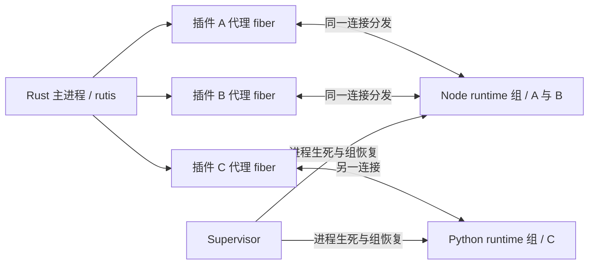

# 协议插件设计：进程外插件、服务代理与生命周期（2026-09-25）

> 状态：架构与生命周期设计提案，线协议仍有待冻结项（§16.3），尚未实现；不是现有 API 或已通过的验收记录。
> 基准：main `ee63071`。需求：[代理 fiber #46](https://github.com/arcships/rutis/issues/46)、
> [接口契约 #47](https://github.com/arcships/rutis/issues/47)、
> [隔离与强制停止 #48](https://github.com/arcships/rutis/issues/48)。
> 2026-09-26 修订：共享语言 runtime 为待实测的默认方案，插件 fiber 与进程分开管理；资源配额和具体限额后置。
> 核心前置：[旧代注册隔离 #41](https://github.com/arcships/rutis/issues/41) 已关闭；实现阶段须核对所用核心版本及 T23 回归，本文历史基准不视为已包含该修复。
> 本文的“宿主”指 Rust 主进程，“插件进程”指受其管理的进程；不沿用旧桥中把 Node 对端称为 host 的命名。

本文“必须 / 不得 / 不能”表示实现的硬约束（MUST / MUST NOT）；“建议 / 应”表示可说明理由偏离的建议（SHOULD）；“可”表示可选项（MAY）。标为拟议、候选或待冻结的内容不构成已发布 API。

## 一、定义与范围

**协议插件是通过显式、可版本化的消息契约与 rutis 交互的进程外装配单元。**
每个插件实例在宿主内有一个代理 fiber；其服务、依赖与资源归属进入同一 rutis 图。
插件代码运行在主进程之外的语言 runtime 中；拟让多个兼容插件默认共享一个 runtime 进程，默认值按 §4.1 实测冻结，Go 的发布取舍见 §4.3。
主进程不加载其 Rust dylib、不执行 Python/JS 代码。
语言 SDK 将本地异步服务映射为协议调用，宿主代理承担契约校验和生命周期配对。

目标：

1. TS、Python、Go 和 Rust 插件可独立于主进程发布，保持已约定的契约即可使用，不绑定主进程的 rustc 或 SDK 二进制。
2. 原生插件可以消费远端服务；协议插件可以消费明确授予的原生或其他协议插件服务。
3. 依赖未就绪不运行插件业务；依赖丢失、断线、更新都沿 rutis 驱逐和重载语义收敛。
4. 插件失败时撤销其能力；runtime 崩溃或需要强制重启时撤销整组插件，明确连带驱逐和恢复语义。
5. 请求、取消、超时、流式背压、错误和恢复策略有可测试的边界。

v1 决策：**本机、受宿主管理、同语言兼容插件共享 runtime、JSON 契约、异步 RPC 与服务端流**。
Linux 是首个验收平台；语言版本或依赖环境不兼容时使用不同 runtime 组。
TS 是第一条完整纵向实现；Python、Go 与 Rust 使用同一协议和测试语料，按实施阶段补齐。
“共享 runtime”不表示每种语言都有通用动态加载器；Go 首版按组构建 runner，见 §4.3。
Shell、PowerShell、AppleScript/JXA 作为系统自动化方向的正式扩展目标；其他脚本语言按需求接入，
执行形态、先后顺序及能力验收见[独立语言路线图](roadmap-protocol-plugin-languages-2026-09-26.md)，不将路线图中的语言标成当前已支持。

不包含：网络远程插件、第三方自行连接的常驻 daemon、任意 Rust trait 自动代理、
同步借用或共享内存跨界、客户端流/双向流、状态迁移、恰好一次业务执行、无中断替换、插件市场和签名信任体系。
事件总线四种分发及 waterfall 不在 v1 线协议中；连续数据先用显式服务流表达，不能把未知事件模式降级为通知。

**进程隔离不是权限沙箱。** 默认子进程以宿主用户身份运行，文件和网络权限相同；环境变量按宿主配置传入，
但不承诺秘密隔离。面对有意攻击宿主或逃逸进程管理的插件，还必须配置独立的 OS 沙箱；见 §十二。

## 二、关键裁决与已有设计的关系

| 问题 | 本文裁决 | 原因及代价 |
| --- | --- | --- |
| 谁控制插件生命周期 | rutis 代理 fiber；远端只执行 start/stop | 不能让两端各自决定是否 Active |
| 运行单位 | 一个兼容环境对应一个语言 runtime 组，多插件共享进程 | 复用语言环境；进程级故障会波及组内所有插件 |
| 契约来源 | 受限 JSON Schema 2020-12 + 方法描述符 | 延续 JSON 数据面，明确生成器支持范围 |
| 版本兼容 | 精确版本 + 契约 bundle 哈希 | 不把 semver 字符串当成结构兼容证明 |
| 服务键 | 宿主构造 `TypeKey<ProtocolService>` + 契约/路由限定名 | 远端不能伪造 Rust `TypeId`；未知接口仍可用通用调用面 |
| 重连 | runtime 新 epoch，组内插件分别创建新 activation | 不恢复旧请求，不把旧 Arc 偷换到新 provider |
| 强制停止 | supervisor 终止整个 runtime 组，不能排在 fiber 清理之后 | 不声称能在共享解释器内强杀任意单个插件 |
| 资源策略 | 本轮不规定内存/CPU/并发/速率配额及默认数值 | 先验证生命周期和真实开销，再单独设计治理策略 |
| 底层桥复用 | 复用已验证的概念和测试；新建独立协议运行时 | 旧桥的无界任务、JSON 透传和取消处理不足以支持本契约 |

[dylib SDK 设计](design-dylib-sdk-2026-09-24.md)用于可信一方插件在主进程共享 Rust 类型；
本设计跨进程只共享契约，不依赖其中的 SDK 身份、全局分配器或启动器校验。

[dsh 桥 v3.2](design-dsh-bridge-2026-08-21.md)将 TS 插件生死交给 TS，Rust 主要提供服务并观察事件。
本设计采用逐插件代理 fiber，是另一个生命周期模式。旧 `rutis-cordis`/`rutis-dsh` 及 `host/` 不隐式迁移；
旧 `hello` 的 `protocol: 1` 与本文 `family: "rutis-plugin", version: 1` 不是同一协议。
需要复用 Cordis 插件时，在独立进程的适配器里把一个选定插件暴露成本文契约，并关闭其独立自动重启策略。

## 三、源码现状与差距

以下结论来自基准源码；右侧均为待实现，不能据左侧已有类型宣称验收完成。

| 现有基础 | 本设计必须增加的内容 |
| --- | --- |
| [rpc.rs](../crates/rutis-cordis/src/rpc.rs)：帧、请求表、握手、超时、孤儿应答、`HostGone` | 激活代隔离、双向取消处理、共享连接的分发、从入队开始的 deadline、连接终止与任务回收 |
| [proto.rs](../crates/rutis-cordis/src/proto.rs)：`HelloCaps`、`HelloVerify`、`PluginLedger` | 不执行代码的清单校验、契约哈希、宿主签发能力、实例与 activation 身份 |
| [services.rs](../crates/rutis-cordis/src/services.rs)：`svc/call`、`svc/part` | 服务图中的远端 provider、逐方法校验、流式背压；现有 `CordisService` 只是 JSON 调用面 |
| [tcp.rs](../crates/rutis-cordis/src/tcp.rs)：专用 loopback TCP、行帧 | v1 继承私有 socket、长度前缀、严格帧错误；按 runtime 组复用连接 |
| [plugin.rs](../crates/rutis/src/plugin.rs)：工厂、静态 `injects` | 纯构造 `ProxyFactory`、预先冻结的依赖映射 |
| [fiber.rs](../crates/rutis/src/fiber.rs)：装载回滚、串行重启、update、watch | supervisor 与这些 API 的配对，不新增一套内核状态机 |
| [ctx.rs](../crates/rutis/src/ctx.rs)：`require_as`、`provide_as_with_check`、effect、refresh | 按 activation 撤销的代理；#41 的代绑定 Ctx 是前置条件 |

具体限制：现有 `Bridge::request` 在发送完成后才开始等待超时；入站 request/notify 会各自 spawn；
`ServiceDispatch` 没有消费驱动的背压。新 runtime 不能直接包一层这些 API 就宣称满足取消、deadline 和慢消费者语义。

## 四、共享语言 runtime 与所有权

拟新增 `rutis-protocol` crate，依赖 rutis、tokio、序列化/校验库，不依赖 dsh，也不依赖 `rutis-sdk`。
语言侧提供 Node/TS、Python、Go、Rust runner，负责在一个进程中装载和管理多个插件实例。



### 4.1 共享粒度

**默认共享是待实测验证的设计假设。** M2 同时运行共享组与单成员组，提前执行 T24，比较相同插件、负载和依赖的启动、RSS/PSS、更新及故障恢复影响。记录环境和重复测量结果后再冻结默认值；内存收益不足以抵偿故障/更新代价时调整默认分组，保留两种部署形态。M5 对其他语言复核，Node 的结果不能替代 Go 等语言的证据。

**语言提供 runtime，部署选择 runtime 组。** 默认把语言、解释器版本、runner 协议版本、依赖环境和信任边界兼容的插件放在同组。
不是全宿主强制只能有一个 Python 或 Node 进程。依赖冲突、不同解释器版本或需要独立故障范围时显式分组；
需要单插件隔离时创建只有该插件的组，生命周期协议不变。

同一进程可复用解释器启动、堆及模块初始化，通常有更低的重复开销；不预先承诺内存节省比例。
模块能否共享还取决于解析路径和版本：Node 按解析文件缓存模块，Python 按 `sys.modules` 缓存，
见 [Node 模块文档](https://nodejs.org/api/modules.html)和 [Python 导入文档](https://docs.python.org/3/reference/import.html)。
Python 首版每组使用一个已锁定的依赖环境；冲突的依赖不能靠多个插件目录或修改 `sys.path` 假装隔离，应拆组。
Node 允许包级依赖，但同名不等于共享一份模块；改变进程全局配置的插件也应单独分组。

### 4.2 两层生命周期

| 组件 | 所有权与职责 |
| --- | --- |
| `ContractCatalog` | 宿主批准的契约、离线校验器、生成器版本 |
| `PreparedPlugin` | 不可变包路径、配置、静态路由和选定 runtime 组；不启动业务 |
| `ProxyFactory` | 每个插件实例一个，保留固定 injects/exports 和工厂纯构造约定 |
| `RuntimeGroup` | 兼容环境、进程、连接、runtime epoch、组内成员、共享模块缓存 |
| 每代 `Activation` | 某插件一次装配的身份、撤销状态、依赖能力、请求/流与任务清理 |
| `Supervisor` | 管理 runtime 进程的启动、退出、组恢复；不替代逐插件 fiber 的生命周期 |
| `ProtocolService` | 某一插件代的可撤销服务引用，旧引用不重新绑定 |

宿主维护每组的 `RuntimeReady` 门控服务，所有成员代理的静态 injects 都包含这个服务及自己的业务依赖。
runtime 的启动由组注册/监督层触发，**不能等某个代理 apply 才启动**，否则 apply 等 Ready、Ready 等 apply 会死锁。
Ready 只表示进程已握手、可接受插件装载，不要求所有成员业务启动。业务依赖有向边仍由 rutis 排序；
同组 A 依赖 B 时 B 可先装配，不设“所有插件都 start 完成才发布任何服务”的组屏障。

runtime 在仍有已登记成员时可保持存活，即使这些插件暂时 Pending；最后一个成员被移除后可关闭空组。
逐插件 dispose 不关闭其他成员的 runtime。supervisor 属于根资源，关闭时先禁止新装载并撤销各组，
再 join 进程和核心清理。停止监督不能排在某个插件/消费者的清理 future 后面。

### 4.3 Go：单成员发布与可选共享 runner

Go 支持相同的协议与逐插件 fiber，但没有 Python/JS 式的通用源代码装载过程。
首版支持单成员与共享两种部署。需要各插件独立发布时使用单成员 runner；部署方明确接受整组构建和更新时，才将选定的 Go 插件 package 与协议 runner **在构建阶段编译进同一可执行文件**。
runner 中的显式 factory 注册表按插件 id 创建实例；同组插件共享一个 Go runtime、调度器和 GC，
仍各自持有 activation、配置、服务、任务与取消范围。
不能把已经独立编译的多个 Go 可执行文件直接合并进同一个运行中进程。

Go 插件清单使用 `factory` 指定注册表条目，不使用脚本 `entry`；包包含契约和配置描述，
runtime 组配置指向 runner 可执行产物及其构建清单。构建清单绑定 runner 哈希、可用 factory、
各插件版本与契约哈希；prepare 和 plugin/start 均核对成员是否包含在该产物中，缺失时明确拒绝。
同一进程的依赖版本在组构建时统一解析；无法统一则拆组。编译在发布流水线完成，宿主不临时编译外部源码。
插件业务只在 factory/start 中启动，package init 不承担业务装配；违反此约定的初始化会影响整个 runner，
不能期待先完成单插件握手再隔离它。

新增或修改 Go 插件代码需要重新构建并部署该组 runner，再按 §8.6 重启整组；配置更新仍只重装目标实例。
这只保留“独立于主进程发布”的能力，不保留组内各插件独立部署的能力。组构建流水线由部署方维护，必须知道全部成员及锁定依赖；第三方只发布独立可执行文件时按单成员接入。Go 的默认分组在 M5 的 T24 测量后单独决定，不能直接套用 Node 的默认共享假设。
已有独立 Go 程序可作为单成员 runtime 组接入；其进程内资源不能与另一 Go 程序自动共享。

Go 标准库 `plugin` 可加载动态产物，但要求严格匹配工具链、构建条件及共同依赖，且插件不能关闭；
官方也建议在可统一构建时考虑直接生成静态组合程序，见 [Go plugin 文档](https://pkg.go.dev/plugin)。
因此动态 Go plugin 不是首版必需路径，后续若有独立二进制装载需求再单独验证。

## 五、包、部署配置与静态声明

### 5.1 插件包

```text
weather-1.2.0/
  plugin.toml
  contracts/weather-1.0.0.json
  contracts/log-1.0.0.json
  config.schema.json
  dist/main.mjs
  ...锁定的运行依赖...
```

```toml
[plugin]
id = "example.weather"
version = "1.2.0"
protocol_family = "rutis-plugin"
protocol_version = 1
entry = "dist/main.mjs"
runtime = "node"                    # 语言 runtime 要求；宿主选择兼容组，不是 shell 命令

[[provides]]
name = "weather"
contract = "example.weather"
version = "1.0.0"
sha256 = "<契约 bundle 的 64 位十六进制摘要>"

[[requires]]
name = "log"
contract = "example.log"
version = "1.0.0"
sha256 = "<契约 bundle 的 64 位十六进制摘要>"
```

清单格式本身也有严格 schema；示例省略包文件摘要表，正式打包要求覆盖入口、契约、配置 schema 和运行依赖。
摘要保证部署一致性，不建立作者可信身份。解释器由宿主配置选择并记录版本，不要求插件与主进程使用相同工具链。
包安装到可信、不可变版本目录；更新新增目录，不覆盖运行中的代码或依赖。
路径必须是包内相对路径，拒绝穿越与逃逸包根的符号链接；命令按 argv 构造，不经 shell 拼接。

### 5.2 宿主部署描述

宿主另行指定 `instance = "weather-east"`、包位置、配置、requires 到服务路由的映射、exports 的发布路由、
runtime 组、插件配置与恢复策略。解释器、进程环境变量、工作目录属于 runtime 组配置，不能由某插件装载时任意修改。
插件仅声明需要什么，不能决定宿主授权什么。同一个包可装多个实例；每实例独立 fiber 和 activation，默认可共用 runtime。
本轮不新增资源上限配置项。资源配额、调度公平性和自动分组依据留待实测后的独立设计。

`prepare()` 只读取文件、验证哈希、编译允许的 schema、校验配置和路由；**不启动插件以探测依赖**。
所有 `requires` 在 spawn 前变成静态 `TypeKey`，与 D32f 一致。缺失契约、重复别名、契约冲突在 prepare 阶段拒绝。
未就绪的服务是正常 Pending，不以“先启动远端再询问需要谁”绕过门控。

完整部署图可知时提前检查循环；动态宿主服务使图不完整时，保留 Pending 并展示缺失边，不能假称已证明无环。
v1 不提供可选依赖，按配置选依赖应拆装配单元。部署层为每个导出路由预留唯一发布者；同包不同实例必须显式不同名。
保留内核作用域语义；instance-scoped 路由只能由宿主依据本地实例身份生成和授权，线上的字符串不能构造内核 `InstanceId`。

## 六、契约、版本与类型生成

### 6.1 唯一来源

选定 **JSON Schema 2020-12 的受限子集**表达数据；一个 `interface.json` bundle 同时包含：
`id`、精确 `version`、方法名、调用模式（`unary` / `server_stream`）、params/result/item/error 的 schema。
方法描述符是 rutis 定义的包格式，并非声称 JSON Schema 标准自带 RPC。
配置、帧信封和控制消息同样从版本化 schema 生成。
`unary` 必须声明 params/result/error；`server_stream` 必须声明 params/item/error，
最终 result 固定为协议的 item 数量摘要，不另定义业务 result。

选择依据：现有桥和 TS/Python 消费习惯都是 JSON，便于检查和故障复现；protobuf 可作为后续编码提案，
WIT 可作为后续 Wasm 组件提案，v1 不同时维护三份接口定义。
这是一项项目裁决，不是 JSON Schema 比其他方案普遍更优的性能结论。

支持范围：对象、数组、布尔、null、有限数字、字符串、enum/const、required、additionalProperties、
有显式判别字段且分支互斥的 oneOf，以及 bundle 内无环 `$ref`。
限制字符串/数组/对象大小；整数字段只能用 JS 安全整数范围，u64/金额等使用契约明确的十进制字符串。
拒绝远程 `$ref`、递归引用、任意正则和未支持的关键字；不做类型强转、填默认值或静默丢字段。
`format` 不作为关键校验依据；JSON Schema 将 annotation 与 assertion 区分，见[规范](https://json-schema.org/draft/2020-12/json-schema-validation)。
未知字段按该字段 schema 的 `additionalProperties` 处理；线协议控制消息一律拒绝未知字段。
对象的 required 与 null 各有独立意义，生成器不得合并成同一种 optional。

```json
{
  "id": "example.weather",
  "version": "1.0.0",
  "methods": {
    "get": {
      "mode": "unary",
      "params": {
        "type": "object",
        "properties": {"city": {"type": "string", "maxLength": 128}},
        "required": ["city"], "additionalProperties": false
      },
      "result": {
        "type": "object",
        "properties": {"celsius": {"type": "number"}},
        "required": ["celsius"], "additionalProperties": false
      },
      "error": {
        "type": "object",
        "properties": {"code": {"const": "unknown_city"}},
        "required": ["code"], "additionalProperties": false
      }
    }
  }
}
```

这是完整的最小方法描述示例；控制协议另有自己的错误枚举，不能由业务 error schema 覆盖。
打包工具生成唯一 UTF-8 bundle 文件，双方对**分发文件原始字节**求 SHA-256；不在各语言中分别重新序列化后算哈希。
打包时锁定生成器、schema 子集版本和规范化输出；注释/排版改变导致哈希改变也按不同产物处理。

### 6.2 兼容规则

身份为 `(contract id, exact version, bundle sha256)`，三者都匹配才准入。
握手交换 manifest 中的全量 requires/provides；要求与宿主 `PreparedPlugin` 一致，不接受远端临时下载的 schema。
semver 仅表达作者的演进承诺，v1 **不按 `^1` 自动适配**。

| 变化 | 发布规则 | v1 如何共存 |
| --- | --- | --- |
| 仅实现变化，契约字节不变 | 插件版本变；契约不变 | 可对原 fiber 执行 update |
| 新方法/可选字段 | 新 minor 契约和新哈希；仍需评估双向数据兼容 | 显式支持旧版本与新版本两个端点，不能只改版本声明 |
| 删除、改类型、改错误/流语义 | 新 major 契约 | 独立路由或明确适配器 |
| 相同版本但哈希不同 | 发布错误 | 拒绝并展示本地/远端摘要 |

宿主可在 catalog 中并存多个精确版本，每条路由只选一个。旧版本何时撤销由部署图决定，不由连接自行协商升级。
显式双端点是 v1 的保守过渡策略，会增加版本维护成本；M2 后可另提可证明的兼容性检查，未经验证前不放宽精确匹配。

### 6.3 生成物与校验责任

同一 bundle 生成 Rust DTO/客户端/服务适配骨架、TS 类型及运行时校验包装、Python 类型及包装、Go struct/客户端与 handler 适配。
类型生成不能代替运行时校验。宿主对每条入站 params、结果、业务错误、stream item 验证；
对每条出站数据在编码入队前同样验证。对端 SDK 做对称检查，不能因此省略宿主检查。

生成 API 必须暴露 deadline、取消、业务错误和传输错误，不生成看似本地同步借用的方法。
CI 重新生成并检查零差异；共享合法/非法语料在四种语言中得出一致结论。
生成器和校验库的具体选型在 M1 技术验证中锁定，不把尚未验证的第三方库当作保证。

## 七、服务图映射与能力边界

### 7.1 统一调用面

宿主中的通用服务对象为拟议 `ProtocolService`，提供异步 `call` / `server_stream`。
生成的 `WeatherClient` 只是其强类型包装，不改变服务的内核身份。
服务键由宿主的路由编码器确定：`TypeKey::keyed_dynamic::<ProtocolService>(route_key)`。
`route_key` 对 `(contract id, exact version, hash, binding name)` 做无歧义长度编码，不能随意字符串拼接造成碰撞。

原生消费者仍通过普通 `injects` 与 `require_as` 获取服务：

```rust,ignore
// 拟议 API；key 来自已校验的宿主路由，不是远端传入的 TypeId。
let service = ctx.require_as::<ProtocolService>(weather_key.clone())?;
let weather = WeatherClient::from_service(service)?;
let value = weather.get(Get { city: "Shanghai".into() }, call_options).await?;
```

已有原生 trait 不会凭同名自动变成远端类型。要导出原生服务，编写或生成本地适配 fiber：
其 `injects` 声明原生服务，apply 捕获当前 provider 的 Arc，提供相应 `ProtocolService`。
原生 provider 失活时，该适配 fiber 被驱逐，继而驱逐协议消费者。
需要把协议服务暴露成既有 Rust trait 时使用反向适配 fiber，且只支持可远程表达的方法。
同步借用、指针、引用生命周期、进程内可变共享对象、泛型方法不自动越界。

### 7.2 代理的声明与注册

`ProxyFactory::injects` 使用 prepare 时冻结的 requires 路由，`build` 只构造 `ProxyPlugin`。
在 apply 中、启动远端业务之前通过 `require_as` 捕获每个依赖的**本代绑定**；远端以后调用该依赖只能走这个绑定，
不能每次按全局名称查询并意外转到新 provider。

插件的 provides 在远端 start 成功后由宿主一次装配注册，使用 `provide_as_with_check`，check 只读本代可用标志。
内核在 provider 为 Loading 时不向消费者开放这些服务，apply 成功成为 Active 后才统一可见。
中途注册失败依赖内核回滚已登记资源；不新增“远端随意 register 任意服务”的控制消息。
同一 activation 的多个导出共享同一个撤销闸门。

每个 proxy 调用还检查闸门与捕获的取消 token；仅靠注册表摘除不足以撤销消费者已经持有的 Arc。
适配原生服务时也必须有同样的闸门。失活后的旧 Arc 返回 `StaleActivation` 或 `Unavailable`，绝不重绑新进程。

### 7.3 能力表

宿主在 start 消息里为 requires 生成不透明、activation 内唯一的 `capability`；为 provides 分配导出句柄。
远端只能使用这些句柄和对应契约中的方法。句柄不编码内部 TypeKey，也不接受任意 `scopeId` 路由。
请求的 connection、activation、方向、capability、方法均由宿主校验；未知能力拒绝并计数。

同组插件即使消费彼此服务，v1 也经宿主路由与能力检查，不自行绕过依赖图直接传函数引用。
这是协议入口的授权边界，不是同进程或同用户恶意代码的安全隔离；共享 runtime 的插件必须互相信任。
requires 的能力在 Starting 阶段可用于插件初始化；它们绑定已就绪的依赖，Stopping 后全部撤销，stop 不能再调用业务服务。
需要外部清理 I/O 的插件自行完成；不能在卸载时重新申请宿主能力以延长资源寿命。

## 八、插件生命周期与 runtime 组生命周期

### 8.1 身份

| 身份 | 生命周期 | 用途 |
| --- | --- | --- |
| package id + instance name | 部署实例 | 人读身份和同名仲裁 |
| 内核 PluginId / generation | fiber / 装载代 | 本地资源归属和诊断 |
| runtime id + epoch | 组 / 每次进程启动 | 连接和进程恢复边界 |
| activation id | 每插件每次实际 apply | 服务、请求、任务和能力撤销边界 |

runtime epoch 和 activation id 由宿主生成，不使用 PID 或远端自报身份代替。
帧必须对应当前连接的 epoch 和目标/来源插件的 activation；组内不能只靠请求 id 或方法名分发。
#41 拒绝旧代 Ctx 注册；runtime 层拒绝旧 epoch/activation 消息，二者不能互相替代。

### 8.2 逐插件装载

1. prepare 离线验证包、配置、契约和 runtime 组兼容性；validate/build 不创建进程或执行插件代码。
2. 注册代理 fiber，静态 injects = RuntimeReady + 业务 requires。监督层独立启动组并完成 runtime hello。
3. Ready 和业务依赖满足后，apply 捕获本代取消 token 与依赖绑定，创建 activation，先登记失败回滚清理所有权。
4. 宿主发 `plugin/start`，带插件实例、包描述、契约、配置、能力和新 activation。runner 先验证，再装载业务入口。
5. 初始化期间可调用已授予的 requires；不得调用尚未发布的 provides。start 等待不能阻塞连接的消息分发。
6. runner 返回装配完成；宿主登记本插件的全部服务，检查代仍有效，再让 apply 完成。Loading 时服务不向消费者开放。
7. 部分失败只回滚此 activation 的服务和任务；runner 能证明清理完成时，其他成员继续运行。

apply 中等待远端的操作都响应本代取消和调用方指定的 deadline。远端代码运行以后，失败可能留下任务，
不能仅删除 activation 表项就宣称已回滚；未能确认清理的实例禁止再次装载，见下一节。

### 8.3 逐插件卸载

本代失活时关闭调用闸门，撤销能力、通知依赖重查并结算本代请求；旧 Arc 不会转向新的 activation。
发送 `plugin/stop`，runner 只清理这个插件的任务、处理器、订阅及应用资源。
stop 的完成应答必须在 runner 已结束其登记任务后发出；“收到 stop”不是完成。
Closing 仍接受 stop 应答和终止控制，不接受新业务调用。正常卸载完成后释放该插件代，runtime 继续服务其他成员。

取消 token 或 supervisor 收到停止意图时就发起上述流程，不等待 effect LIFO 排到它。
本地消费者若卡在清理中，进程监督仍能推进；fiber/root 的清理可能继续等待，诊断如实区分。
不能在共享解释器里安全强杀一个任意插件任务。stop 超出调用方的等待期限后将该实例标为 StopUnconfirmed，
保持能力撤销并禁止新代；管理接口返回受影响 runtime 组和成员列表。
默认策略是**暂停该实例并要求运维介入**：保留 StopUnconfirmed 和任务记录，管理结果显式标记需要干预；不自动重试该插件，也不自动杀同组其他成员。
能力撤销仅阻止协议调用，残余任务仍可能消耗资源或直接执行 OS 副作用；默认策略不保证其持续时间有界。
管理者可通过拟议 `ManagedRuntime::restart` 明确重启整组，或关闭该组；提交前展示受影响成员及消费者，执行 §8.4 的撤销、回收和屏障。
宿主可显式配置“stop 未确认后升级为整组停止/重启”，但必须在部署时选择，不能伪装成单插件强停。
迟到的真实 stop 完成确认可以清除未确认清理状态，但不自动创建新 activation，仍需显式重试；组回收失败进入 Quarantined。
这是生命周期故障策略，不引入内存/CPU 配额；普通 RPC 超时不触发整组升级。

### 8.4 runtime 崩溃与组恢复

一个进程退出、连接失效或被强制停止，意味着该 runtime epoch 下的**所有** activation 不再可用：

1. supervisor 先设置组状态为 Recovering/Unavailable，关闭所有成员闸门、取消各成员本代 token，并将 RuntimeReady 置为不可用、触发 refresh。
2. 结算这一 epoch 的全部请求和流，撤销各成员服务；rutis 驱逐组内成员以及依赖它们的其他消费者。
3. 监督层独立终止/回收旧 runtime，不能等待本地消费者清理完成才启动进程停止操作。
4. 等所有旧成员代完成清理且旧进程确认回收，再创建新进程和新 epoch，完成 hello 后恢复 RuntimeReady。
5. 各代理沿自身业务依赖重新装配；同组、跨组消费者仍按依赖顺序恢复，不恢复旧请求和旧堆状态。

Ready 门控恢复前必须有一次“旧代全部清理完成”的屏障，防止短暂失效后被核心等值合并，导致旧代未换而复用新进程。
屏障包含断线时处于 Loading、Active 或正在 stop 的成员；Pending 且从未创建 activation 的成员无需等待远端 stop。
连接已经失效时，清理 guard 使用组退出/回收结果完成远端清理，不能等待一个已不可能收到的 plugin/stop 应答。
屏障同时等待受此次驱逐影响的本地消费者旧代清理。若其中任何一个一直不退出，组可以完成进程回收但不得宣称恢复成功。
这是有意选择的安全性优先于可用性：默认保持整组 Ready 关闭，不跳过屏障恢复其他成员，避免旧本地任务跨代使用新服务。
组恢复管理调用到达调用方指定的等待截止时返回 `RecoveryBlocked`，包含阻塞 fiber/代、清理阶段、旧进程回收结果；这只结束等待，监督与清理仍继续。
运维先排查并请求停止阻塞任务的拥有者；清理完成后，未取消的恢复操作才继续。取消恢复/关闭组可阻止后续拉起，但不能假称本地任务已退出。
再次发起组 restart 或强杀已回收的子进程不能解除本地屏障。宿主内任务无法协作退出时，默认没有同进程强制绕过入口，需保存诊断并通过外部进程管理重启整个宿主；其停机影响超出该 runtime 组。
这些管理结果是拟议 API，M3 必须实现并测试；不设置固定超时数值，也不承诺无关成员在此情形仍可用。

### 8.5 核心状态与管理并发

| 场景 | 核心状态与协议状态 |
| --- | --- |
| runtime 或业务依赖未就绪 | Pending；不创建插件 activation |
| plugin/start 中 | Loading / Starting |
| 服务装配完成 | Active / Running |
| 插件装配失败且已回滚 | Failed；不必重启整个 runtime |
| 组断线 | 闸门立即关闭，随后成员清理；不能直接把 Active 改写成 Failed |
| stop 未确认 | 协议 StopUnconfirmed；核心仍显示真实清理进度或清理错误 |
| 显式 dispose | 禁止该实例自动重试，最终 Disposed；其他成员不变 |
| 旧进程未确认回收 | 组 Quarantined，禁止新 epoch |

`ManagedPlugin` 管理单插件 update/restart/dispose；`ManagedRuntime` 管理组重启和组诊断。
管理器不持锁跨 await 核心转换；dispose/shutdown 的终态意图及取消不排在正在等待的 restart 后面。
重试必须核对 runtime epoch、activation 和宿主的期望装载状态；已经 dispose 的成员不能因组恢复再次出现。
组恢复期间禁止开启新的 activation，新注册/更新的期望配置在恢复后使用。
普通插件错误默认保留 Failed，由显式重试处理；实例管理记录保留失败原因，后续 apply 入口拒绝
被核心 refresh 隐式重试，直到显式重试/有效更新清除该记录。组故障导致的临时失活则在组恢复流程中解除。
组自动恢复可由宿主启用，本轮不规定次数、退避和预算数值。
永久契约错误不得无条件重启。所有 apply 入口都检查组恢复/隔离和实例终态，防止核心 refresh 绕过这些约束。

### 8.6 配置更新与代码更新

配置变化仍通过 `FiberView::update`：纯 dry-run → 停止旧 activation → 同 runtime 中重新装配新 activation。
插件 id、requires 映射、provides 路由与契约、factory 名称、runtime 组必须与创建时一致；检查在 validate_config/build 内。
声明或 runtime 组变化需要 dispose 后重新 spawn，不沿用旧 injects。

**代码包或 runtime 依赖环境更新，v1 重启整个 runtime 组。** 新包先离线校验，保持旧进程运行直到管理操作提交；
随后对全组执行 §8.4，更新后的目标插件及其他仍被期望装载的成员依赖门控重装。失败不自动回滚，保留旧包供显式恢复。
不能把删除一条模块缓存记录当成干净卸载；旧引用、全局状态和语言模块加载器都可能保留旧代码。
Node ESM 有独立模块缓存，Python 删除 `sys.modules` 条目也不销毁其他持有的模块引用，见
[Node ESM 文档](https://nodejs.org/api/esm.html)和 [Python 导入文档](https://docs.python.org/3/reference/import.html)。
这样先保证代码更新语义可理解，不在首版承诺共享进程内的任意代码热替换。需要缩小更新影响范围时拆 runtime 组。

## 九、线协议与调用语义

### 9.1 传输与两层握手

Linux 首版由宿主为每个 runtime 创建私有 Unix stream socket pair，约定 fd 交给 runner；stdout/stderr 保留给日志。
每组一条连接，多插件消息按 activation 分发；不为每个插件重复建立解释器和连接。
Shell/系统自动化扩展可由共享 runner 管理多个受管脚本执行进程，复用协议层而不强制共用脚本执行环境。
其他平台的传输后端需独立验证，不能把 Unix fd 接口原样当作 Windows 支持。
帧为 u32 网络字节序长度 + UTF-8 JSON。解析须检查长度、JSON 结构和身份；EOF、截断、非法控制帧终止连接。
具体帧大小、解析深度和队列容量由实现验证决定，不在本文固定默认值；这不表示实现可以无检查地按外部长度分配。

第一层 `runtime/hello` 校验协议 family/version、runtime id/epoch、语言环境与 runner 能力。
第二层每次 `plugin/start` 校验对应插件的包身份、契约、配置和能力；一个插件不兼容不应让其他兼容插件握手失效。
没有完成 hello 不能装插件；没有进入 start 不能发该插件业务消息。
Starting 允许该插件使用已授予的 requires；成功装配后才允许调用 provides。
Stopping 允许完成应答及取消，不准入该插件的新业务调用；其他 Running 插件正常通信。
同连接不二次 hello，重连意味着新 runtime epoch。runtime/hello 和进程管理消息没有 plugin activation，
其余消息必须携带成员身份，不能让“缺失 activation”成为访问全部成员的通配符。

### 9.2 信封

业务请求示例（身份和 capability 为示意值，实际由宿主分配）：

```json
{
  "type": "req", "id": "h:42", "runtime_epoch": "r1",
  "plugin_instance": "weather-east", "activation": "a1",
  "method": "svc/call",
  "params": {"capability": "weather-export", "method": "get", "args": {"city": "Shanghai"}},
  "timeout_ms": 30000
}
```

`res` 原样带 id/runtime_epoch/成员身份（如适用），`ok: true` 时恰有 `result`，`ok: false` 时恰有 `error`。
`ntf` 没有自己的请求 id，但带 runtime_epoch、成员身份和目标 `call_id`（如适用）。
请求 id 使用 `h:<十进制计数>` / `p:<十进制计数>` 表示发起方；同一 runtime epoch 内按方向分配且不复用，所有成员及控制消息共用计数器。
所有字段都是协议 schema 的一部分，禁止用 JSON number 承载可能超出 JS 安全范围的计数。

| 消息 | 方向 | 语义 |
| --- | --- | --- |
| `runtime/hello` | 宿主 → runner | 组、epoch、语言环境和协议握手 |
| `plugin/start` | 宿主 → runner | 校验并装配一个 activation，不影响其他成员 |
| `plugin/stop` | 宿主 → runner | 清理一个 activation；完成应答证明登记任务已退出，进程保持运行 |
| `runtime/stop` | 宿主 → runner | 结束整组；应答不能代替进程退出确认 |
| `svc/call` | 双向 | 获授服务的单值结果或服务端流 |
| `call/cancel` | 发起方 → 执行方 | 请求取消，不等于任务已结束 |
| `call/finished` | 执行方 → 发起方 | 对已取消调用给出登记任务退出的完成确认 |
| 流控制消息 | 双向 | 消费需求、项目和结束，见 §十；帧形状待纵向验证 |

runtime 管理方法仅由宿主调用；成员不得以自己的能力操作整个组。
未知方法、重复在飞 id、身份不匹配有明确错误，不能将一成员的正常业务错误直接升级成整条连接断开。
无法可靠解析/归属的控制帧或连接损坏才按组故障处理。

### 9.3 执行、deadline 与取消

每个调用绑定 `(runtime epoch, plugin activation, call id)`，终态只交付一次。
调用 deadline 从本地 API 接收起覆盖排队、写入、执行和流读取；过线只传剩余时长，不依赖跨进程墙钟一致。
具体默认超时、并发数和调度策略暂不设计。业务执行不能占住接收泵，等待某插件结果不能阻塞其他成员的控制消息。
写到半帧后失败须关闭连接，不能继续复用已损坏的字节流；这会影响整组，应在诊断中明确。

取消先结算调用方等待、撤销后续结果交付；Queued 且尚未发送的请求从发送队列移除。
已发送的请求传 cancel，并保留“用户等待结束，但执行方退出尚未确认”的状态。
runner 在 handler 及其登记子任务清理完成后返回 `call/finished`；它不是“已收到 cancel”的 ack。
若正常终态应答先于取消完成，则可作为执行结束依据；取消消息迟到后仍须幂等回应已完成，避免无意义等待。
宿主跟踪未确认状态，不把其完成信号一律当孤儿丢弃。具体终态记录回收策略在实现中验证，不恢复业务等待。

没有完成确认只能说调用已取消等待，不能说远端任务已停止。共享 runtime 中不因单次取消超时自动杀组；
持续不协作可标记插件 StopUnconfirmed，交由 §8.3 的组恢复策略处理。
宿主原生 handler 同样只能协作取消，实际未退出的任务仍归属原代，不能因删除请求表就失去清理记录。
派生下游调用继承取消范围和剩余 deadline，不能通过中转让取消链断开。

不自动重试业务调用；超时或断线可能发生在副作用完成之后，错误须表达执行结果未知。
需要业务重试时由契约定义幂等键和持久化去重，不承诺跨重连 exactly-once。
旧 epoch/activation 的消息不能影响新代；正常竞态产生的迟到应答、取消完成通知必须有幂等处理，不能误伤其他成员。

### 9.4 错误模型

错误信封包括稳定 code、可读 message、阶段、可选契约化 details、`execution`（`not_started` / `unknown`）。
业务错误置于 `ApplicationError.details` 并按该方法 error schema 校验；不把任意堆栈/配置/secret 回显到对端。

| 类别 | 例子 | 处理 |
| --- | --- | --- |
| 调用方数据错误 | InvalidParams、MethodNotFound、CapabilityDenied | 调用失败，未执行 handler；记录错误与调用归属 |
| 宿主出站数据错误 | LocalContractViolation | 不发送；记录本地适配器缺陷 |
| 对端返回违约 | InvalidResult、InvalidStreamItem | 当前调用失败，隔离相应 activation；其他成员不因可归属的业务违约被杀 |
| 生命周期/传输 | Cancelled、DeadlineExceeded、Unavailable、StaleActivation | 明确结算，不自动重放 |
| 管理错误 | ContractMismatch、StartupTimeout、StopTimeout、ReapFailed | 进入监督诊断及相应失败/隔离状态 |

## 十、流式语义与后置的资源设计

本轮保留 unary 和 server_stream 的行为定义，不设计 CPU/内存/pids 配额、每插件并发额度、速率限制、
日志容量、默认超时表、双重 credit 算法或自动调度/分组策略。原稿的具体数值表和 cgroup 资源要求撤回。
实现后先测共享 runtime 的基础开销和真实调用负载，再决定哪些限制值得成为公共配置。

仍需明确以下协议语义，否则语言 SDK 无法互通：

- 流属于某个调用及其 activation，项目按顺序交付，最终成功或错误只出现一次；空流合法。
- 消费者不读取时，生产侧不能无限推进并把结果全堆在宿主；保留消费驱动的背压。
- 第一轮纵向原型优先验证逐次拉取/消费应答，再决定是否需要窗口批量化；不提前冻结 credit/字节预算协议。
- 取消或 drop 关闭流、传播取消并等待独立的执行完成确认；不能让未消费流失去资源归属。
- 正常终态在已接收项目之后交付；取消、失活则停止继续交付旧代项目。
- 终态后在途的拉取/消费确认允许幂等收尾，不能因双向传输竞态杀掉正常共享连接。
- 若后续采用窗口协议，必须验证窗口可容纳合法项目或在准入时拒绝，不能让首项永远等不到额度。

这是正确性和资源所有权要求，不是本轮的资源治理方案。帧检查、任务登记、发送队列和慢消费者的实现选择
在纵向原型中验证；若实验表明必须增加协议字段，再以明确修订冻结，不能将未验证数值写成既定标准。

## 十一、runtime 停止与故障范围

正常 `plugin/stop` 只影响一个插件；`runtime/stop`、进程崩溃、失联或强制终止影响整组。
对组执行强制停止前，先撤销组内全部 activation 和 RuntimeReady，触发所有相关消费者驱逐。
共享解释器中的死循环、进程全局崩溃或原生扩展错误可能阻塞整组；协议不能承诺只终止责任插件。

supervisor 管理进程退出与回收，独立于 fiber 清理等待：先请求 runtime 正常退出，无法完成时由宿主策略
升级为终止进程及其受管后代。只有确认旧进程及受管后代退出，才允许新 epoch；无法确认则 Quarantined。
同一个父进程内多个插件创建的子进程默认只能安全归属到 runtime 组；需要逐插件回收的后代必须经过 runner
登记并由它在 stop 时清理，未完成则插件 stop 不能报告成功。

本设计不把 cgroup v2 委派环境作为 v1 必备条件，也不提前选定通用资源治理后端。
Linux 进程树管理、宿主退出后的回收以及其他平台能力在实现验证时选定；应明确可保证的后代范围，
不能把仅 kill 主 PID 的实现宣称为完整进程树回收。独立部署若采用 cgroup/容器，是部署选项，不是协议要求。
未通过平台回收验证前不标为该平台可用。

runtime 管理命令和诊断必须列出受影响成员。用户希望缩小崩溃/更新影响范围时分成多个 runtime 组，
单成员组即可提供原设计的一插件一进程形态，无需再设计另一套协议。

## 十二、权限与三方 Rust

协议能力表只允许所声明并获授的服务/方法；入站消息不能获得原始 Ctx、任意 TypeKey 或任意文件句柄。
这是宿主代理的防护，不会限制插件自行访问系统。

默认部署：同用户文件/网络权限，显式环境传递，日志脱敏，**不是秘密隔离或完整沙箱**。
同组插件共享进程地址空间、模块和全局状态；不能把 activation/capability 当成同组恶意代码之间的安全隔离。
需要运行不可信作者代码时，由部署层提供受限 UID/容器/namespace/seccomp 或相应平台 sandbox，
限制文件、网络、环境和进程控制。沙箱策略独立版本化并写入诊断，不能在缺失时仍标为 sandboxed。
远程网络接入需要额外认证、加密和身份设计，不通过把私有 socket 换成监听 TCP 就开放。

Rust runtime 可用静态链接插件集合，或在独立 runtime 进程中加载与其 ABI 兼容的 dylib。
三方 Rust 可部署为单成员 runtime 组；相互信任且使用同一兼容 SDK 的插件可共享 Rust runtime。若分发 Rust dylib，
主进程仍只看消息；dylib 的 ABI/分配器兼容验证是该 runner 自己的责任，可复用一方 dylib 设计，
不能因此要求 Rust 主进程链接三方库或共享其 vtable。

## 十三、拟议宿主 API 与语言 SDK

以下为设计草图，尚不能编译；最终 API 以纵向测试约束，不在此 PR 发布接口。

```rust,ignore
let supervisor = ProtocolSupervisor::new(runtime_backends)?;
let node = supervisor.runtime_group("node-default", node_environment)?;
let prepared = supervisor.prepare(package_dir, deployment.with_runtime(node), &catalog)?;
let plugin = supervisor.spawn(&ctx, prepared)?; // 注册代理 fiber；依赖未齐时 Pending
let status = plugin.watch();                  // 内核快照 + 独立协议诊断
plugin.update_config(config_v2).await?;        // 同组内仅重装这一插件
supervisor.replace_package(plugin.id(), prepared_v2).await?; // 代码更新会重启其 runtime 组
plugin.dispose().await?;                       // 清理该插件；其他成员继续使用 runtime
```

`prepare` 不执行用户代码；`spawn` 登记插件成员和代理 fiber，可触发组监督层启动 runtime，
但插件业务入口必须等 RuntimeReady 与其业务依赖就绪后才执行。
supervisor 的 shutdown 先关闭管理准入，撤销所有 runtime 组和 activation，再监督各组进程停止，并 join 核心清理。
其等待截止结果要同时报告仍未回收的进程和仍在清理的 fiber；不把两者合成一个含糊的 stopped 布尔值。

SDK 要求：

- TS：异步方法/AsyncIterable，AbortSignal 接取消；协议 fd 与 stdout 独立。
- Python：async 方法/异步迭代器，任务取消与 finally 清理；不在事件循环线程执行阻塞业务。
- Rust：异步方法/Stream 与 CancellationToken；无需链接主进程的 SDK dylib。
- Go：生成类型、`context.Context` 传播取消和 deadline；流迭代接口及登记的 goroutine 在 stop 时 join，不把 context 取消当成任务已退出。
- 基础 SDK 支持组内多插件 start/stop、严格 schema、相同帧/错误/流语义；不自行重连或重放调用。
- 后续语言按 §16.2 明示 runner 的已实现能力；缺少流或反向调用时在装载前拒绝相应契约，不静默降级。
- 插件 stop 处理器应协作清理；未确认完成时按 StopUnconfirmed 处理，需要强停则操作整个 runtime 组。

## 十四、诊断与运维

核心 diagnostics 展示每个代理 fiber 的声明、依赖、状态与绑定。
supervisor 另展示 runtime 组、语言环境、进程身份、epoch、成员列表、各 activation、停止/恢复阶段及故障影响范围。
插件错误和 runtime 进程错误分别记录；不能用“插件已停止”掩盖组内仍有未退出任务。
快照带观测时间，不能把不同时间的核心/协议/OS 状态拼成原子结果。

保留调用、schema 错误、迟到消息、取消完成与回收失败等排障记录；不默认记录业务参数、配置秘密。
本轮不冻结监控指标体系和阈值。原型实测比较一插件一进程与共享 runtime 的启动耗时、RSS/PSS、
重复依赖开销和故障恢复影响，为后续资源政策提供依据。
管理入口区分单插件 restart/dispose 与 runtime 组 restart；组操作展示连带成员及消费者，不隐式假称单插件隔离。

## 十五、验收矩阵

以下均待实现验证，使用可控时序与真实 runtime 进程；不以固定 sleep 代替清理、身份和退出断言。

| 编号 | 场景 | 必须断言 |
| --- | --- | --- |
| T01 | 两个 TS 插件选择同一 runtime 组 | 同一进程，两个独立 fiber/activation，服务与配置不混用 |
| T02 | Python 与 Node 或不兼容环境；Go 共享 runner | 不兼容者拆组；多个 Go factory 同进程独立装卸，产物未包含的 factory 被拒绝 |
| T03 | Rust 消费 TS 服务；TS 消费原生服务 | 显式适配、普通依赖门控、契约校验成立 |
| T04 | 同组 A 依赖 B；跨组依赖 | B 可以先装配，无“全组同时 Ready”死锁；缺依赖的插件业务不启动 |
| T05 | RuntimeReady 引导 | runtime 不依赖成员 apply 才启动；组恢复关闭/开启门控有效 |
| T06 | 单插件配置更新、正常 dispose | 只换该 activation，其他同组成员继续运行 |
| T07 | 单插件 start 失败 | 能回滚则不影响其他成员；清理未确认不得伪称成功 |
| T08 | 组崩溃/断线/强制重启 | 全组旧能力失效，消费者驱逐，旧代清理屏障后才恢复 |
| T09 | 旧 runtime epoch/activation 的迟到帧 | 不命中新成员/新请求，正常迟到控制消息幂等收尾 |
| T10 | 代码包更新、Go runner 新增 factory | 显示并重启整组；Go 更换组构建产物，旧模块/任务不作为新版本继续使用 |
| T11 | 契约版本或哈希不符 | 拒绝该插件，不能靠 semver 或同名类型放行 |
| T12 | 双向参数/结果/业务错误校验 | 非法消息不触发错误 handler；语言 SDK 语料一致 |
| T13 | 取消与应答竞态、丢 future | 本地一次结算，完成确认仍被跟踪，不自动误杀共享进程 |
| T14 | 慢消费者、空流、末项/结束/消费确认交错 | 消费驱动、不无限推进、顺序和终态正确，迟到确认不误伤整组 |
| T15 | 单插件 stop 不响应 | StopUnconfirmed、需要干预、禁止自动重试；迟到确认不重装；显式/已配置升级按整组回收 |
| T16 | 旧进程回收失败 | Quarantined，不启动新 epoch，不声称已经停止 |
| T17 | 本地消费者清理卡住 | 进程停止独立推进；等待截止返回 RecoveryBlocked，Ready 仍关闭；清理解除才恢复，重复 restart 不绕过屏障 |
| T18 | dispose/update/新注册与组恢复并发 | 已 dispose 成员不复活，不出现新旧进程混用，无管理锁死锁 |
| T19 | 帧损坏与成员业务违约 | 区分连接级和成员级错误，身份路由正确 |
| T20 | 未授予/失活/越作用域能力 | 宿主不执行；同组正常调用不绕过服务图 |
| T21 | runtime 及其登记子进程关闭 | 退出与后代回收有平台证据；能力缺失不虚报保证 |
| T22 | Rust/TS/Python/Go 类型再生成和互通 | 零生成差异，共享合法/非法语料通过 |
| T23 | 旧 Ctx 与旧重试任务迟到 | #41 拒绝旧代注册，旧重试不能重启健康新组 |
| T24 | 共享与独立进程对照实验 | 记录运行环境、插件数、依赖、启动/内存开销和更新/故障影响；不预设节省比例 |

## 十六、实施阶段与语言扩展路线

### 16.1 核心实施阶段

| 阶段 | 交付 | 完成条件 |
| --- | --- | --- |
| M0 核心前置 | #41 已关闭，核对修复版本与 T23；RuntimeReady 门控与组恢复清理屏障核对 | 代隔离和核心取消语义成立，不在文档 PR 顺带改核心 |
| M1 契约工具链 | schema 子集、描述符、Rust/TS 生成物、错误模型 | 离线校验及双语言语料一致 |
| M2 共享 runtime 纵向 | 一个 Node 进程装两个插件，独立代理 fiber、依赖调用、单插件 stop | T01/T03–T07 + T24；同时跑单成员组，对照结果决定默认分组 |
| M3 故障与更新 | runtime 退出、组恢复、StopUnconfirmed、代码包更新、代隔离 | 正常和失败路径不遗漏同组成员、不复活终态插件 |
| M4 流与取消 | 消费驱动的流、调用完成确认、终态竞态处理 | T13/T14；根据原型冻结必要控制帧，不提前设计配额体系 |
| M5 语言与平台 | Python、Go、Rust runtime、平台进程回收、文档与对照测量 | T01–T24 有证据，明确支持平台与环境 |
| L1–L3 语言扩展 | 独立语言路线图中的 runner 和候选语言 | 按单语言能力验收，不阻塞已通过的语言发布 |
| 后续独立设计 | 配额、调度公平性、批量窗口、监控阈值、自动分组 | 基于 M2 初测、M5 复核与实际需求，不作为当前接口的既定规则 |

`rutis-cordis` 保留旧协议及回归测试。抽取通用机制可在纵向原型成立后评估，不先重写旧桥。
#46–#48 的实现与验收完成后再关闭；设计 PR 只用 Refs。
需要重点验证共享语言环境的依赖冲突、模块缓存和配置更新语义、组恢复屏障、跨组驱逐与未确认清理。
验证失败时修订具体设计，不用“共享 runtime”掩盖无法完成的逐插件卸载。

### 16.2 runner 能力声明

runner 在 runtime/hello 中声明已实现能力，插件清单声明所需能力；字段按下一节冻结。
只实现 unary 的 runner 仍须实现生命周期、契约校验、取消/退出确认和错误路由。
缺少 server_stream 时拒绝流方法；缺少反向调用时拒绝声明 requires 的插件，不静默降级。
后续语言及其独立发布验收见[语言扩展路线图](roadmap-protocol-plugin-languages-2026-09-26.md)。

### 16.3 待冻结项与交付门槛

以下项目尚未成为稳定的 SDK 契约；原型必须使用显式实验版本，不能宣称跨版本互通。

| 待冻结项 | 冻结阶段 | 必需证据 |
| --- | --- | --- |
| schema 子集、方法描述符、错误枚举与生成规则 | M1 | Rust/TS 合法及非法语料一致 |
| hello 能力字段、start/stop 信封、身份和拒绝规则 | M2 | 双插件与单成员组互通、未知能力拒绝 |
| 默认分组策略 | M2 初测，M5 各语言复核 | T24 对照结果、故障和更新影响；不足以支持共享时修订默认值 |
| 帧接收大小/深度检查及解析失败行为 | M2，新增语言时复核 | 畸形长度和 JSON 语料，不按外部长度无检查分配；属于解析边界，不扩展为资源配额体系 |
| 流请求/消费确认、取消与 call/finished 帧、完成记录回收 | M4，M5 多语言 SDK 互通前 | T13/T14 竞态及迟到控制帧语料，回收不误认请求身份 |

M1 的 DTO 生成不等于线协议冻结；M2 的实验性调用帧可迭代，M5 互通验收必须使用冻结后的同一版本。

### 16.4 旧桥迁移路径

M2/M3 选择一个现有 Cordis 用例，通过独立进程适配器迁移到新契约，记录服务、事件和生命周期的差异。
旧事件总线/waterfall 不属于 v1，存在这些需求的用户继续使用旧桥，不自动转换为通知或流。
M5 提供可运行的迁移样例、配置/接口映射及退回旧部署的步骤；切换前停止旧 provider，避免重复发布和业务双执行。
旧桥与新协议保留独立握手及回归测试。只有覆盖实际使用能力、迁移验证通过并发布迁移说明后，
才另提废弃计划和支持窗口；本 PR 不废弃旧 crate，也不承诺全部旧功能最终迁移。

## 十七、完成定义

- [ ] 核对已关闭 #41 的修复版本并通过 T23；旧 Ctx/epoch/activation 不影响新代。
- [ ] M2 T24 验证默认分组假设，M5 逐语言复核；共享组/单成员组均保留独立代理 fiber，不兼容环境能明确分组。
- [ ] 单插件正常卸载/配置更新不杀同组成员；进程故障和代码更新明确作用于整组。
- [ ] RuntimeReady 引导、旧代清理屏障、取消完成、迟到消息和并发管理均通过验证。
- [ ] 基础版契约生成物与互通语料进入仓库，T01–T24 有证据；旧 dsh 桥回归通过。
- [ ] L1–L3 各扩展 runner 发布时另附适用的 T/E 验收证据、能力声明与支持环境，不阻塞基础版完成。
- [ ] 平台回收与权限边界如实记录，不把共享 runtime 声称为插件间安全隔离。
- [ ] 记录共享/独立 runtime 实测数据；本设计不冻结资源配额与具体数值策略。
