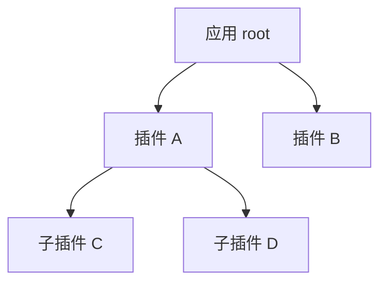

# Rutis 应用开发指南

Rutis 是一个 Rust 插件框架，用来组织应用中的功能模块，并管理它们的启动、重载和关闭。

使用 Rutis 时，你将功能写成插件，通过服务共享能力，通过事件分发数据并组织处理过程。框架根据插件声明的依赖安排启动，在依赖发生变化时重新加载相关插件，并在插件退出时执行资源清理。

本文介绍如何用这些能力设计应用。具体代码和 API 用法见 [开发手册](development-handbook.md)。阅读本文需要具备 Rust 和异步编程基础。

## 基本概念

### 插件

插件是应用中可以独立加载和卸载的功能模块。它把一组资源的初始化、使用和释放组织在一起。

每个插件实现 `Plugin` 接口，在 `apply` 方法中完成初始化：读取依赖、创建服务、注册事件监听，并安排资源清理。初始化完成后，插件进入 `Active` 状态，开始提供服务。

### 服务

服务是插件提供给其他组件使用的对象，可以包含共享状态，也可以提供可调用的接口。

服务通过类型键注册和查找。插件调用 `ctx.provide(service)` 注册服务，使用方调用 `ctx.get::<Service>()` 获取 `Arc<Service>`。需要多个实现时，可以用 trait 定义公共接口。

### 上下文

`Ctx` 是插件使用框架能力的入口。它决定服务从哪里查找，也决定新建资源由哪个插件管理。

通过当前插件的 `Ctx` 注册的服务、监听器、清理函数和子插件，会随该插件一起卸载。应用入口创建的 root 上下文则管理整个应用。

### 生命周期

每次注册插件，Rutis 都会创建一个 fiber 来管理它的运行状态。注册返回的 `FiberView` 用于观察状态、修改配置、重启或关闭插件。

一个插件可以多次执行 `apply`。每次加载形成新的一代：创建这一代的资源，运行，然后清理。依赖服务恢复、主动重启和配置更新都可能开始新的一代。

## 职责划分

**插件作者负责业务逻辑和业务资源的完整生命周期；Rutis 负责提供生命周期架构与通用机制。**

插件作者实现资源的创建、使用、关闭和恢复，并通过框架接口登记相应逻辑。Rutis 负责依赖管理、插件装卸、清理逻辑的调用与等待，以及事件分发等通用工作。

## 组织插件

### 划分插件

插件划分主要考虑两件事：一组功能承担什么职责，以及它需要在什么条件下启动、重载和关闭。

一起创建和释放的资源适合放在同一个插件中。需要独立配置、替换实现或启停的功能，可以拆成独立插件。插件内部的算法、数据结构和辅助函数继续使用普通 Rust 模块组织。

设计一个插件时，明确它提供的服务、需要的依赖，以及它负责释放的资源。这三项共同决定插件的边界。

### 安排父子关系

父子关系表达资源归属。在一个插件的 `apply` 中调用 `ctx.plugin(child)`，即可创建属于它的子插件。父插件卸载时，Rutis 会清理这些子插件。



在这个结构中，C 和 D 的生命周期由 A 管理。B 则由 root 管理，可以独立于 A 启停。

父子结构通常用于组织一组需要共同释放的资源，也可以承载会话、连接或其他运行实例。具体层级由应用需要管理的生命周期决定。

应用入口负责创建 root、选择插件实现、传入配置，并持有需要管理的 `FiberView`。这样的入口也称为组合根。

### 声明服务依赖

服务依赖表达一个插件运行所需的条件。插件通过 `injects()` 声明依赖的服务键，Rutis 在这些服务就绪后执行 `apply`。

提供方卸载时，依赖它的消费者会清理当前资源。服务重新就绪后，消费者自动加载，并取得新的服务对象。把插件运行必需的服务写入 `injects()`，并在每次 `apply` 中重新获取，就能建立这一自动重载关系。

父子关系决定资源的释放范围，服务依赖决定变化的传播范围。例如，C 可以由 A 创建，同时使用 B 提供的服务：A 负责关闭 C，B 的服务变化负责触发 C 重载。

初始化依赖应形成单向关系。多个插件共同需要的能力，可以提取为独立服务；依赖某项可选能力的功能，也可以单独封装成插件，等待该能力就绪后加载。

### 安排状态的保存时间

根据状态需要保留的时间选择存放位置：

| 保存时间 | 存放位置 | 生命周期 |
|---|---|---|
| 一次加载期间 | 在 `apply` 中创建 | 当前代卸载时释放 |
| 跨多次加载 | 更长寿命的父插件或独立服务 | 随持有者释放 |
| 跨进程运行 | 文件、数据库等持久存储 | 由应用的保存与恢复流程管理 |

把可重建的运行资源和需要保留的状态分别安排，可以控制重载的影响。例如，一个插件依赖的服务发生变化时，它可以重建连接和任务，并继续使用由父插件持有的状态。

## 连接各个功能

### 服务调用

服务提供可被其他组件直接使用的对象或接口。调用方取得服务后，通过其方法、字段或句柄完成交互；具体能力由服务类型定义。

服务适合表达明确的调用关系和共享资源访问。接口设计应说明输入、返回值、错误、并发和取消方式。服务会被重新加载时，还应约定旧对象在停止后的调用行为，方便使用方处理状态变化。

### 事件分发与处理

事件总线负责将事件分发给已注册的处理函数，并组织这些处理函数的执行过程。发送方提交事件，处理方注册监听器，总线根据事件类型和通道找到对应的监听器，再按照选定的方式调用它们。

当一个事件对应多个监听器时，需要确定执行顺序、是否等待处理完成，以及怎样返回结果。Rutis 为此提供四种分发方式：

| API | 执行方式 | 结果处理 |
|---|---|---|
| `emit` | 提交后立即返回，在后台按顺序调用监听器；同键事件依次分发 | 监听器错误交给 ErrorSink |
| `parallel` | 并发调用监听器，等待全部完成 | 成功返回 `()`，失败汇总错误 |
| `serial` | 按注册顺序调用，遇到 `Some(value)` 或错误时结束 | 返回首个值；全部返回 `None` 时结果为 `None` |
| `waterfall` | 监听器通过 `next` 调用后续处理，并可处理其返回结果 | 返回整条调用链的结果 |

这些机制通常可以用于状态通知、请求分发、插件间协作和中间件处理。例如，同一状态变化可以交给多个监听器分别处理；一个请求可以依次交给多个处理者，直到其中一个返回结果。具体用途由事件内容和处理函数共同定义。

设计事件接口时，先确定事件携带的数据和预期结果，再选择执行方式。需要多个监听器参与时，同时约定顺序、错误处理，以及没有监听器时的行为。普通监听器通过 `on` 注册；waterfall 通过 `on_waterfall` 注册，并由调用方提供链末的处理函数 `terminal`。

## 组织多个实例

### 区分服务

普通类型键用于同一个 root 内的共享服务。需要同时提供同类型的多个服务时，使用限定名区分。注册、依赖声明和读取使用相同的键。

某个插件实例及其子插件需要独立的一组服务时，可以使用实例键：

```rust,ignore
let instance = ctx.instance();
let state_key = TypeKey::instance::<State>(instance);
```

这里的 `ctx` 来自持有状态的父插件。实例键允许该插件及其后代访问对应服务。创建子插件时，将这个键传给它，用于依赖声明和读取。

`InstanceId` 标识当前进程中的插件实例。需要跨进程保存的业务标识，由应用另外定义。

### 区分事件通道

普通事件在同一个 root 的总线上分发；named 通道通过名称区分同类型事件；实例通道将注册和发送范围限定在对应实例的子树中。

使用实例事件时，父插件把自己的实例 ID 传给相关子插件。子插件使用自己的上下文和同一个父实例 ID，通过 `on_instance` 和 `emit_instance` 注册、发送事件。

### 选择服务作用域

`ctx.isolate(key, label)` 为指定服务键选择查找范围。它通常用于复用同一插件，并为其配置不同的服务环境。

同一个 root 内，相同键和 label 对应同一作用域；独立的生命周期仍由父插件管理。具体用法见 [开发手册](development-handbook.md#服务键与作用域)。

## 管理运行过程

### 启动

宿主注册插件后，根据所需插件是否进入 `Active` 判断相关功能是否就绪。依赖暂未满足的插件保持 `Pending`，依赖就绪后继续加载。

父插件完成自身初始化并返回，随后由宿主汇总子插件的就绪状态。这个顺序适用于子插件依赖父插件服务的情况：父插件先成为可用的服务提供者，子插件再开始运行。

### 更新

需要修改配置的插件通过 `PluginFactory` 创建。宿主调用 `view.update(config)` 后，Rutis 先检查新配置，再清理旧实例并加载新实例；依赖该插件的消费者随之重载。

更新过程中，宿主可以观察插件状态并记录结果。新实例加载失败时，由宿主按应用策略决定重试、恢复上次配置或保持失败状态。需要保留的状态和正在执行的操作，应在设计时明确处理方式。

### 关闭

插件退出时，按照约定结束当前工作，再释放占用的资源。后台任务收到取消信号后，可以取消当前操作，也可以完成约定范围的工作后退出；清理函数等待任务实际结束，再释放它使用的资源。

关闭一个插件及其子树，使用它的 `FiberView::shutdown()`；退出整个应用，使用 `root.shutdown()`。设置等待超时后，宿主可以及时报告关闭进度，并保留句柄继续等待结果。

## 开发约定

开始实现前，建议把以下约定落实到设计中：

1. **按生命周期划分插件。** 一起创建和释放的资源放在同一个插件内，独立启停的功能使用子插件。
2. **完整声明必需依赖。** 服务键统一定义，依赖在 `injects()` 中声明，每次加载时重新读取。
3. **让初始化及时完成。** `apply` 负责创建资源和登记清理，持续工作放入受管理的后台任务。
4. **为资源安排释放过程。** 取得资源后及时登记清理；后台任务同时保存取消信号和任务句柄。
5. **按保存时间放置状态。** 临时状态放在当前加载中，长期状态由父插件或持久存储保存。
6. **明确就绪条件。** 启动、重载和配置更新后，根据所需插件的状态决定何时继续相关操作。
7. **实现完整的资源生命周期。** 插件作者负责资源的初始化、运行、关闭，以及需要时的状态恢复。

设计说明可以围绕四项内容展开：插件及其职责、父子关系与服务依赖、状态保存方式、更新和关闭过程。它们确定后，再进入 [开发手册](development-handbook.md) 完成实现。

---

适用于 Rutis 0.3.0。行为依据仓库提交 `015d48c`。
